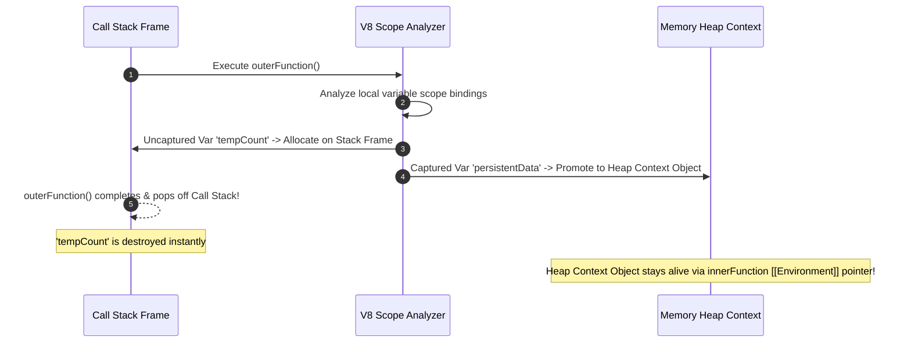
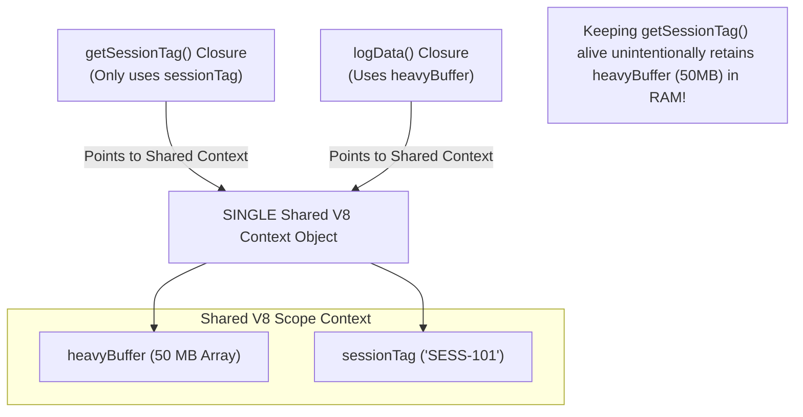

# Module 14: Closures Internals — V8 Context Objects, `[[Environment]]` Slots, and Shared Scope Retention

## Overview

A **Closure** is a fundamental ECMAScript feature defined as the pairing of a function with references to its surrounding **Lexical Environment**.

At the V8 engine level, closures are implemented by allocating a heap-based **V8 Context Object**. When an inner function references outer scope variables, V8 promotes those variables from the temporary Call Stack to a persistent **Heap Context Object** linked via the function's internal `[[Environment]]` slot.

Understanding V8 Context allocation, **Shared Scope Objects**, and memory trade-offs between closures and ES6 classes is essential for architecting leak-free, high-performance applications.

---

## 1. V8 Engine Closure Architecture: Context Objects & `[[Environment]]` Slots

When V8 parses a function that accesses outer variables, it allocates a heap-allocated **Context Object** that outlives the parent function's Call Stack frame:

```mermaid
flowchart TD
    subgraph Call Stack (Unwinds & Pops Off)
        StackFrame["createCounter() Call Stack Frame<br/>- Execution Context pops off when function returns"]
    end

    subgraph Memory Heap Space (Persists in Memory)
        ContextObj["V8 Heap Context Object<br/>- Properties: [ count: 42 ]<br/>- Pointers: [ outerEnv -> GlobalContext ]"]
        ClosureFn["increment() Function Object<br/>- Internal Slot: [[Environment]] -> Context Object"]
    end

    StackFrame -.->|Returned Function| ClosureFn
    ClosureFn -->|[[Environment]] Slot Pointer| ContextObj
```

### Internal Implementation Mechanism

1. **Escape Analysis**: During parsing, V8 identifies variables referenced by nested inner functions.
2. **Context Allocation**: Captured variables are allocated inside a heap **Context Object** rather than the stack frame.
3. **Internal Slot Linkage**: The created inner function object receives an internal specification slot called **`[[Environment]]`**, which stores a pointer address to the heap Context Object.

---

## 2. Context Allocation Lifecycle: Stack-to-Heap Variable Promotion



---

## 3. The Shared Scope Context Problem (Subtle Memory Leaks)

A common performance pitfall in JavaScript is V8's **Shared Context Optimization**:

> [!WARNING]
> **V8 Shared Scope Rule**: V8 creates **ONE single shared Context object per lexical scope**. Every inner function declared in that scope points to the exact same shared Context object. Consequently, if *any* inner function captures a heavy variable, that heavy variable stays retained in memory for all other closures defined in that scope!



```javascript
// BAD: Shared Context Retains Heavy Variable Unintentionally
function setupSessionHandlers(rawBufferData) {
  const sessionTag = "SESS-101";
  const heavyBuffer = new Array(10_000_000).fill(rawBufferData); // 80MB Array

  function getSessionTag() {
    return sessionTag; // Uses sessionTag ONLY
  }

  function processHeavyBuffer() {
    return heavyBuffer.length; // Uses heavyBuffer
  }

  // Retention Risk: Both functions share ONE Context Object: { sessionTag, heavyBuffer }
  // Returning getSessionTag() keeps 80MB heavyBuffer retained in RAM!
  return getSessionTag; 
}

// FIX: Isolate Heavy Variables into Separate Scope Blocks
function setupSessionHandlersFixed(rawBufferData) {
  const sessionTag = "SESS-101";

  // Heavy processing isolated inside an IIFE block scope
  (() => {
    const heavyBuffer = new Array(10_000_000).fill(rawBufferData);
    // Process heavy buffer...
  })(); // heavyBuffer Scope closes & is safely Garbage Collected!

  return function getSessionTag() {
    return sessionTag; // Only captures sessionTag in Context Object
  };
}
```

---

## 4. How `eval()` Destroys V8 Scope Optimizations

Using `eval()` inside a function disables V8's escape analysis optimizations.

Because `eval("...")` can dynamically reference any variable string at runtime, V8 is forced to **capture ALL variables in the outer scope** into the heap Context object, inflating memory usage:

```javascript
function evalScopeAntiPattern() {
  const varA = 10;
  const varB = 20;
  const heavyUnusedPayload = new Array(1_000_000).fill("DATA");

  // DISABLES V8 ESCAPE ANALYSIS! All variables forced into Heap Context.
  return function dynamicExec(codeString) {
    return eval(codeString); 
  };
}
```

---

## 5. Memory Efficiency: Closures vs. ES6 Prototype Classes

| Feature | Closure Factory Pattern | ES6 Prototype Class |
| :--- | :--- | :--- |
| **Encapsulation** | Strict private state via Lexical Context. | Private fields (`#field`) or public properties. |
| **Method Allocation**| Creates **new function objects** per instance. | Methods allocated **ONCE** on Prototype. |
| **Memory Footprint** | Higher ($\mathcal{O}(N)$ per instance). | **Minimal ($\mathcal{O}(1)$ shared prototype memory)**. |
| **Ideal Use Case** | Singletons, modules, event handlers. | High-frequency instances (10,000+ items). |

```javascript
// 1. Closure Factory (Higher RAM: Creates separate function instances for every call)
function createCounterClosure() {
  let count = 0;
  return {
    increment() { return ++count; },
    getCount() { return count; }
  };
}

// 2. ES6 Class (Lower RAM: Prototype methods shared across all instances)
class CounterClass {
  #count = 0;

  increment() {
    return ++this.#count;
  }

  getCount() {
    return this.#count;
  }
}
```

---

## Key Production Takeaways

1. **Beware of Shared Scope Context Retainers**: Remember that all closures defined in the same scope share a single V8 Context Object. If one closure captures a large payload, nullify the heavy reference or isolate it in an IIFE scope block.
2. **Prefer ES6 Classes for High-Quantity Objects**: When instantiating thousands of object instances (e.g. game entities, data rows), use ES6 classes. Prototype methods exist once in memory, whereas closure factories instantiate duplicate function objects per call.
3. **Avoid `eval()` & `with()`**: Never use `eval()` inside functions. It disables V8 Scope Analysis and forces every local variable into heap Context memory.
4. **Inspect Retainers in Chrome DevTools**: If heap snapshots show unexpected object retention, inspect the `Context` node in the Chrome DevTools Retainer Tree to identify which closure is keeping the object alive.

