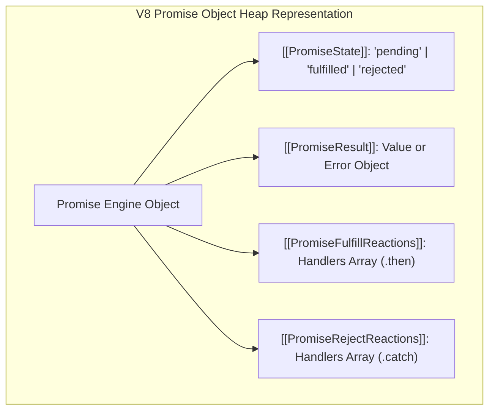
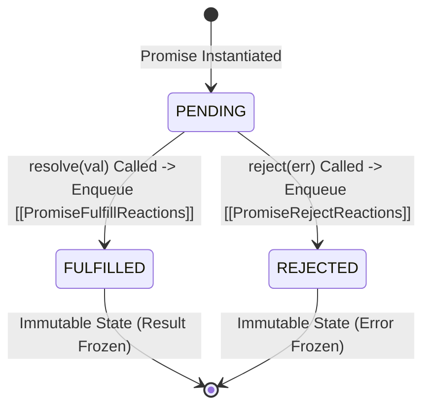

# Module 15: Async Internals in V8 — Promise Reaction Slots, `async/await` State Machines, and Stack Suspension

## Overview

Asynchronous JavaScript is built upon **Promises**, **Microtask Queues**, and **Generators**. Under the hood, V8 compiles `async/await` syntax into finite state machines that suspend execution context states to the heap upon encountering `await` and resume execution via microtask checkpoints.

Understanding how V8 structures **Promise Internal Slots** (`[[PromiseState]]`, `[[PromiseResult]]`, `[[PromiseFulfillReactions]]`), how **Stack Frame Suspension** operates, and how **Promise Concurrency Combinators** execute allows software engineers to write highly concurrent, non-blocking code.

---

## 1. Promise Architecture & V8 Internal Specification Slots

According to the ECMAScript specification, a V8 `Promise` object contains four core internal slots:



### Promise State Machine Transitions



1. **`[[PromiseState]]`**: Stores current lifecycle state (`"pending"`, `"fulfilled"`, or `"rejected"`). State transitions are immutable and occur exactly once.
2. **`[[PromiseResult]]`**: Holds the resolved payload value or rejection Error object.
3. **`[[PromiseFulfillReactions]]`**: An array of `PromiseReaction` records attached via `.then()`. When resolved, V8 transfers these handlers directly into the **Microtask Queue**.
4. **`[[PromiseRejectReactions]]`**: An array of error handling `PromiseReaction` records attached via `.catch()`.

---

## 2. The `async/await` State Machine & Stack Frame Suspension

When V8 encounters an `async function`, it transpiles the function into an implicit **Generator (`function*`) State Machine** combined with automated Promise resolution wrappers:

```mermaid
flowchart TD
    State0["State 0: Function Start<br/>Executes Sync Code to first 'await'"] -->|await validateToken()| Suspend1["1. SUSPEND FRAME<br/>- Save Call Stack frame (Variables & EIP) to Heap Context<br/>- Return Implicit Pending Promise to Caller"]

    Suspend1 -->|Microtask Queue Resumes| State1["State 1: Resume Execution<br/>- Reconstruct Stack Frame from Heap Context<br/>- Execute to next 'await'"]

    State1 -->|await fetchUserData()| Suspend2["2. SUSPEND FRAME<br/>- Save State 1 Frame to Heap Context"]

    Suspend2 -->|Microtask Queue Resumes| State2["State 2: Return Final Result<br/>- Fulfill Implicit Promise"]
```

### Low-Level Execution Lifecycle

1. **Execution**: The `async` function runs synchronously on the Call Stack until it hits the first `await` expression.
2. **Suspension**: V8 pauses the function, captures its current CPU register state and Lexical Environment, packs them into a **Heap Context Object**, and yields control back to the caller by returning a pending Promise.
3. **Resumption**: When the awaited Promise settles, V8 places a microtask handler into the **Microtask Queue**. Once the Call Stack empties, the Event Loop pops the microtask, restores the function's stack frame from the Heap Context, and resumes execution seamlessly!

---

## 3. Promise Concurrency Combinators Matrix

| Combinator Method | Behavior on Fulfill | Behavior on Reject | Ideal Use Case |
| :--- | :--- | :--- | :--- |
| **`Promise.all([p1, p2])`** | Resolves when **ALL** fulfill. | **Short-circuits instantly** on first rejection. | Parallel independent batch queries where all data is required. |
| **`Promise.allSettled([p1, p2])`** | Resolves when **ALL** settle (fulfilled or rejected). | **Never rejects**. Returns array of status objects. | Bulk API operations where individual failures are handled gracefully. |
| **`Promise.race([p1, p2])`** | Resolves with the **FIRST** settled result. | Rejects if the **FIRST** settled result is a rejection. | Implementing request timeouts / SLA guards. |
| **`Promise.any([p1, p2])`** | Resolves with the **FIRST** fulfilled result. | Rejects only if **ALL** promises reject (`AggregateError`). | Redundant service fallbacks (fetching from fastest mirror server). |

---

## 4. Performance Benchmark: Sequential `await` vs. Parallel `Promise.all`

Sequential `await` statements force execution to suspend and resume serially, causing unnecessary network latency compounding.

```mermaid
gantt
    title Sequential Await vs. Parallel Promise.all Execution Time
    dateFormat ss
    
    section Sequential Awaits (300ms Total)
    fetchUsers() 100ms :a1, 00, 01s
    fetchOrders() 100ms :a2, after a1, 01s
    fetchProducts() 100ms :a3, after a2, 01s

    section Parallel Promise.all (100ms Total)
    fetchUsers() 100ms :crit, b1, 00, 01s
    fetchOrders() 100ms :crit, b2, 00, 01s
    fetchProducts() 100ms :crit, b3, 00, 01s
```



```javascript
// Mock Async Network Service
function fetchMicroserviceData(serviceName, delayMs) {
  return new Promise((resolve) => {
    setTimeout(() => resolve({ service: serviceName, time: Date.now() }), delayMs);
  });
}

// 1. BAD Anti-Pattern: Sequential Awaits (Compounding Latency)
async function getDashboardDataSequential() {
  const start = process.hrtime.bigint();

  const users = await fetchMicroserviceData("Users", 100);
  const orders = await fetchMicroserviceData("Orders", 100);
  const products = await fetchMicroserviceData("Products", 100);

  const end = process.hrtime.bigint();
  console.log(`Sequential Awaits Execution Time: ${Number(end - start) / 1_000_000} ms`);
  return [users, orders, products];
}

// 2. GOOD Pattern: Parallel Execution via Promise.all
async function getDashboardDataParallel() {
  const start = process.hrtime.bigint();

  // Dispatch all 3 network requests concurrently!
  const [users, orders, products] = await Promise.all([
    fetchMicroserviceData("Users", 100),
    fetchMicroserviceData("Orders", 100),
    fetchMicroserviceData("Products", 100)
  ]);

  const end = process.hrtime.bigint();
  console.log(`Parallel Promise.all Time       : ${Number(end - start) / 1_000_000} ms`);
  return [users, orders, products];
}

async function runConcurrencyBenchmark() {
  await getDashboardDataSequential();
  await getDashboardDataParallel();
}

runConcurrencyBenchmark();
```

---

## Key Production Takeaways

1. **Avoid Sequential `await` Statements for Independent Async Tasks**: Never write sequential `await` statements for requests that do not depend on one another. Use `Promise.all()` to execute network tasks in parallel.
2. **Handle Promise Rejections to Prevent Node.js Process Crashes**: Unhandled Promise rejections trigger the `unhandledRejection` event in Node.js, which terminates modern processes by default. Always attach `.catch()` or wrap `await` calls inside `try/catch`.
3. **Use `Promise.allSettled()` for Partial Success Handlers**: When making bulk batch API calls where individual failures are acceptable, use `Promise.allSettled()` instead of `Promise.all()` to prevent single failures from short-circuiting the entire batch.
4. **Understand Microtask Priority over Macrotasks**: Resolved Promise reactions are placed in the Microtask Queue and executed immediately when the Call Stack empties, running before `setTimeout` or `setInterval` callbacks.

