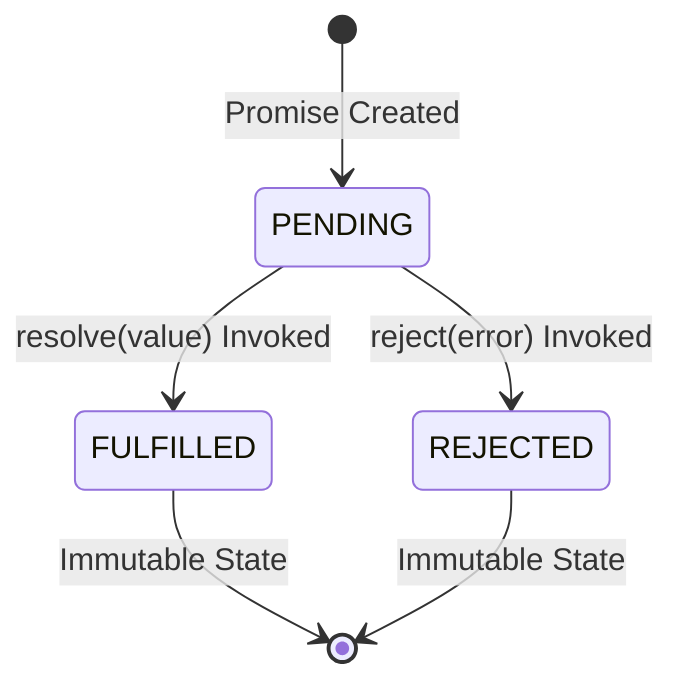
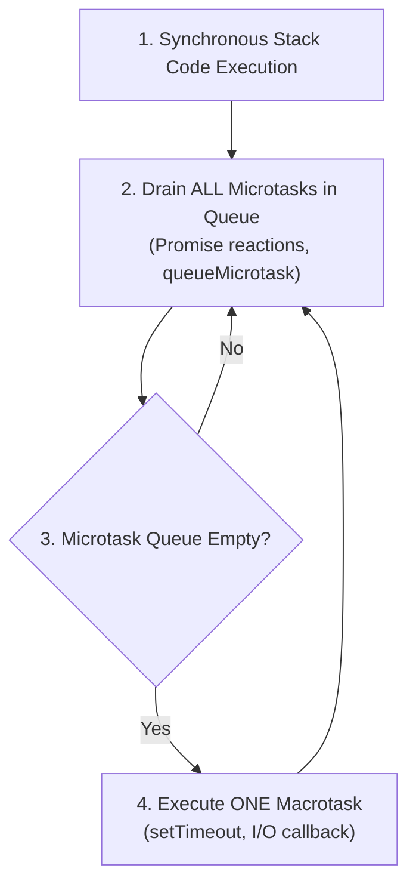

# File 15: Async Internals in V8

## Overview
Asynchronous JavaScript is built on **Promises**, **Microtask Queues**, and **Generators**. Under the hood, V8 compiles `async/await` syntax into finite state machines that suspend execution context states to the heap and resume execution via microtask checkpoints.

---

## 1. Promise Lifecycle & V8 Internal Reactions

A Promise acts as a state machine transitioning between 3 states:



- When `.then()` or `.catch()` is attached to a Promise, V8 attaches a **PromiseReaction** record to the internal slots of the Promise.
- When settled, V8 queues these reactions directly into the **Microtask Queue**.

---

## 2. Microtask vs Macrotask Queue Execution



```javascript
console.log("A: Sync Start");
setTimeout(() => console.log("F: Macrotask (setTimeout)"), 0);
Promise.resolve()
    .then(() => {
        console.log("C: Microtask 1");
        Promise.resolve().then(() => console.log("D: Microtask 2 (Nested)"));
    })
    .then(() => console.log("E: Microtask 3 (Chained)"));
console.log("B: Sync End");

// Output: A, B, C, D, E, F
```

---

## 3. The `async/await` State Machine
When V8 encounters `async/await`, it transforms the function into an explicit state machine built on **Generators** and **Implicit Promises**.

```mermaid
flowchart LR
    State0["State 0: Function Start"] -->|await validateOrder()| Suspend1["Suspend State 0 -> Context to Heap"]
    Suspend1 -->|Microtask Triggered| State1["State 1: Resumed with Result"]
    State1 -->|await processPayment()| Suspend2["Suspend State 1 -> Context to Heap"]
    Suspend2 -->|Microtask Triggered| State2["State 2: Completion"]
```

```javascript
async function processOrder(orderId) {
    console.log("Step 1");
    const valid = await validateOrder(orderId); // State 0 -> Suspends, yields control
    console.log("Step 2");
    const paid = await processPayment(valid);   // State 1 -> Suspends, yields control
    return paid;
}
```

---

## 4. Generator Suspension Internals
Generators (`function*`) use the exact same suspension mechanism as `async/await`. Calling `yield` saves the current stack frame (instruction pointer, local variables) to a heap context, allowing `.next()` to restore execution later.

```javascript
function* orderProcessor() {
    console.log("Start");
    const res1 = yield "Step 1 Complete"; // Saves execution state to Heap
    console.log("Resumed with:", res1);
    yield "Step 2 Complete";
}

const gen = orderProcessor();
console.log(gen.next()); // { value: "Step 1 Complete", done: false }
console.log(gen.next("Approved")); // Logs "Resumed with: Approved", { value: "Step 2 Complete", done: false }
```

---

## 5. Promise Concurrency Patterns

```javascript
function fetchSvc(name, delay, fail = false) {
    return new Promise((res, rej) => 
        setTimeout(() => fail ? rej(new Error(`${name} failed`)) : res({ service: name }), delay));
}

async function demoConcurrency() {
    // 1. Promise.all: Executes concurrently; fails instantly if ANY promise rejects
    const all = await Promise.all([fetchSvc("users", 50), fetchSvc("orders", 80)]);

    // 2. Promise.allSettled: Executes concurrently; NEVER rejects, returns status array
    const settled = await Promise.allSettled([fetchSvc("users", 30), fetchSvc("failing", 50, true)]);

    // 3. Promise.race: Returns the result of the FIRST settled promise (fulfilled or rejected)
    const race = await Promise.race([fetchSvc("slow", 100), fetchSvc("fast", 20)]);

    // 4. Promise.any: Returns the FIRST FULFILLED promise (ignores rejections unless ALL reject)
    const any = await Promise.any([fetchSvc("failing", 10, true), fetchSvc("successful", 40)]);
}
```

---

## 6. Performance Impact: Sequential Awaits vs Parallel `Promise.all`

```javascript
async function fetchData(id) {
    return new Promise(r => setTimeout(() => r({ id }), 100));
}

// BAD: Sequential execution (300ms total delay)
async function getSequential() {
    const a = await fetchData(1);
    const b = await fetchData(2);
    const c = await fetchData(3);
    return [a, b, c];
}

// GOOD: Parallel execution (100ms total delay)
async function getParallel() {
    return await Promise.all([fetchData(1), fetchData(2), fetchData(3)]);
}
```

---

## Key Takeaways
1. Promises transition between **PENDING**, **FULFILLED**, and **REJECTED** states; settled reactions queue into the **Microtask Queue**.
2. **Microtasks** drain completely before the Event Loop yields to the next macrotask.
3. `async/await` is compiled by V8 into a **State Machine** that suspends stack contexts to the heap.
4. **Generators** (`yield` / `.next()`) share the underlying suspend/resume engine primitive with `async/await`.
5. Avoid sequential `await` calls for independent operations; use **`Promise.all()`** for concurrent performance.
