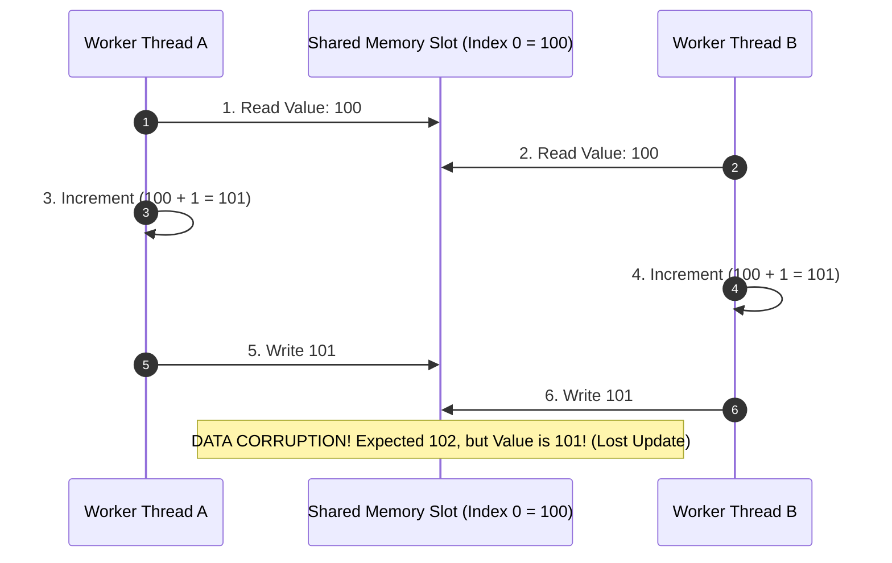
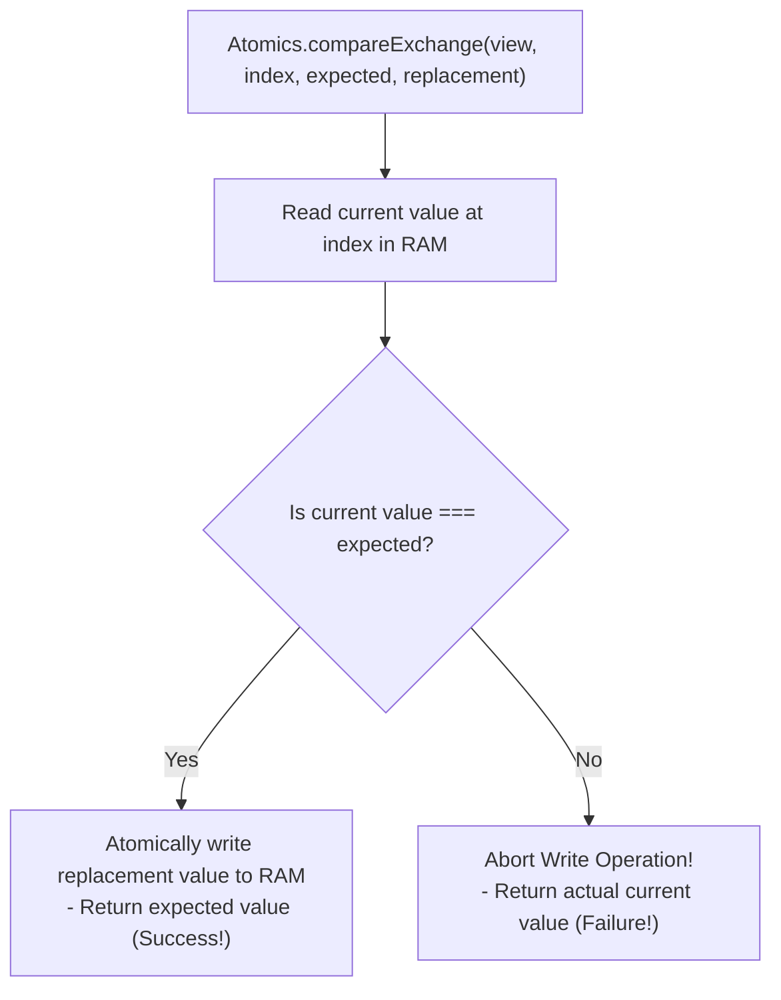

# Module 16: Shared Memory and Atomics — SharedArrayBuffer, Lock-Free CAS, and Thread Synchronization

## Overview

In traditional JavaScript Worker Thread models, data communication relies on message passing via `postMessage()`, which uses the **Structured Clone Algorithm** to serialize and copy data between threads.

**`SharedArrayBuffer`** introduces true multithreaded shared memory by allowing multiple Worker Threads in Node.js or browser environments to read and write to **identical physical RAM byte addresses** with zero copy cost.

To prevent race conditions, memory corruption, and instruction reordering across CPU cores, the **`Atomics`** namespace provides hardware-level indivisible operations, **Compare-And-Swap (CAS)** primitives, and thread synchronization (`Atomics.wait()` / `Atomics.notify()`).

---

## 1. Message Passing (`postMessage`) vs. Zero-Copy Shared Memory

```mermaid
flowchart TD
    subgraph Structured Clone Message Passing (Copy Overhead)
        ThreadA1["Main Thread A<br/>Memory Array (100 MB)"] --> Serialize["Structured Clone Serializer<br/>(O(N) CPU Serialization & Copying)"]
        Serialize --> ThreadB1["Worker Thread B<br/>Duplicate Memory Array (100 MB)"]
    end

    subgraph SharedArrayBuffer Zero-Copy Architecture (O(1) Shared RAM)
        ThreadA2["Main Thread A<br/>ArrayBuffer View Pointer"] --> SharedMem["Shared Physical RAM Memory Block<br/>(SharedArrayBuffer Allocation)"]
        ThreadB2["Worker Thread B<br/>ArrayBuffer View Pointer"] --> SharedMem
    end
```

### Memory Architectural Differences

- **`postMessage()`**: Duplicates byte arrays across thread isolation boundaries, doubling RAM consumption and incurring an $\mathcal{O}(N)$ CPU serialization penalty for large datasets.
- **`SharedArrayBuffer`**: Maps identical physical memory addresses into the address spaces of multiple worker threads. Thread operations execute directly against shared RAM in **$\mathcal{O}(1)$ Constant Time**.

---

## 2. Race Conditions & Unsynchronized Data Corruption

When two threads concurrently modify an unsynchronized shared memory location, **Race Conditions** occur due to CPU instruction interleaving:



---

## 3. Indivisible Thread-Safe Operations with `Atomics`

The `Atomics` namespace provides static methods that guarantee operations execute **indivisibly** at the CPU hardware instruction level. No other thread can read or write intermediate states during an atomic operation:

```javascript
// Allocate 32 Shared Bytes in RAM
const sharedBuffer = new SharedArrayBuffer(32);
const int32View = new Int32Array(sharedBuffer); // 8 32-bit Integer Slots

// Thread-Safe Atomic Store and Load
Atomics.store(int32View, 0, 100);
console.log("Atomic Load Value:", Atomics.load(int32View, 0)); // 100

// Thread-Safe Indivisible Addition (Prevents Lost Updates!)
const oldValue = Atomics.add(int32View, 0, 5); // Adds 5 to Slot 0 indivisibly!
console.log("Returned Old Value:", oldValue);                  // 100
console.log("New Value in Shared RAM:", Atomics.load(int32View, 0)); // 105
```

---

## 4. Compare-And-Swap (CAS) & Lock-Free Algorithms

The **Compare-And-Swap (CAS)** primitive (`Atomics.compareExchange()`) is the cornerstone of high-performance lock-free data structures.

It updates a shared memory location **only if the current value matches the expected value**:

$$\text{Atomics.compareExchange(typedArray, index, expectedValue, replacementValue)}$$



### Lock-Free Atomic Multiplication Loop using CAS

```javascript
// Multiplies a shared memory value atomically without using blocking mutexes
function atomicMultiply(typedArray, index, multiplier) {
  let currentValue;
  let newValue;

  do {
    currentValue = Atomics.load(typedArray, index);
    newValue = currentValue * multiplier;
    
    // CAS Loop: Re-tries atomically if another thread modified currentValue in the interim!
  } while (Atomics.compareExchange(typedArray, index, currentValue, newValue) !== currentValue);

  return newValue;
}
```

---

## 5. Thread Synchronization: `Atomics.wait()` and `Atomics.notify()`

Instead of spinning CPU loops (**busy-waiting**), worker threads can sleep efficiently using `Atomics.wait()` until notified by another thread via `Atomics.notify()`:

```javascript
// WORKER THREAD CODE: Sleep safely until index 0 changes from value 0 or 5000ms elapses
function workerThreadTask(sharedBuffer) {
  const view = new Int32Array(sharedBuffer);
  console.log("Worker: Sleeping on Shared Buffer index 0...");

  // Puts worker thread to sleep in OS scheduler (ZERO CPU consumption!)
  const waitStatus = Atomics.wait(view, 0, 0, 5000); 
  console.log("Worker: Woken Up! Status:", waitStatus); // Output: "ok"
}

// MAIN THREAD CODE: Wake up sleeping worker thread
function mainThreadSignal(sharedBuffer) {
  const view = new Int32Array(sharedBuffer);

  // Perform updates
  Atomics.store(view, 0, 1); // Change value
  
  // Wake up 1 waiting worker thread on index 0
  const wokenThreads = Atomics.notify(view, 0, 1); 
  console.log(`Main Thread: Woke ${wokenThreads} worker thread(s).`);
}
```

> [!CAUTION]
> **Main UI Thread Constraint**: Calling `Atomics.wait()` on the main browser UI thread throws a `TypeError` to prevent developers from accidentally freezing browser UI rendering. `Atomics.wait()` can only be invoked inside Worker Threads.

---

## 6. Building a Production Custom Mutex (Lock) using Atomics

```javascript
class AtomicMutex {
  constructor(sharedBuffer, lockIndex = 0) {
    this.view = new Int32Array(sharedBuffer);
    this.lockIndex = lockIndex;
    this.UNLOCKED = 0;
    this.LOCKED = 1;
  }

  // Acquire Lock (Spinlock with Atomics.wait fallback)
  lock() {
    while (Atomics.compareExchange(this.view, this.lockIndex, this.UNLOCKED, this.LOCKED) !== this.UNLOCKED) {
      // Sleep thread if lock is currently held by another worker
      Atomics.wait(this.view, this.lockIndex, this.LOCKED);
    }
  }

  // Release Lock and Notify Waiting Workers
  unlock() {
    if (Atomics.compareExchange(this.view, this.lockIndex, this.LOCKED, this.UNLOCKED) === this.LOCKED) {
      Atomics.notify(this.view, this.lockIndex, 1); // Wake 1 sleeping thread
    }
  }
}
```

---

## 7. Security: Spectre Vulnerabilities & Cross-Origin Isolation

Because microsecond-precision timers using `SharedArrayBuffer` memory polling could be exploited for Spectre side-channel memory attacks, modern browsers require **Cross-Origin Isolation HTTP Headers** to enable `SharedArrayBuffer`:

```http
Cross-Origin-Embedder-Policy: require-corp
Cross-Origin-Opener-Policy: same-origin
```

---

## Key Production Takeaways

1. **Use `SharedArrayBuffer` for Zero-Copy Data Sharing**: When transferring megabytes of raw binary data between Worker Threads, use `SharedArrayBuffer` to eliminate `postMessage()` serialization latency.
2. **Always Access Shared Memory via `Atomics`**: Never perform plain arithmetic operations (`view[0]++`) on shared memory. Always use `Atomics.add()`, `Atomics.sub()`, `Atomics.load()`, and `Atomics.store()`.
3. **Use `Atomics.wait()` to Avoid Busy-Waiting**: Never implement `while(true)` loops to wait for worker thread signals. Use `Atomics.wait()` to put threads to sleep in the OS scheduler without burning CPU cycles.
4. **Configure COOP/COEP Headers in Web Browsers**: Ensure server response headers contain `Cross-Origin-Opener-Policy` and `Cross-Origin-Embedder-Policy` to enable `SharedArrayBuffer` support in browser applications.

