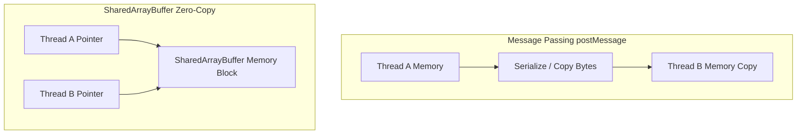
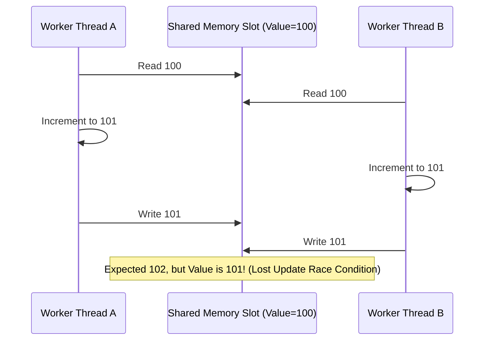

# File 16: Shared Memory and Atomics

## Overview
`SharedArrayBuffer` allows worker threads in Node.js or browsers to share raw byte buffers in memory without data copying or serialization. The `Atomics` namespace provides thread-safe, indivisible operations to prevent race conditions and synchronize thread execution without busy-waiting.

---

## 1. Structured Clone (`postMessage`) vs Shared Memory



- **`postMessage()`**: Serializes and **copies** data between worker threads (higher CPU overhead for large datasets).
- **`SharedArrayBuffer`**: Gives both main and worker threads direct read/write access to **identical physical RAM bytes** ($0$ copy overhead).

```javascript
// Allocation of 16 Shared Bytes
const sharedBuffer = new SharedArrayBuffer(16);
const int32View = new Int32Array(sharedBuffer); // 4 32-bit integers
int32View[0] = 100;
int32View[1] = 200;
```

---

## 2. Race Conditions in Multithreaded Execution
When multiple threads read and write to the same shared memory location simultaneously without synchronization, **race conditions** occur, leading to lost updates.



---

## 3. Thread-Safe Operations with `Atomics`
The `Atomics` object guarantees that operations execute **indivisibly**. No thread can read an intermediate state while an atomic operation is in progress.

```javascript
const sharedBuffer = new SharedArrayBuffer(32);
const view = new Int32Array(sharedBuffer);

// Thread-safe store and load
Atomics.store(view, 0, 42);
console.log(Atomics.load(view, 0)); // 42

// Thread-safe indivisible addition
const oldValue = Atomics.add(view, 1, 5); // Adds 5 to index 1, returning old value indivisibly!
```

---

## 4. Compare-And-Swap (CAS) & Lock-Free Algorithms
`Atomics.compareExchange()` is the fundamental building block of **lock-free concurrency algorithms**. It updates a memory value **only if the current value matches the expected value**.

$$\text{compareExchange(view, index, expectedValue, replacementValue)}$$

```javascript
const view = new Int32Array(new SharedArrayBuffer(16));
Atomics.store(view, 0, 100);

// CAS Attempt 1: Expect 100 -> Replaces with 200
const success = Atomics.compareExchange(view, 0, 100, 200);
console.log(success === 100); // true (Value is now 200)

// CAS Attempt 2: Expect 100 -> Fails because value is now 200!
const failed = Atomics.compareExchange(view, 0, 100, 300);
console.log(failed === 100);  // false (Value remains 200)
```

### Atomic Multiplication Loop using CAS
```javascript
function atomicMultiply(view, index, multiplier) {
    let oldValue;
    do {
        oldValue = Atomics.load(view, index);
    } while (Atomics.compareExchange(view, index, oldValue, oldValue * multiplier) !== oldValue);
    return Atomics.load(view, index);
}
```

---

## 5. Thread Synchronization: `Atomics.wait()` & `Atomics.notify()`
Instead of spinning CPU loops (**busy-waiting**), threads can sleep safely using `Atomics.wait()` until woken by `Atomics.notify()`.

```javascript
const view = new Int32Array(new SharedArrayBuffer(4));

// Inside Worker Thread: Sleep until index 0 changes from 0 or times out after 100ms
const result = Atomics.wait(view, 0, 0, 100); 

// Inside Main Thread: Wake up 1 waiting worker thread on index 0
Atomics.notify(view, 0, 1);
```

> **Constraint**: `Atomics.wait()` cannot be invoked on the main browser UI thread to avoid freezing the browser rendering loop.

---

## 6. Building a Custom Mutex with Atomics

```javascript
class AtomicMutex {
    constructor(sharedBuffer, index) {
        this.view = new Int32Array(sharedBuffer);
        this.index = index;
    }
    lock() {
        // Spin-wait until CAS sets 0 -> 1
        while (Atomics.compareExchange(this.view, this.index, 0, 1) !== 0) {
            Atomics.wait(this.view, this.index, 1, 10); // Sleep 10ms if locked
        }
    }
    unlock() {
        Atomics.store(this.view, this.index, 0); // Release lock
        Atomics.notify(this.view, this.index, 1); // Wake waiting thread
    }
}
```

---

## 7. Security: Spectre Vulnerabilities & Cross-Origin Isolation
Because `SharedArrayBuffer` enables microsecond-precision timers via memory polling (exploited in Spectre side-channel attacks), modern browsers enable `SharedArrayBuffer` **only when Cross-Origin Isolation headers are configured**:

```http
Cross-Origin-Embedder-Policy: require-corp
Cross-Origin-Opener-Policy: same-origin
```

---

## Key Takeaways
1. **`SharedArrayBuffer`** allows multiple threads to access identical RAM bytes with zero copy cost.
2. Unsynchronized shared memory access causes **race conditions** and lost updates.
3. **`Atomics`** provides indivisible operations (`add`, `sub`, `load`, `store`) across threads.
4. **`Atomics.compareExchange()`** (CAS) is the foundation of lock-free concurrency algorithms.
5. **`Atomics.wait()`** puts worker threads to sleep, freeing CPU until **`Atomics.notify()`** wakes them.
