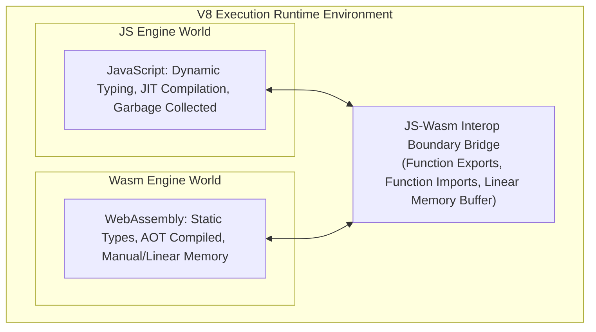
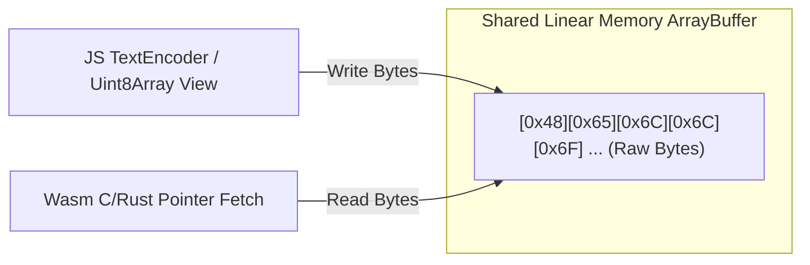

# File 17: WebAssembly Interop with JavaScript

## Overview
**WebAssembly (Wasm)** is a low-level, binary instruction format designed to execute compiled code (from C++, Rust, Go) at near-native speed inside JavaScript runtimes. Wasm operates alongside JavaScript in the same V8 security sandbox, sharing linear memory and execution contexts.

---

## 1. JavaScript vs WebAssembly Architecture



### When to Use Which?
- **Use JavaScript**: DOM Manipulation, UI Logic, Event Handling, Web APIs, high-level business workflow.
- **Use WebAssembly**: Heavy numerical math, Image/Video processing, Cryptography, 3D Game Engines, Compression algorithms.

---

## 2. The Wasm Loading & Instantiation Pipeline


```javascript
// Minimal Inline Wasm Module Demo (Adding two numbers)
const wasmBytes = new Uint8Array([
    0x00, 0x61, 0x73, 0x6d, 0x01, 0x00, 0x00, 0x00, // Wasm Magic Header & Version
    0x01, 0x07, 0x01, 0x60, 0x02, 0x7f, 0x7f, 0x01, 0x7f, // Type Signature: (i32, i32) -> i32
    0x03, 0x02, 0x01, 0x00,
    0x07, 0x07, 0x01, 0x03, 0x61, 0x64, 0x64, 0x00, 0x00, // Export Name: "add"
    0x0a, 0x09, 0x01, 0x07, 0x00, 0x20, 0x00, 0x20, 0x01, 0x6a, 0x0b // Instruction Opcodes: i32.add
]);

async function runWasm() {
    const { instance } = await WebAssembly.instantiate(wasmBytes);
    console.log(instance.exports.add(40, 2)); // 42 (Executed in Wasm engine!)
}
runWasm();
```

---

## 3. WebAssembly Linear Memory (`WebAssembly.Memory`)
WebAssembly has **no direct access to JavaScript heap objects**. Interop data exchange occurs via a flat contiguous array of raw bytes called **Linear Memory**.



```javascript
// Allocate 1 Page of Wasm Memory (1 Page = 64 KB = 65,536 Bytes)
const memory = new WebAssembly.Memory({ initial: 1, maximum: 10 });
const uint8 = new Uint8Array(memory.buffer);

// Write String Bytes from JS
const str = "Hello Wasm";
const bytes = new TextEncoder().encode(str);
uint8.set(bytes, 0);

// Read String Bytes from Wasm Memory
const decodedStr = new TextDecoder().decode(new Uint8Array(memory.buffer, 0, bytes.length));
console.log(decodedStr); // "Hello Wasm"
```

> **Memory Growth Rule**: Calling `memory.grow()` detaches existing JS `ArrayBuffer` views! Always re-instantiate typed array views after growing memory.

---

## 4. Function Imports & Exports Boundary

```javascript
// JS Function imported INTO WebAssembly
const imports = {
    env: {
        logProgress: (percent) => console.log(`Progress: ${percent}%`),
    }
};

// Passing JS functions into Wasm instantiation
WebAssembly.instantiate(wasmBytes, imports).then(({ instance }) => {
    // Calling Wasm function FROM JavaScript
    instance.exports.startProcessing();
});
```

---

## 5. Performance Characteristics: Wasm vs JIT JS
- **Wasm**: Constant, deterministic performance right from the **first execution frame** (no warm-up needed).
- **JavaScript**: Starts slow in interpreter mode, requiring **JIT warm-up** cycles before TurboFan reaches peak C++ like speed.
- **Boundary Overhead**: Crossing the JS-Wasm boundary carries a small call overhead (~10ns - 50ns per call). Avoid making millions of tiny interop calls inside high-frequency loops; pass raw memory blocks instead.

---

## 6. Popular Compilation Toolchains
- **Rust -> `wasm-pack`**: Preferred for modern web development (emits lightweight `.wasm` with TS glue code).
- **C / C++ -> `Emscripten`**: Industry standard for porting legacy desktop libraries (FFmpeg, SQLite, OpenCV).
- **TypeScript -> `AssemblyScript`**: Compiles a TypeScript-like syntax directly to Wasm.

---

## Key Takeaways
1. **WebAssembly** executes compiled binary code inside the V8 sandbox at near-native speed.
2. The lifecycle is: **Fetch Bytes -> `WebAssembly.compile()` -> `WebAssembly.instantiate()`**.
3. JS and Wasm exchange data through **Linear Memory** (`WebAssembly.Memory`), a flat `ArrayBuffer` structured in **64KB pages**.
4. Wasm offers **predictable performance without JIT warm-up delays**.
5. Batch interop calls to minimize boundary crossing overhead.
