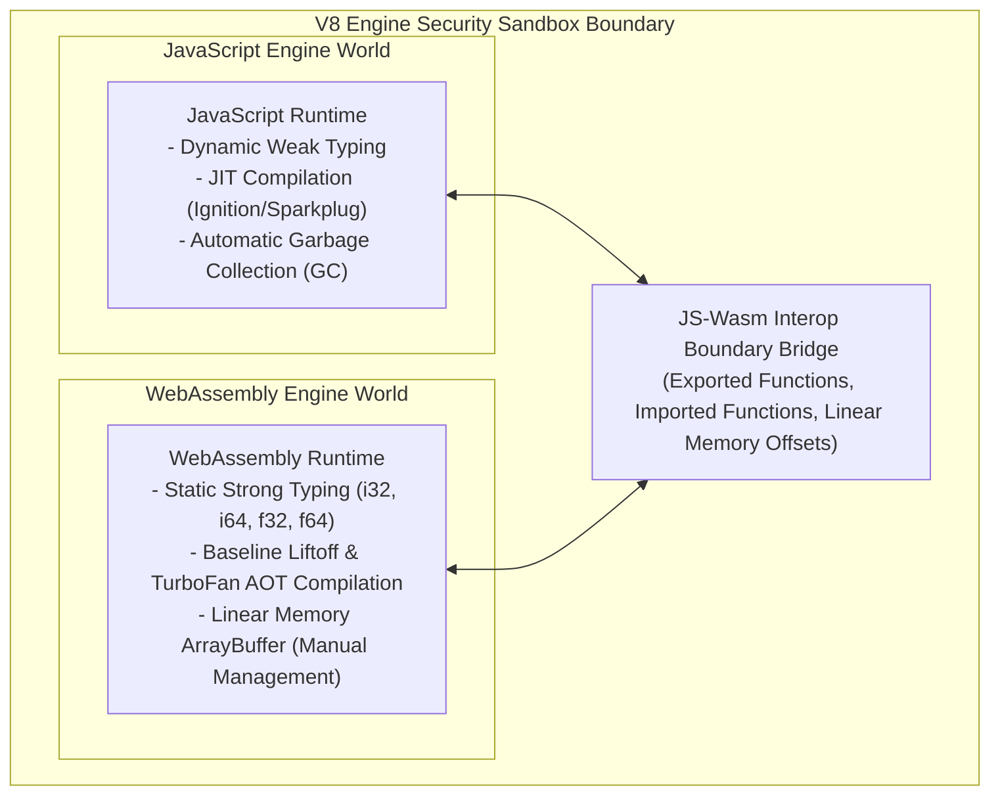
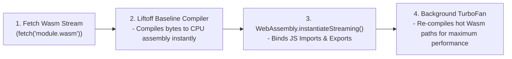

# Module 17: WebAssembly Interop with JavaScript — Liftoff/TurboFan Compilers, Linear Memory, and Boundary Overhead

## Overview

**WebAssembly (Wasm)** is a low-level binary instruction format designed to execute compiled code (from Rust, C++, C, or Go) inside modern JavaScript runtimes at near-native execution speed.

In Google V8, WebAssembly runs inside the same security sandbox as JavaScript, sharing the single-threaded Event Loop and Memory Heap boundaries. However, WebAssembly operates with static typing, predictable ahead-of-time (AOT) performance, and manual **Linear Memory Allocation**.

Understanding how V8 compiles Wasm binaries using the **Liftoff** baseline compiler and **TurboFan**, how data is passed across the **JS-Wasm Boundary**, and how **Linear Memory (`WebAssembly.Memory`)** operates is essential for high-performance engineering.

---

## 1. V8 Engine Architecture: JavaScript vs. WebAssembly Engine Worlds



### Architectural Comparison

| Dimension | JavaScript Engine | WebAssembly Engine |
| :--- | :--- | :--- |
| **Data Types** | Dynamic (Objects, Strings, Numbers, Symbols). | 4 Primitive Types (`i32`, `i64`, `f32`, `f64`) + Vector `v128`. |
| **Compilation Pipeline**| Ignition Interpreter $\to$ TurboFan JIT. | **Liftoff Baseline Compiler** $\to$ **TurboFan AOT**. |
| **Performance Profile**| Requires JIT warmup; susceptible to Deopts. | **Instant, deterministic execution** from Call 1. |
| **Memory Model** | V8 Heap Allocation with Garbage Collection. | Flat, contiguous **Linear Memory Buffer** (Manual offsets). |

---

## 2. WebAssembly Streaming Compilation & Instantiation Pipeline

Modern browsers and Node.js use `WebAssembly.instantiateStreaming()` to compile Wasm bytecode into native machine instructions **in parallel while bytes are streaming over the network**:



```javascript
// Production Pattern: Streaming Instantiation with Import Object
const wasmImports = {
  env: {
    logProgress: (percentage) => console.log(`Wasm Processing: ${percentage}%`),
    renderAlert: (code) => console.warn(`Wasm Alert Code: ${code}`)
  }
};

async function loadWasmModule(url) {
  // Streams, compiles, and instantiates Wasm concurrently with fetch download!
  const { module, instance } = await WebAssembly.instantiateStreaming(
    fetch(url), 
    wasmImports
  );

  console.log("Exported Wasm Functions:", Object.keys(instance.exports));
  return instance;
}
```

---

## 3. WebAssembly Linear Memory (`WebAssembly.Memory`)

WebAssembly has **no direct access to JavaScript Heap Objects** (DOM elements, JSON objects, closures). All complex data structures (strings, structs, images) must be passed through **Linear Memory**.

Linear memory is allocated in **64-KB Pages** ($1 \text{ Page} = 65,536 \text{ Bytes}$):

```mermaid
flowchart TD
    subgraph Shared Linear Memory (WebAssembly.Memory Allocation)
        Page0["Page 0 (64 KB: Bytes 0 to 65535)"]
        Page1["Page 1 (64 KB: Bytes 65536 to 131071)"]
    end

    JSWriter["JS TextEncoder / Int32Array View"] -->|Write Raw Bytes at Offset| Page0
    WasmPtr["Wasm C/Rust Pointer Dereference"] -->|Read Bytes at Offset| Page0
```

```javascript
// Allocate 2 Pages of Initial Wasm Memory (2 * 64KB = 128KB)
const memory = new WebAssembly.Memory({ initial: 2, maximum: 10 });

// Pass memory reference inside imports
const imports = { env: { memory } };

// Write String Bytes from JS into Wasm Linear Memory Offset 0
function writeStringToWasmMemory(str, offset = 0) {
  const encoder = new TextEncoder();
  const bytes = encoder.encode(str);

  const uint8View = new Uint8Array(memory.buffer);
  uint8View.set(bytes, offset);
  
  return bytes.length;
}

// Read String Bytes from Wasm Linear Memory
function readStringFromWasmMemory(offset, length) {
  const uint8View = new Uint8Array(memory.buffer, offset, length);
  return new TextDecoder().decode(uint8View);
}

writeStringToWasmMemory("Engineering Playbook", 0);
console.log("Read String:", readStringFromWasmMemory(0, 20));
```

---

## 4. The `memory.grow()` ArrayBuffer Detachment Trap

> [!WARNING]
> **ArrayBuffer Detachment Rule**: Calling `memory.grow(additionalPages)` expands WebAssembly memory by reallocating physical RAM. In JavaScript, **growing Wasm memory automatically detaches all existing `ArrayBuffer` views**, throwing `TypeError: Cannot perform ArrayBuffer.prototype.slice on a detached ArrayBuffer` if old views are accessed!

```javascript
const memory = new WebAssembly.Memory({ initial: 1 });
let view = new Int32Array(memory.buffer);
view[0] = 42;

// Grow memory by 1 Page (64KB)
memory.grow(1);

// BAD: Accessing old view throws TypeError because memory.buffer was reallocated!
// console.log(view[0]); // TypeError: Detached ArrayBuffer!

// FIX: Re-instantiate typed array view after growing memory
view = new Int32Array(memory.buffer);
console.log("Value after Memory Grow:", view[0]); // 42 (Safe!)
```

---

## 5. JS-Wasm Boundary Crossing Overhead

Calling a Wasm function from JavaScript involves a small **Boundary Transition Cost** ($\sim 5\text{ns} - 15\text{ns}$ per invocation) due to type marshaling and argument checking:

```javascript
// BAD: Invoking Wasm function 10,000,000 times inside a JS loop (Boundary Bottleneck)
function processBad(wasmInstance, dataArray) {
  for (let i = 0; i < dataArray.length; i++) {
    wasmInstance.exports.processSingleItem(dataArray[i]); // High boundary overhead!
  }
}

// GOOD: Copy array into Wasm Memory once and perform batch processing inside Wasm!
function processGood(wasmInstance, dataArray) {
  const offset = 0;
  const memoryView = new Int32Array(wasmInstance.exports.memory.buffer);
  memoryView.set(dataArray, offset);

  // Single Wasm invocation processes entire dataset natively!
  wasmInstance.exports.processBatchInBulk(offset, dataArray.length);
}
```

---

## Key Production Takeaways

1. **Use `WebAssembly.instantiateStreaming()`**: Always load `.wasm` files using streaming APIs to compile bytes concurrently while downloading over network sockets.
2. **Batch Interop Calls across JS-Wasm Boundary**: Avoid making millions of individual Wasm function calls in JavaScript loops. Write data directly into Linear Memory and invoke batch processing functions.
3. **Handle Memory Growth ArrayBuffer Detachment**: Re-create all `TypedArray` views (`Uint8Array`, `Int32Array`) immediately whenever `memory.grow()` is invoked.
4. **Leverage Rust / C++ Toolchains**: Use **`wasm-pack`** (Rust) or **`Emscripten`** (C/C++) to automatically generate TypeScript bindings, memory allocation helpers, and glue code.

