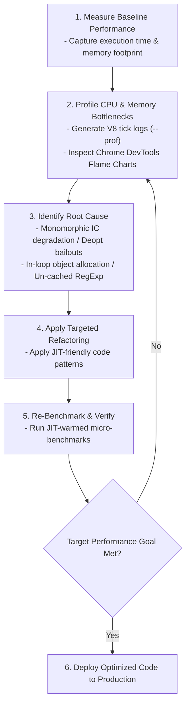
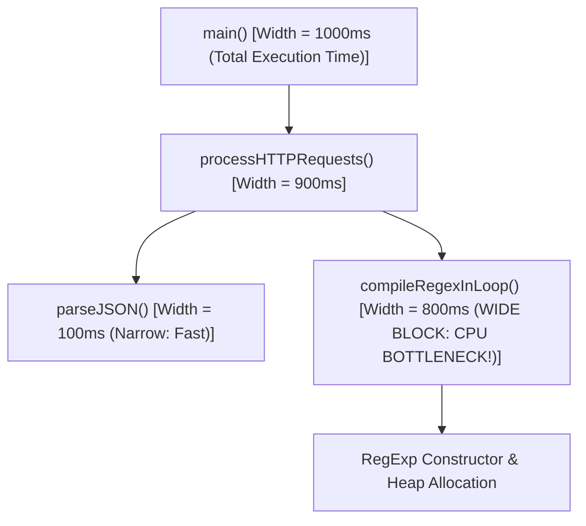

# Module 18: Performance Profiling and Optimization — V8 Tick Logs, Flame Charts, and Microbenchmarking

## Overview

Optimizing JavaScript performance requires **empirical measurement** rather than developer intuition. Intuitive guesses about code performance are incorrect up to 80% of the time due to modern JIT compiler optimizations.

V8 provides built-in instrumentation tools, high-resolution timers (`performance.now()`), tick profilers (`node --prof`), deoptimization tracers (`--trace-deopt`), and memory snapshot utilities to isolate CPU and memory bottlenecks using Pareto's 80/20 rule.

Understanding how to generate and interpret **Flame Charts**, conduct valid **JIT-Warmed Benchmarks**, and prevent common anti-patterns allows software engineers to build enterprise-grade, high-throughput systems.

---

## 1. The Empirical Optimization Workflow



---

## 2. High-Resolution Timing & Annotation APIs

### Precision Comparison Matrix

| Timing API | Precision Level | Monotonic Clock Guarantee | Ideal Use Case |
| :--- | :--- | :--- | :--- |
| **`Date.now()`** | Millisecond ($\pm 1\text{ms}$). | **No** (Subject to system clock drift/NTP). | Displaying user timestamps. |
| **`performance.now()`** | Sub-millisecond ($\pm 0.005\text{ms}$). | **Yes** (Monotonic clock). | Benchmarking JS functions. |
| **`process.hrtime.bigint()`** | Nanosecond ($\pm 1\text{ns}$). | **Yes** (Monotonic clock). | High-precision Node.js microservice benchmarks. |

### Annotating Timelines with `performance.mark()` and `performance.measure()`

User Timing API annotations automatically surface in the **Chrome DevTools Performance Panel**:

```javascript
const { performance, PerformanceObserver } = require("perf_hooks");

// Observer to log performance measurement metrics
const observer = new PerformanceObserver((items) => {
  items.getEntries().forEach((entry) => {
    console.log(`[PERF MARK] ${entry.name}: ${entry.duration.toFixed(3)} ms`);
  });
});
observer.observe({ entryTypes: ["measure"] });

function executeHeavyBatchProcessing() {
  performance.mark("batch-processing-start");

  let total = 0;
  for (let i = 0; i < 1_000_000; i++) {
    total += Math.sqrt(i);
  }

  performance.mark("batch-processing-end");

  // Calculate duration between marks
  performance.measure("Batch Processing Duration", "batch-processing-start", "batch-processing-end");
}

executeHeavyBatchProcessing();
```

---

## 3. V8 CPU Profiling & Flame Chart Interpretation

```bash
# 1. Run Node.js application with V8 Tick Profiler enabled
node --prof app.js

# 2. Process raw V8 isolate tick logs into human-readable text output
node --prof-process isolate-0x104008000-v8.log > v8_profile_results.txt

# 3. Launch Chrome DevTools inspector to view visual flame charts
node --inspect-brk app.js
```

### Flame Chart Call-Stack Hierarchy Analysis



#### How to Interpret Flame Charts

- **X-Axis (Width of Block)**: Represents **Total Execution Duration**. Functions with wide horizontal blocks consume the highest CPU time and represent primary optimization targets.
- **Y-Axis (Stack Depth)**: Represents the **Call Stack Depth**. Functions at the top of the stack are currently executing; lower blocks represent parent caller functions.
- **Self-Time vs. Total-Time**:
  - **Total-Time**: Time spent executing the function *plus* all nested child functions called by it.
  - **Self-Time**: Time spent strictly inside the function's own code body. A function with high Self-Time is directly consuming CPU cycles!

---

## 4. Microbenchmarking Pitfalls & JIT Warmup Mechanics

Writing accurate micro-benchmarks requires accounting for **JIT Compiler Warmup Cycles**:

```mermaid
flowchart LR
    subgraph Iteration 1 to 1000 (JIT Warmup Phase)
        Ignition["Ignition Bytecode Interpreter"] --> Feedback["Type Profile Collection"]
    end

    subgraph Iteration 1000+ (Optimized Compilation Phase)
        Feedback --> TurboFan["TurboFan Compiled Native Assembly"]
        TurboFan --> AccurateBench["Accurate Measurement (Near-Native Speed)"]
    end
```

```javascript
// BAD BENCHMARK: Measures un-warmed Ignition interpreter phase & dead code elimination
function badBenchmark(fn) {
  const start = performance.now();
  fn(); // Execution is cold; timing includes interpreter setup!
  return performance.now() - start;
}

// GOOD BENCHMARK: Warm up JIT compiler & prevent Dead-Code Elimination
function accurateBenchmark(fn, iterations = 10_000_000) {
  // 1. WARMUP PHASE: Triggers Sparkplug/TurboFan JIT compilation
  for (let i = 0; i < 10_000; i++) {
    fn(i);
  }

  // 2. MEASUREMENT PHASE: High-resolution timing of compiled native code
  const start = process.hrtime.bigint();
  let resultAccumulator = 0;

  for (let i = 0; i < iterations; i++) {
    resultAccumulator += fn(i); // Using result prevents Dead-Code Elimination!
  }

  const end = process.hrtime.bigint();
  
  // Prevent optimizer from stripping the function call completely
  if (resultAccumulator === 0) console.log("Unlikely side effect guard");

  return Number(end - start) / 1_000_000;
}
```

---

## 5. Real-World Optimization Case Study: In-Loop `RegExp` Re-Compilation

### Anti-Pattern: Re-Compiling `RegExp` Objects inside High-Frequency Loops

```javascript
// BAD: Instantiates and compiles a new RegExp object on EVERY loop iteration!
function parseUserCommentsSlow(comments) {
  const matchedURLs = [];

  for (let i = 0; i < comments.length; i++) {
    // Re-compiles Regex AST and allocates heap memory on every loop iteration!
    const urlPattern = new RegExp("https?:\\/\\/[\\w\\-]+(\\.[\\w\\-]+)+", "gi");
    const match = comments[i].match(urlPattern);
    if (match) matchedURLs.push(match);
  }

  return matchedURLs;
}

// GOOD: Caches compiled RegExp object instance in module scope once
const URL_PATTERN = /https?:\/\/[\w\-]+(\.[\w\-]+)+/gi;

function parseUserCommentsFast(comments) {
  const matchedURLs = [];

  for (let i = 0; i < comments.length; i++) {
    URL_PATTERN.lastIndex = 0; // Reset stateful global regex index
    const match = comments[i].match(URL_PATTERN);
    if (match) matchedURLs.push(match);
  }

  return matchedURLs;
}
```

```javascript
// Benchmark Verification
const testComments = Array.from({ length: 100_000 }, (_, i) => `User comment ${i}: Visit https://example.com/item`);

console.time("1. Slow In-Loop RegExp Compilation");
parseUserCommentsSlow(testComments);
console.timeEnd("1. Slow In-Loop RegExp Compilation");

console.time("2. Fast Cached RegExp Instance");
parseUserCommentsFast(testComments);
console.timeEnd("2. Fast Cached RegExp Instance"); // ~12x Faster execution speed!
```

---

## 6. Enterprise Production Optimization Matrix

| Performance Priority | Feature Area | Recommended Architectural Pattern | Expected Gain |
| :--- | :--- | :--- | :--- |
| **P0 (Critical)** | Memory Heap Garbage Collection | Reuse buffer allocations; implement Object Pools for hot paths. | $5\times - 10\times$ reduced GC pause times. |
| **P0 (Critical)** | Async Networking | Use `Promise.all()` to parallelize independent network/DB calls. | $2\times - 5\times$ reduced I/O latency. |
| **P1 (High)** | JIT Compilation Stability | Keep functions type-monomorphic and small ($<600$ AST nodes) for inlining. | $3\times - 8\times$ CPU instruction throughput. |
| **P1 (High)** | Object Allocation | Avoid in-loop object instantiations (caching `RegExp`, schemas, configs). | $10\times$ faster loop iteration speed. |
| **P2 (Medium)** | Data Structure Design | Use TypedArrays (`Uint8Array`, `Int32Array`) for large numerical datasets. | $4\times$ smaller RAM footprint. |

---

## Key Production Takeaways

1. **Always Measure Baseline Before Refactoring**: Never refactor code based on intuition alone. Generate V8 tick logs (`node --prof`) or run Chrome DevTools CPU profiles to verify bottlenecks.
2. **Warm Up JIT Compilers during Microbenchmarking**: Always run a warmup loop ($>10,000$ calls) before measuring execution timing to ensure TurboFan native code is executing.
3. **Cache Heavy Objects Outside Hot Loops**: Never instantiate `RegExp` objects, JSON schema validators, or heavy configuration objects inside high-frequency loops.
4. **Use High-Resolution Timers (`performance.now()`)**: Avoid `Date.now()` for performance timing due to system clock drift. Use `performance.now()` or `process.hrtime.bigint()` for nanosecond precision.

