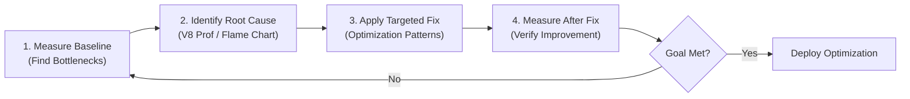
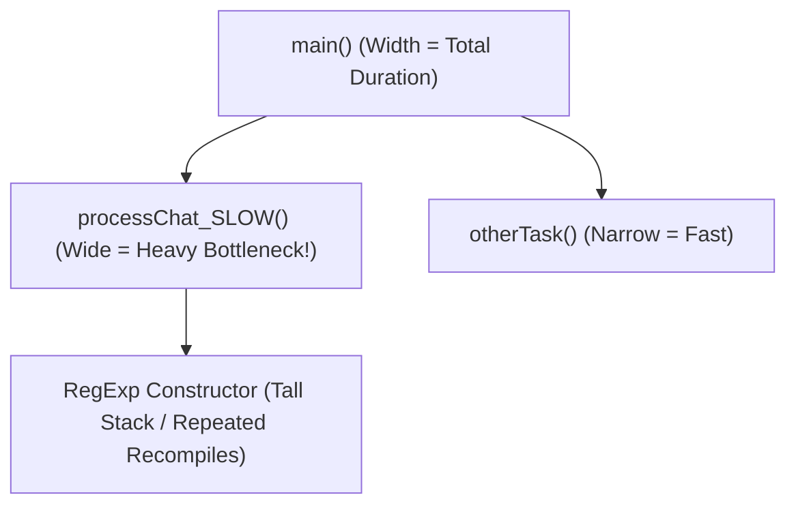

# File 18: Performance Profiling and Optimization

## Overview
Optimizing JavaScript performance requires empirical measurement rather than developer intuition. V8 provides built-in instrumentation tools, high-resolution timers, CPU profilers, and memory snapshot inspection utilities to identify bottlenecks using the **80/20 rule** (optimizing the 20% of code causing 80% of latency).

---

## 1. The Optimization Workflow



---

## 2. Timing APIs: `performance.now()` vs `console.time()`

### Microsecond Precision with `performance.now()`
`performance.now()` returns monotonic high-resolution timestamps measured in milliseconds with sub-millisecond precision, unaffected by system clock adjustments.

```javascript
const { performance } = require("perf_hooks");

const start = performance.now();
let sum = 0;
for (let i = 0; i < 100000; i++) sum += i;
const end = performance.now();

console.log(`Execution Time: ${(end - start).toFixed(4)} ms`);
```

### Quick Benchmarks with `console.time()`
```javascript
console.time("Array Sort");
const arr = Array.from({ length: 100000 }, () => Math.random());
arr.sort((a, b) => a - b);
console.timeEnd("Array Sort"); // Output: "Array Sort: 35.120ms"
```

---

## 3. User Timing API: Performance Marks & Measures
Marks and measures allow developers to annotate execution phases. These annotations automatically surface inside **Chrome DevTools Performance Timeline**.

```javascript
performance.mark("fetch-start");
// Simulate fetch operation...
performance.mark("fetch-end");

performance.measure("Fetch Duration", "fetch-start", "fetch-end");
const entries = performance.getEntriesByType("measure");
entries.forEach(entry => console.log(`${entry.name}: ${entry.duration.toFixed(2)}ms`));
```

---

## 4. V8 CPU Profiling & Flame Charts

```bash
# Generate V8 Tick Logs
node --prof script.js

# Process V8 Tick Log into Human-Readable Format
node --prof-process isolate-0x104008000-v8.log > profile.txt

# Inspect in Chrome DevTools
node --inspect script.js
```

### How to Read a Flame Chart



- **Width of Block**: Represents total execution time spent in that function. Wider blocks indicate main CPU bottlenecks.
- **Depth of Stack**: Represents call stack depth. Taller stacks indicate deep call chains.

---

## 5. Benchmarking Best Practices: Warmup & JIT
Micro-benchmarks often yield misleading results if JIT warmup cycles are ignored.

```javascript
// WRONG: Measuring unoptimized interpreter phase
function naiveBenchmark(fn) {
    const start = performance.now();
    fn();
    return performance.now() - start;
}

// RIGHT: Warm up JIT compiler before taking measurements
function accurateBenchmark(fn, iterations = 10000) {
    for (let i = 0; i < 1000; i++) fn(); // Warmup phase (Triggers JIT compilation)
    
    const start = performance.now();
    for (let i = 0; i < iterations; i++) fn(); // Benchmark execution phase
    return (performance.now() - start) / iterations;
}
```

---

## 6. Real-World Case Study: Regex Compilation Bottleneck

### Un-Optimized Implementation (Slow)
```javascript
function processChatSlow(messages) {
    const results = [];
    for (const msg of messages) {
        // BAD: Re-compiling RegExp object inside high-frequency loop!
        const urlRegex = new RegExp("https?:\\/\\/[\\w\\-]+(\\.[\\w\\-]+)+", "gi");
        results.push(msg.match(urlRegex) || []);
    }
    return results;
}
```

### Optimized Implementation (Fast)
```javascript
// GOOD: Cache RegExp object in module scope once
const URL_REGEX = /https?:\/\/[\w\-]+(\.[\w\-]+)+/gi;

function processChatFast(messages) {
    const results = [];
    for (const msg of messages) {
        URL_REGEX.lastIndex = 0; // Reset stateful regex index
        results.push(msg.match(URL_REGEX) || []);
    }
    return results;
}
```

```javascript
const testMsgs = Array.from({ length: 10000 }, (_, i) => `Check https://example.com/${i}`);

console.time("Slow Chat Process");
processChatSlow(testMsgs);
console.timeEnd("Slow Chat Process");

console.time("Fast Chat Process");
processChatFast(testMsgs);
console.timeEnd("Fast Chat Process"); // ~10x Faster!
```

---

## 7. Optimization Checklist Matrix

| Optimization Priority | Performance Area | Actionable Technique |
| :--- | :--- | :--- |
| **High Impact** | Memory Allocations | Avoid object creation inside hot loops; use Object Pools |
| **High Impact** | Regular Expressions | Cache static RegExp object instances outside function scope |
| **High Impact** | Asynchronous Logic | Use `Promise.all()` to parallelize independent network calls |
| **Medium Impact**| Type Stability | Pass uniform shapes to hot functions to preserve Monomorphic ICs |
| **Medium Impact**| Array Management | Pre-allocate array capacity (`new Array(n)`) when size is known |

---

## Key Takeaways
1. **Always measure before optimizing**; developer intuition incorrectly identifies bottlenecks ~80% of the time.
2. Use **`performance.now()`** for sub-millisecond monotonic execution timing.
3. Profile CPU usage using **`node --prof`** and analyze visual flame charts in Chrome DevTools.
4. **Warm up JIT compilers** before taking benchmark measurements to avoid measuring interpreter startup time.
5. Cache expensive object instantiations (like `RegExp` or complex schemas) outside hot loops.
