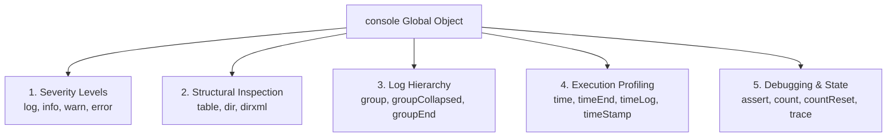
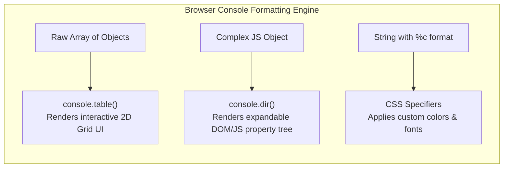
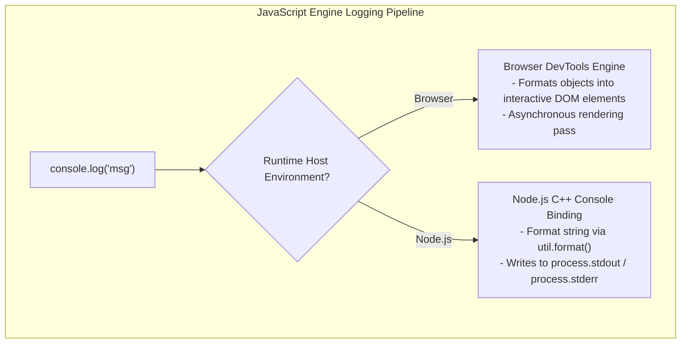

# Module 01: Console Methods & Comments — Formatting, Performance Timing, and JSDoc Standards

## Overview

The JavaScript `console` object provides diagnostic logging, performance measuring, and object inspection capabilities.

While basic `console.log()` outputs raw data, modern runtimes (Browsers and Node.js) provide specialized logging methods for severity tiering, interactive tabular visualization (`console.table()`), deep object tree inspection (`console.dir()`), execution timing (`console.time()`), call stack tracing (`console.trace()`), and CSS-styled terminal/console output (`%c`).

---

## 1. Console API Methods Architecture



### Logging Severity Level Matrix

| Method | Log Severity Tier | Standard Browser Styling | Node.js Output Stream |
| :--- | :--- | :--- | :--- |
| **`console.log()`** | General Informational | Plain default text | `process.stdout` |
| **`console.info()`** | Informational Highlight | Blue badge icon | `process.stdout` |
| **`console.warn()`** | Warning Condition | Yellow alert background & stack trace | `process.stderr` |
| **`console.error()`** | Fatal Error | Red alert background & stack trace | `process.stderr` |

```javascript
// Demonstration of Console Severity Tiers
console.log("Standard Log: System initialized.");
console.info("Info Badge: User authenticated successfully.");
console.warn("Warning: Memory heap usage exceeded 80% threshold.");
console.error("Error: Database connection failed. Stack trace captured.");
```

---

## 2. Advanced Inspection: `console.table()`, `console.dir()`, & `%c` Styling



### 1. Tabular Visualization (`console.table()`)

`console.table()` formats arrays of objects or nested key-value structures into interactive 2D tables:

```javascript
const users = [
  { id: 101, name: "Anita", role: "Architect", status: "Active" },
  { id: 102, name: "Vikram", role: "DevOps", status: "Away" },
  { id: 103, name: "Priya", role: "Frontend Lead", status: "Active" }
];

// Renders an interactive, sortable table in Developer Tools!
console.table(users, ["name", "role"]);
```

### 2. Deep Object Inspection (`console.dir()`)

Unlike `console.log()`, which formats HTML elements as DOM trees, `console.dir()` prints a JSON-like tree representation of object properties:

```javascript
const config = { db: { host: "127.0.0.1", port: 5432 }, flags: [true, false] };
console.dir(config, { depth: null, colors: true });
```

### 3. Custom Console Styling (`%c` Format Specifiers)

Browsers support CSS styling inside console messages using the `%c` specifier:

```javascript
console.log(
  "%c SUCCESS %c Order processed successfully!",
  "background: #10B981; color: white; font-weight: bold; padding: 4px 8px; border-radius: 4px;",
  "color: #059669; font-weight: bold;"
);
```

---

## 3. Node.js Output Streams vs. Browser Console Architecture



> [!NOTE]
> **Synchronous vs. Asynchronous Logging**: In Node.js, `console.log()` writing to a file redirect or pipe is **synchronous** (blocks the event loop). Writing to a terminal TTY is **asynchronous** in modern Node.js versions. Never use high-frequency `console.log()` inside production hot loops!

---

## 4. Execution Timing & Diagnostic Assertions

```javascript
// 1. Measuring Code Block Execution Time
console.time("Array-Sorting-Timer");

const numbers = Array.from({ length: 100_000 }, () => Math.random());
numbers.sort((a, b) => a - b);

console.timeEnd("Array-Sorting-Timer"); // Output: Array-Sorting-Timer: 24.18ms

// 2. Conditional Assertion Guard
const userAge = 15;
console.assert(userAge >= 18, "Access Denied: User is underage!", { userAge });

// 3. Execution Counter
function handleRequest(route) {
  console.count(`Route Call Count: ${route}`);
}
handleRequest("/api/users"); // Route Call Count: /api/users: 1
handleRequest("/api/users"); // Route Call Count: /api/users: 2

// 4. Call Stack Tracing
function innerStep() {
  console.trace("Call Stack Trace at innerStep()");
}
function outerStep() { innerStep(); }
outerStep();
```

---

## 5. Commenting Standards & JSDoc Annotations

```javascript
// Single-line comment: Explains immediate next line of code

/*
  Multi-line block comment:
  Explains complex multi-step algorithms or design rationale.
*/

/**
 * JSDoc Documentation Architecture:
 * Provides formal type annotations and contract documentation for IDEs.
 * 
 * @param {string} userId - Unique identifier of the target user.
 * @param {number} amount - Transaction payload amount in cents.
 * @param {boolean} [isPriority=false] - Optional priority flag.
 * @returns {Promise<{ transactionId: string, status: string }>} Result object.
 * @throws {Error} Throws an error if user balance is insufficient.
 */
async function processPayment(userId, amount, isPriority = false) {
  if (amount <= 0) throw new Error("Invalid transaction amount");
  return { transactionId: "TXN-9001", status: "APPROVED" };
}
```

---

## Key Production Takeaways

1. **Use `console.table()` for Tabular Data**: Use `console.table()` to inspect arrays of objects cleanly without expanding individual nested objects manually.
2. **Remove High-Frequency `console.log()` from Hot Loops**: High-frequency console output blocks Node.js event loop execution when piped to files or stdout streams.
3. **Use `console.assert()` for Light Diagnostic Guards**: Use `console.assert()` to log warnings only when critical invariants evaluate to `false`.
4. **Annotate Functions with JSDoc**: Write comprehensive JSDoc comments (`/** ... */`) to enable IDE auto-completion, parameter hints, and type checking in JavaScript projects.

