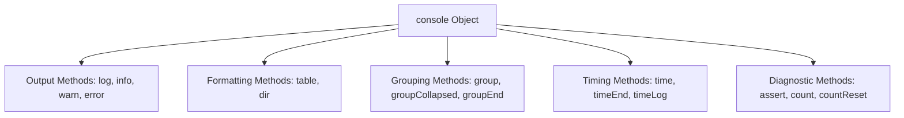

# File 01: Console Methods & Comments

## Overview
The JavaScript `console` object provides logging and diagnostic capabilities. It allows developers to output messages, format structured tabular data, inspect objects, group logs, and measure execution performance. Comments provide developer context and document code contracts without affecting execution.

---

## 1. Primary Console Methods



### Logging Severity Levels

| Method | Purpose | Typical Browser Styling |
| :--- | :--- | :--- |
| `console.log()` | General informational logging | Default text |
| `console.info()` | Informational message | Blue icon / text |
| `console.warn()` | Warning condition | Yellow background / icon |
| `console.error()` | Error condition with stack trace | Red background / icon |

```javascript
console.log("Clue found: Muddy footwear print");
console.warn("WARNING: Fingerprint evidence is smudging!");
console.error("ERROR: Chain of custody broken!");
```

---

## 2. Structured Data Inspection: `console.table()` & `console.dir()`
`console.table()` formats arrays of objects or tabular datasets into structured, interactive visual tables.

```javascript
const evidenceLog = [
    { id: 1, item: "Footwear print", location: "Window sill" },
    { id: 2, item: "Broken bangles", location: "Shop floor" },
    { id: 3, item: "Smudge mark",    location: "Door handle" }
];

console.table(evidenceLog);
```

---

## 3. Log Organization & Performance Timing

### Grouping Logs
```javascript
console.group("Suspect Profile: Raju");
console.log("Motive: Financial debt");
console.log("Alibi: Verified at coffee stall");
console.groupEnd();
```

### Measuring Execution Duration
```javascript
console.time("processingTime");
let sum = 0;
for (let i = 0; i < 1_000_000; i++) sum += i;
console.timeEnd("processingTime"); // Output: processingTime: ~1.5ms
```

---

## 4. Conditional Assertions & Counters
- `console.assert(condition, message)`: Writes an error message to the console only if `condition` evaluates to `false`.
- `console.count(label)`: Tracks how many times a specific label has been logged across execution flow.

```javascript
console.count("itemProcessed"); // itemProcessed: 1
console.count("itemProcessed"); // itemProcessed: 2

const totalItems = 5;
console.assert(totalItems > 10, "Assertion failed: Item count must exceed 10");
```

---

## 5. Commenting Syntax Standards

```javascript
// Single-line comment: Used for brief line explanations

/*
 * Multi-line block comment:
 * Used for longer narrative explanations
 * or temporary code disabling.
 */

/**
 * JSDoc Comment: Formally documents function signatures, parameter types, and returns.
 * @param {string} suspectName - The name of the suspect under investigation.
 * @param {number} age - Age of the suspect.
 * @returns {boolean} True if suspect matches criteria.
 */
function verifySuspect(suspectName, age) {
    return age > 18;
}
```

---

## Key Takeaways
1. Use distinct console severity levels (`log`, `warn`, `error`) for clear diagnostic filtering.
2. Use **`console.table()`** to visualize array and object structures clearly.
3. Use **`console.time()`** and **`console.timeEnd()`** for lightweight execution profiling.
4. **`console.assert()`** logs errors only when given condition evaluates to `false`.
5. Use **JSDoc annotations** (`/** ... */`) to document function APIs and enable IDE type hints.
