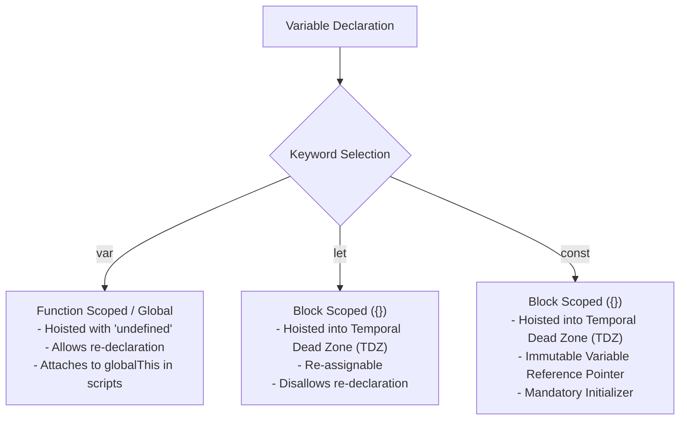
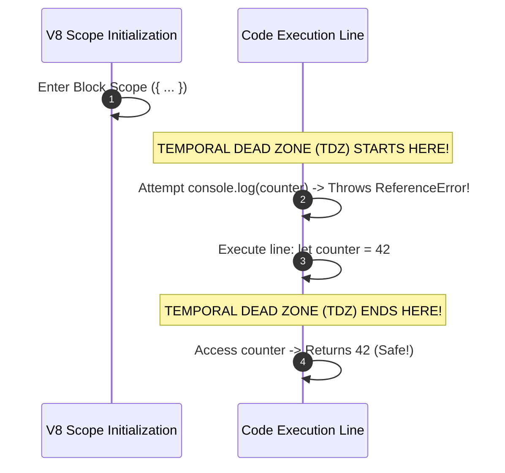

# Module 02: Variables (`var`, `let`, `const`) — Scope Records, TDZ, and Reference Immutability

## Overview

Variables in JavaScript serve as named pointers to memory locations holding primitive values or object references.

Modern ECMAScript (ES6+) provides three variable declaration keywords: `var` (legacy function-scoped or globally scoped), `let` (modern block-scoped re-assignable binding), and `const` (modern block-scoped constant reference pointer).

Understanding how the V8 engine handles **Variable Environment Records**, **Block Scoping (`{}`)**, the **Temporal Dead Zone (TDZ)**, and **Pointer Immutability vs. Object Property Mutation** is essential for writing predictable code.

---

## 1. Variable Declaration Architecture & Feature Comparison



### Comprehensive Keyword Comparison Matrix

| Feature Specification | `var` (ES5 Legacy) | `let` (ES6 Standard) | `const` (ES6 Standard) |
| :--- | :--- | :--- | :--- |
| **Scope Boundary** | Function Scope / Global | Block Scope (`{}`) | Block Scope (`{}`) |
| **Hoisting Behavior** | Hoisted & initialized to `undefined` | Hoisted into **Temporal Dead Zone (TDZ)** | Hoisted into **Temporal Dead Zone (TDZ)** |
| **Same-Scope Re-declaration** | Permitted (overwrites binding) | Throws `SyntaxError` | Throws `SyntaxError` |
| **Variable Re-assignment** | Permitted | Permitted | Throws `TypeError` |
| **Initial Value Requirement** | Optional (`undefined` assigned) | Optional (`undefined` assigned) | **Mandatory** at declaration line |
| **`globalThis` Binding** | Attaches property in top-level script | Does NOT attach to `globalThis` | Does NOT attach to `globalThis` |

---

## 2. Block Scoping (`{}`) vs. Function Scoping

- **Function Scope (`var`)**: Variables declared with `var` belong to the entire enclosing function body, ignoring block boundaries such as `if` statements, `for` loops, or `try/catch` blocks.
- **Block Scope (`let` / `const`)**: Variables declared with `let` or `const` exist strictly within the enclosing pair of curly braces (`{ ... }`).

```javascript
function ScopeDemonstration() {
  var functionScoped = "Available throughout ScopeDemonstration()";

  if (true) {
    var leakedVar = "var LEAKS out of if-blocks!";
    let blockScopedLet = "Trapped strictly inside if-block";
    const blockScopedConst = "Also trapped strictly inside if-block";
    
    console.log(blockScopedLet);   // Accessible inside block
    console.log(blockScopedConst); // Accessible inside block
  }

  console.log(functionScoped); // Accessible
  console.log(leakedVar);      // "var LEAKS out of if-block!" (Leaked!)
  
  // Accessing block-scoped variables outside their block throws ReferenceError:
  // console.log(blockScopedLet);   // ReferenceError: blockScopedLet is not defined
  // console.log(blockScopedConst); // ReferenceError: blockScopedConst is not defined
}

ScopeDemonstration();
```

---

## 3. The Temporal Dead Zone (TDZ) Mechanics

The **Temporal Dead Zone (TDZ)** is the time span between the entering of a scope block and the execution of the actual line where the variable is declared and initialized.



```javascript
// Demonstrating TDZ with 'let' and 'const'
function testTDZ() {
  // console.log(legacyVar); // Returns undefined (var is initialized on scope entry)
  // console.log(modernLet);  // Throws ReferenceError: Cannot access 'modernLet' before initialization

  var legacyVar = "Hoisted with undefined";
  let modernLet = "Initialized here!";
}

testTDZ();
```

---

## 4. `const` Pointer Immutability vs. Object Mutation

A common misconception is that `const` makes objects or arrays immutable. In reality, `const` only freezes the **variable identifier reference pointer**. The underlying object properties stored in heap memory can still be freely mutated:

```mermaid
flowchart LR
    subgraph Stack Memory
        ConstRef["const user = 0x8F01<br/>(Pointer Value FROZEN)"]
    end

    subgraph Heap Memory (Object Payload)
        ObjectPayload["Heap Object (0x8F01)<br/>- name: 'Rajesh'<br/>- role: 'Architect' -> 'Director' (MUTABLE!)"]
    end

    ConstRef -->|Points to Address 0x8F01| ObjectPayload
```

```javascript
// 1. Const with Primitive Value (Value Immutable)
const maxThreshold = 100;
// maxThreshold = 200; // Throws TypeError: Assignment to constant variable!

// 2. Const with Reference Value (Pointer Immutable, Object Mutable)
const developer = { name: "Rajesh", role: "Developer" };

// PERMITTED: Mutating object properties in heap memory
developer.role = "Lead Architect";
developer.salary = 150000;
console.log(developer); // { name: "Rajesh", role: "Lead Architect", salary: 150000 }

// PROHIBITED: Re-assigning variable reference pointer
// developer = { name: "Priya" }; // Throws TypeError!

// 3. Deep Immutability via Object.freeze()
const immutableConfig = Object.freeze({ apiEndpoint: "https://api.domain.com", timeout: 5000 });
// immutableConfig.timeout = 10000; // Fails silently in non-strict mode, throws TypeError in strict mode!
```

---

## Key Production Takeaways

1. **Default to `const`**: Declare all variables using `const` by default. Use `let` only when variable re-assignment is explicitly required. Avoid legacy `var`.
2. **Respect the Temporal Dead Zone**: Always declare `let` and `const` variables at the top of their enclosing scope block before referencing them.
3. **Use `Object.freeze()` for True Object Immutability**: `const` only prevents pointer re-assignment. Use `Object.freeze()` when you need to prevent mutations to object keys and properties.
4. **Isolate Loop Counters with `let`**: Use `let` inside `for` loops (`for (let i = 0; i < n; i++)`). This creates a new block-scoped binding per iteration, eliminating classic `var` closure bugs in async callbacks.

