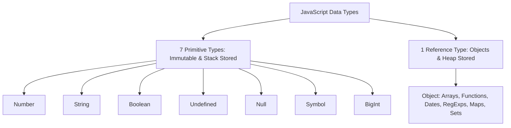

# File 03: Data Types

## Overview
JavaScript is a dynamically typed language. Data types are categorized into two primary groups: **Primitive Types** (immutable, direct value storage on stack) and **Reference Types** (mutable, pointer stored on stack pointing to heap memory).

---

## 1. Type Classification Taxonomy



---

## 2. Primitive vs Reference Types

### Key Differences

| Property | Primitive Types | Reference Types |
| :--- | :--- | :--- |
| **Data Memory** | Call Stack Memory | Heap Memory Space |
| **Mutability** | Immutable (Value cannot be altered) | Mutable (Properties can be modified) |
| **Copying Behavior** | Passed by **Value** | Passed by **Reference-Value** |
| **Comparison** | Compared by **Value Content** | Compared by **Memory Address Pointer** |

```javascript
// Primitive Copying: Value duplicated independently
let a = 10;
let b = a;
b = 20;
console.log(a); // 10 (Unchanged)

// Reference Copying: Pointers share identical Heap location
let obj1 = { name: "Alice" };
let obj2 = obj1;
obj2.name = "Bob";
console.log(obj1.name); // "Bob" (Mutated!)
```

---

## 3. The `typeof` Operator & Its Quirks
The `typeof` operator returns a string representing the evaluation type of an operand.

```javascript
console.log(typeof 42);           // "number"
console.log(typeof "hello");      // "string"
console.log(typeof true);         // "boolean"
console.log(typeof undefined);    // "undefined"
console.log(typeof Symbol("id")); // "symbol"
console.log(typeof 100n);         // "bigint"
console.log(typeof function(){}); // "function"

// Quirks & Historical Bugs
console.log(typeof null);         // "object" (Historical JS Bug since 1995!)
console.log(typeof [1, 2, 3]);    // "object" (Use Array.isArray())
```

---

## 4. Accurate Type Checking
To bypass `typeof null` and array quirks, use `Object.prototype.toString.call()`.

```javascript
function getExactType(val) {
    return Object.prototype.toString.call(val).slice(8, -1);
}

console.log(getExactType(null));        // "Null"
console.log(getExactType([1, 2]));      // "Array"
console.log(getExactType(new Date()));  // "Date"
console.log(getExactType(/regex/));     // "RegExp"
```

---

## Key Takeaways
1. JS has **7 Primitive types** and **1 Reference type** (Object).
2. Primitives are immutable and passed by **value**; objects are mutable and passed by **reference**.
3. `typeof null === "object"` is a legacy JS bug; use `Object.prototype.toString.call()` for precise type checking.
4. Use `Array.isArray(val)` to check if a variable is an array.
