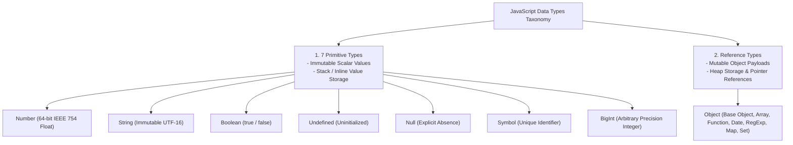
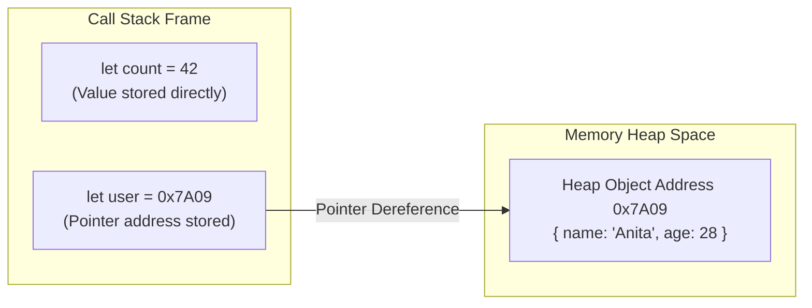

# Module 03: Data Types — 7 Primitives, Reference Types, and V8 Memory Allocation

## Overview

JavaScript is a **dynamically typed language**, meaning variables are not bound to a specific static data type; rather, values hold types.

Under the ECMAScript specification, data types are divided into two fundamental categories:
1. **7 Primitive Data Types**: Immutable, scalar values stored directly in call stack contexts (or small integer tagged pointers).
2. **Reference Data Types (`Object`)**: Mutable composite structures (Objects, Arrays, Functions, Dates, Maps, Sets) allocated on the Memory Heap and accessed via memory pointers.

---

## 1. ECMAScript Data Type Taxonomy



---

## 2. Primitive vs. Reference Memory Model



### Primitive vs. Reference Type Comparison Matrix

| Property Dimension | Primitive Types | Reference Types (`Object`) |
| :--- | :--- | :--- |
| **Storage Location** | Call Stack Memory Frame / Tagged Smi | Memory Heap Space |
| **Mutability** | **Immutable** (Value itself cannot be altered) | **Mutable** (Properties & elements can be altered) |
| **Assignment Copying** | Passed by **Value** (Independent copy created) | Passed by **Reference Pointer Copy** (Shared target) |
| **Equality Check (`===`)**| Compares **Literal Scalar Values** | Compares **Heap Memory Address Pointers** |
| **Standard Primitive Types**| `number`, `string`, `boolean`, `undefined`, `null`, `symbol`, `bigint` | `object` (includes Arrays, Functions, Dates) |

```javascript
// 1. Primitive Copying: Independent Value Duplication
let scoreA = 100;
let scoreB = scoreA; // Independent copy of primitive 100
scoreB = 200;

console.log("scoreA:", scoreA); // 100 (Unchanged!)
console.log("scoreB:", scoreB); // 200

// 2. Reference Copying: Pointer Sharing Same Heap Memory
const player1 = { name: "Rohit", score: 85 };
const player2 = player1; // Copies pointer address 0x7A09!

player2.score = 99; // Mutates shared heap object
console.log("player1.score:", player1.score); // 99 (Mutated!)
```

---

## 3. The `typeof` Operator Specification & Historical Quirks

The `typeof` unary operator returns a lowercase string indicating the evaluated type of an operand:

```javascript
console.log(typeof 42);           // "number"
console.log(typeof "JavaScript"); // "string"
console.log(typeof true);         // "boolean"
console.log(typeof undefined);    // "undefined"
console.log(typeof Symbol("id")); // "symbol"
console.log(typeof 9007199254740991n); // "bigint"
console.log(typeof function() {}); // "function" (Special ECMAScript callable object exception!)

// Quirks & Historical Edge Cases
console.log(typeof null);         // "object" (HISTORICAL JS BUG since 1995! Null has 0x00 type tag)
console.log(typeof [1, 2, 3]);    // "object" (Arrays are specialized objects)
console.log(typeof new Date());   // "object"
```

---

## 4. Robust Type Detection Strategy

Because `typeof null` returns `"object"` and `typeof []` returns `"object"`, production applications require a reliable decision tree for exact type verification:

```mermaid
flowchart TD
    InputVal[Input Value to Test] --> CheckNull{Is Value === null?}
    CheckNull -- Yes --> ReturnNull["Return 'null'"]
    
    CheckNull -- No --> CheckArray{Is Array.isArray(val)?}
    CheckArray -- Yes --> ReturnArray["Return 'array'"]
    
    CheckArray -- No --> UniversalCheck["Execute Object.prototype.toString.call(val)"]
    UniversalCheck --> ExactResult["Returns exact tag: '[object Date]', '[object Map]', etc."]
```

```javascript
// Robust Universal Type Inspection Utility
function getExactDataType(value) {
  if (value === null) return "null";
  if (typeof value === "undefined") return "undefined";
  
  // Extracts string representation from Object.prototype.toString
  // Output format: "[object TypeName]" -> extract "TypeName" lowercased
  return Object.prototype.toString.call(value).slice(8, -1).toLowerCase();
}

console.log(getExactDataType(null));         // "null"
console.log(getExactDataType([1, 2, 3]));    // "array"
console.log(getExactDataType(new Date()));   // "date"
console.log(getExactDataType(/regex/g));     // "regexp"
console.log(getExactDataType(new Map()));    // "map"
console.log(getExactDataType(new Set()));    // "set"
```

---

## Key Production Takeaways

1. **Distinguish Value Copying vs. Pointer Copying**: Remember that assigning primitive variables duplicates values, while assigning object variables duplicates memory pointers.
2. **Never Rely on `typeof null`**: `typeof null === "object"` is a legacy JS bug. Always use `val === null` to check for null values.
3. **Use `Array.isArray()` for Array Verification**: Never check arrays with `typeof arr === "object"`. Use `Array.isArray(arr)`.
4. **Use `Object.prototype.toString.call()` for Exact Object Subtypes**: Use `Object.prototype.toString.call(val)` when you need to distinguish dates, regexes, maps, and plain objects reliably.
