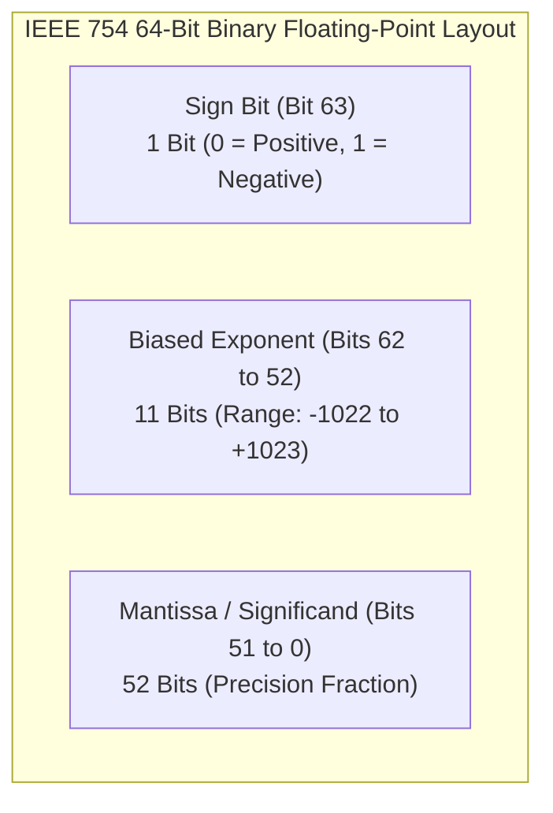
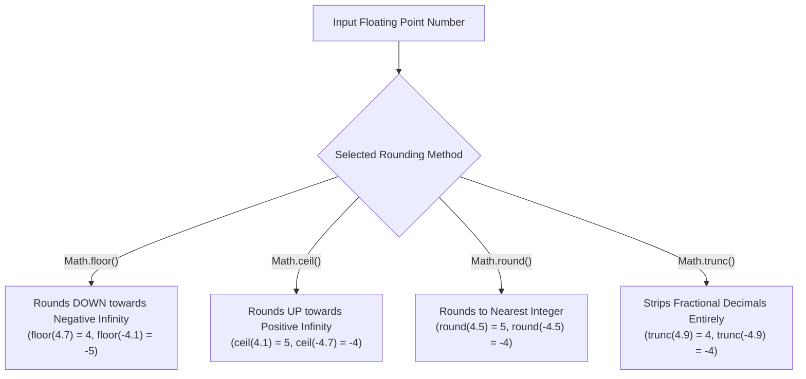

# Module 04: Numbers and Math — IEEE 754 Binary Floats, V8 Smi Optimizations, and `Math` Utilities

## Overview

JavaScript represents numbers using a single primitive data type: **IEEE 754 Double-Precision 64-bit Binary Floating-Point Numbers**.

Under the hood, V8 optimizes integer operations using **Smi (Small Integer)** 31-bit signed integer pointers to avoid heap allocations.

Understanding binary floating-point representation, `Number.EPSILON` comparison thresholds, rounding semantics (`floor`, `ceil`, `round`, `trunc`), secure random number generation (`crypto.getRandomValues`), and string parsing radix rules is vital for building bug-free software.

---

## 1. The IEEE 754 64-Bit Binary Float Memory Layout

Every JavaScript number is allocated across **64 bits** of memory:



### Floating-Point Binary Imprecision (`0.1 + 0.2 !== 0.3`)

Decimals like `0.1` and `0.2` cannot be expressed as exact finite binary fractions, leading to small representation errors:

```javascript
console.log(0.1 + 0.2);             // Output: 0.30000000000000004
console.log(0.1 + 0.2 === 0.3);     // false!

// Production Fix: Compare floating-point values using Number.EPSILON threshold
function nearlyEqualFloats(a, b) {
  return Math.abs(a - b) < Number.EPSILON;
}

console.log(nearlyEqualFloats(0.1 + 0.2, 0.3)); // true
```

---

## 2. V8 Numeric Architecture: Smi vs. HeapNumber

```mermaid
flowchart TD
    JSNum[JavaScript Numeric Allocation] --> CheckSmi{Is integer inside 31-bit signed range?<br/>(-2³⁰ to +2³⁰ - 1)}

    CheckSmi -- Yes --> Smi["1. Smi (Small Integer)<br/>- Stored IN-PLACE in register/stack<br/>- Zero Heap Allocation & Zero GC Overhead!"]

    CheckSmi -- No --> HeapNumber["2. HeapNumber<br/>- Allocated in Memory Heap<br/>- Boxed 64-bit IEEE float pointer"]
```

---

## 3. Rounding Semantics: `floor`, `ceil`, `round`, `trunc`



```javascript
// Comparing Rounding Behavior for Positive and Negative Numbers
const pos = 4.7;
const neg = -4.7;

console.log("Math.floor:", Math.floor(pos), Math.floor(neg)); // 4, -5
console.log("Math.ceil :", Math.ceil(pos),  Math.ceil(neg));  // 5, -4
console.log("Math.round:", Math.round(pos), Math.round(neg)); // 5, -5
console.log("Math.trunc:", Math.trunc(pos), Math.trunc(neg)); // 4, -4
```

---

## 4. `Math.random()` vs. Cryptographically Secure Random Generation

```mermaid
flowchart LR
    subgraph Math.random (Non-Cryptographic PRNG)
        MathRand["Math.random()<br/>- Uses xoroshiro128+ PRNG<br/>- FAST, but predictable! (DO NOT use for Security)"]
    end

    subgraph Crypto Web API (Cryptographically Secure)
        CryptoAPI["crypto.getRandomValues()<br/>- OS-level Hardware Entropy<br/>- Cryptographically Secure (Tokens, Passwords)"]
    end
```

```javascript
// 1. Standard Pseudo-Random Bounded Integer Range [min, max]
function getRandomInt(min, max) {
  const minCeil = Math.ceil(min);
  const maxFloor = Math.floor(max);
  return Math.floor(Math.random() * (maxFloor - minCeil + 1)) + minCeil;
}

console.log("Random Die Roll (1-6):", getRandomInt(1, 6));

// 2. Cryptographically Secure Token Generation (Node.js & Browsers)
function generateSecureRandomByte() {
  const byteArray = new Uint8Array(1);
  crypto.getRandomValues(byteArray);
  return byteArray[0];
}

console.log("Secure Random Byte (0-255):", generateSecureRandomByte());
```

---

## 5. String Parsing Radix Rules & `toFixed()` Nuances

```javascript
// 1. Number Parsing with Explicit Radix Base (ALWAYS specify Radix 10!)
console.log(Number.parseInt("42px", 10));    // 42
console.log(Number.parseInt("010", 10));     // 10
console.log(Number.parseFloat("3.14159"));  // 3.14159

// 2. toFixed() Formats Decimals (Returns STRING, NOT Number!)
const price = 19.9982;
const formattedPrice = price.toFixed(2);
console.log(formattedPrice, typeof formattedPrice); // "20.00", "string"

// Parse formatted string back to Number if needed
const numericPrice = Number(formattedPrice);
console.log(numericPrice, typeof numericPrice);     // 20, "number"
```

---

## Key Production Takeaways

1. **Compare Floating-Point Numbers using `Number.EPSILON`**: Never compare calculated decimal floats with `===`. Use `Math.abs(a - b) < Number.EPSILON`.
2. **Always Pass Radix 10 to `Number.parseInt()`**: Always specify `10` as the second argument (`Number.parseInt(str, 10)`) to avoid legacy octal parsing bugs.
3. **Use `crypto.getRandomValues()` for Security Tokens**: Never use `Math.random()` for auth tokens, session IDs, or password resets; use `crypto.getRandomValues()`.
4. **Remember `toFixed()` Returns a String**: `num.toFixed(d)` outputs a formatted string. Cast it back to a Number with `Number()` if subsequent arithmetic is required.

