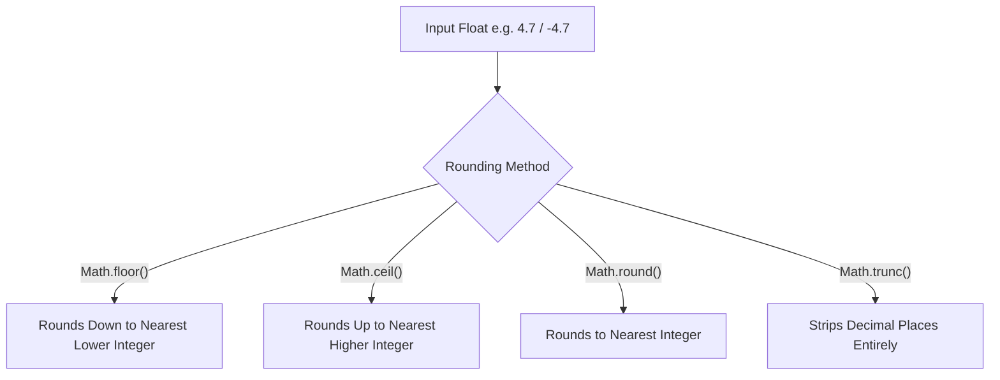

# File 04: Numbers and Math

## Overview
JavaScript handles numbers using standard **IEEE 754 Double-Precision 64-bit Floating-Point** format. The built-in `Math` object provides mathematical constants and functions for rounding, exponentiation, and random number generation.

---

## 1. Number Operators & Floating Point Precision

```javascript
// Arithmetic Operators
console.log(10 + 3);  // 13
console.log(10 - 3);  // 7
console.log(10 * 3);  // 30
console.log(10 / 3);  // 3.3333333333333335
console.log(10 % 3);  // 1 (Remainder / Modulo)
console.log(2 ** 4);  // 16 (Exponentiation)

// IEEE 754 Precision Issue
console.log(0.1 + 0.2); // 0.30000000000000004
```

---

## 2. Rounding Methods with `Math`



```javascript
console.log(Math.floor(4.9));  // 4
console.log(Math.ceil(4.1));   // 5
console.log(Math.round(4.5));  // 5
console.log(Math.trunc(4.9));  // 4

// Negative rounding nuance
console.log(Math.floor(-4.1)); // -5 (Rounds DOWN towards negative infinity)
console.log(Math.trunc(-4.1)); // -4 (Strips fractional part)
```

---

## 3. Useful `Math` Utilities

```javascript
// Min & Max
console.log(Math.min(10, 5, 20, 3)); // 3
console.log(Math.max(10, 5, 20, 3)); // 20

// Square Root & Absolute Values
console.log(Math.sqrt(16)); // 4
console.log(Math.abs(-42));  // 42

// Random Number Generation (Range [min, max])
function getRandomInt(min, max) {
    return Math.floor(Math.random() * (max - min + 1)) + min;
}
console.log(getRandomInt(1, 10)); // Returns integer between 1 and 10
```

---

## 4. Number Parsing & Methods
- `Number.parseInt(str, radix)`: Parses strings into integers.
- `Number.parseFloat(str)`: Parses strings into floating-point numbers.
- `num.toFixed(digits)`: Formats numbers to fixed decimal places (returns a string).

```javascript
console.log(Number.parseInt("42px", 10)); // 42
console.log(Number.parseFloat("3.14159")); // 3.14159
console.log((12.3456).toFixed(2));        // "12.35" (String)
```

---

## Key Takeaways
1. All standard JS numbers are **64-bit floating-point** numbers.
2. Use **`Math.floor()`** to round down, **`Math.ceil()`** to round up, and **`Math.trunc()`** to drop decimals.
3. Always supply a **radix (base 10)** when calling `Number.parseInt()`.
4. `toFixed()` returns a **string representation**; parse it back to a Number if further calculations are needed.
