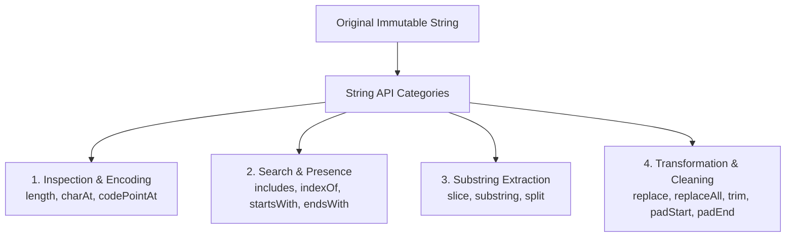
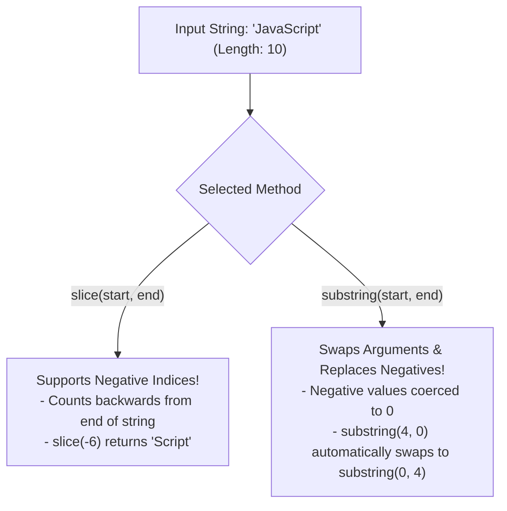

# Module 05: Strings and String Methods — UTF-16 Code Units, Substring Extraction, and V8 Storage

## Overview

JavaScript strings are **immutable sequences of UTF-16 code units** used to represent textual data.

Because primitive strings are immutable, operations that appear to modify a string (such as `.toUpperCase()`, `.replace()`, or `.trim()`) allocate and return a brand-new string in memory without altering the original value.

Understanding UTF-16 **Surrogate Pairs**, V8 internal string representations (`SeqOneByteString`, `ConsString`, `SlicedString`), and differences between `.slice()` and `.substring()` is essential for writing performant string manipulation logic.

---

## 1. String Methods Taxonomy Architecture



---

## 2. UTF-16 Code Units vs. Unicode Code Points

JavaScript strings index characters by 16-bit **UTF-16 Code Units**:
- **Standard ASCII / Latin-1 Characters**: Fit within a single 16-bit code unit (`length === 1`).
- **Emojis & Supplementary Symbols**: Occupy **Surrogate Pairs** (two 16-bit code units: High Surrogate + Low Surrogate), resulting in `.length === 2`.

```javascript
const text = "Hello";
console.log(text.length); // 5 Code Units

const rocketEmoji = "🚀";
console.log(rocketEmoji.length);       // 2 Code Units (Surrogate Pair!)
console.log([...rocketEmoji].length);  // 1 Unicode Code Point (Spread iterator splits by code point)

console.log(rocketEmoji.charCodeAt(0).toString(16));  // "d83d" (High Surrogate)
console.log(rocketEmoji.codePointAt(0).toString(16)); // "1f680" (Full Code Point)
```

---

## 3. Substring Extraction: `slice()` vs. `substring()`



### `slice()` vs. `substring()` Comparison Matrix

| Feature / Behavior | `slice(start, end)` | `substring(start, end)` |
| :--- | :--- | :--- |
| **Negative Indices (`< 0`)** | Counts backwards from end of string | Coerced automatically to `0` |
| **`start > end` Handling** | Returns empty string `""` | Swaps arguments automatically (`start` becomes `end`) |
| **Recommendation** | **Standard Choice (Predictable)** | Avoid (Inconsistent argument swapping) |

```javascript
const str = "JavaScript";

// 1. Standard Extraction
console.log(str.slice(0, 4));      // "Java"
console.log(str.substring(0, 4));  // "Java"

// 2. Negative Indexing Nuance
console.log(str.slice(-6));        // "Script" (Counts 6 characters from end)
console.log(str.substring(-6));    // "JavaScript" (-6 coerced to 0 -> substring(0))

// 3. Start > End Argument Swapping Nuance
console.log(str.slice(4, 0));      // "" (Empty string)
console.log(str.substring(4, 0));  // "Java" (Swaps 4 and 0 -> substring(0, 4))
```

---

## 4. V8 Internal String Storage: `SlicedString` Memory Leak Hazard

```mermaid
flowchart LR
    subgraph SlicedString Memory Pointer Risk
        ParentPayload["Parent Payload String (10 MB RAM)"] <-- Pointer -- SlicedResult["SlicedString ('HEADER')<br/>- Offset: 10000000 | Length: 6"]
    end
```

> [!WARNING]
> **SlicedString Memory Leak**: Calling `.slice()` or `.substring()` on a massive string returns a V8 `SlicedString` that retains a pointer to the entire parent string payload. To allow the 10MB parent string to be Garbage Collected, force V8 to create an independent string by concatenating space (`(" " + slice).slice(1)`).

```javascript
// Sanitizing and Formatting User Input Strings
function sanitizeEmail(rawEmail) {
  if (typeof rawEmail !== "string") return "";

  return rawEmail
    .trim()                 // Strips leading and trailing whitespace
    .toLowerCase()          // Normalizes character casing
    .replace(/\s+/g, "");   // Removes internal whitespace gaps
}

console.log("Clean Email:", sanitizeEmail("   User.Name @ Domain.com \n ")); // "user.name@domain.com"
```

---

## Key Production Takeaways

1. **Prefer `slice()` over `substring()`**: Use `.slice()` for substring extraction because its negative index support is explicit and predictable.
2. **Handle Emojis with `[...str]` or `codePointAt()`**: Remember that Emojis occupy 2 UTF-16 code units (`length === 2`). Use spread iteration `[...str]` to measure real user-perceived character lengths.
3. **Beware of SlicedString Memory Retention**: When extracting tiny substrings from multi-megabyte payloads, force string copying to release references to large parent payloads.
4. **Use `replaceAll()` for Global Replacements**: Use `str.replaceAll("old", "new")` instead of global regex literals when replacing simple static text patterns.

