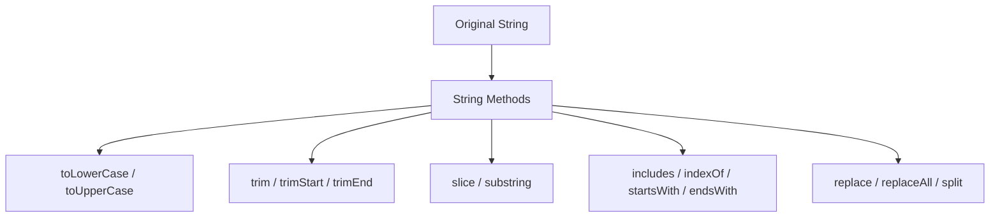

# File 05: Strings and String Methods

## Overview
JavaScript strings are immutable sequences of UTF-16 code units used to represent textual data. Because strings are primitive values, all string transformation methods return brand new strings rather than mutating the original variable.

---

## 1. Essential String Methods



---

## 2. Searching & Inspection Methods

```javascript
const text = "JavaScript is awesome and powerful";

// Case-sensitive searching
console.log(text.includes("awesome"));    // true
console.log(text.startsWith("Java"));     // true
console.log(text.endsWith("ful"));        // true
console.log(text.indexOf("is"));          // 11
```

---

## 3. Substring Extraction: `slice()` vs `substring()`
Both extract parts of a string between specified indices:

```javascript
const str = "JavaScript";

// slice(start, end) — Supports negative indices (counts from end)
console.log(str.slice(0, 4));   // "Java"
console.log(str.slice(-6));     // "Script"

// substring(start, end) — Swaps negative values to 0
console.log(str.substring(0, 4)); // "Java"
```

---

## 4. Replacement & Splitting

```javascript
const sentence = "The quick brown fox jumps over the lazy dog";

// Replace single occurrence vs all occurrences
console.log(sentence.replace("fox", "cat"));
console.log("foo bar foo".replaceAll("foo", "baz")); // "baz bar baz"

// Splitting string into Array
const csv = "Apple,Banana,Orange";
const fruits = csv.split(","); // ["Apple", "Banana", "Orange"]
```

---

## 5. Trimming & Case Conversion

```javascript
const rawInput = "   hello@example.com  \n";

const cleanEmail = rawInput.trim().toLowerCase();
console.log(`'${cleanEmail}'`); // 'hello@example.com'
```

---

## Key Takeaways
1. Strings are **immutable**; methods always return a new string.
2. Prefer **`slice()`** over `substring()` due to negative index support.
3. Use **`includes()`**, **`startsWith()`**, and **`endsWith()`** for boolean string searching.
4. Chain `.trim().toLowerCase()` to sanitize user input strings cleanly.
