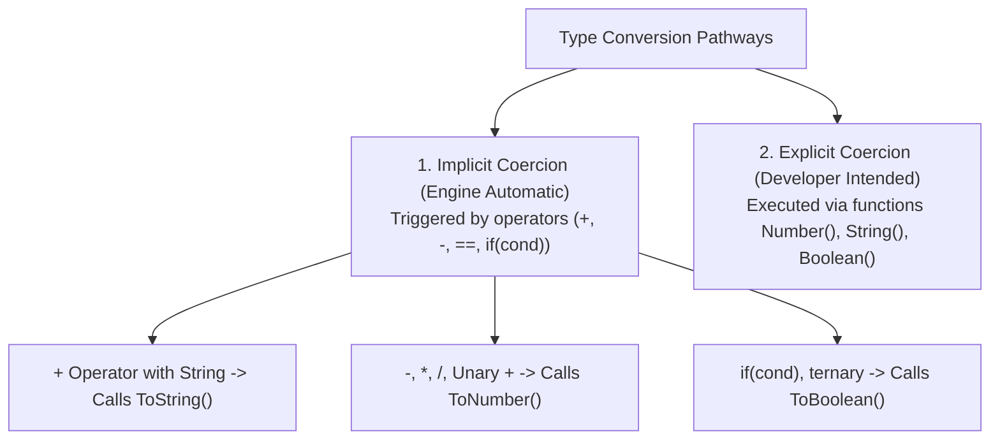
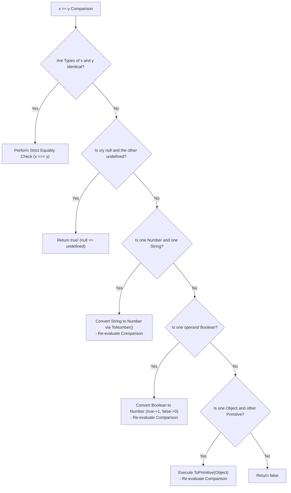

# Module 07: Type Coercion — Abstract Equality, `ToPrimitive` Algorithm, and Coercion Quirks

## Overview

**Type Coercion** is the automatic (implicit) or manual (explicit) conversion of values from one data type to another in JavaScript.

Because JavaScript is dynamically and weakly typed, binary operators (`+`, `-`, `==`) trigger implicit type coercion rules specified by ECMAScript abstract operations like `ToPrimitive`, `ToNumber`, and `ToString`.

Understanding the **12-Step Abstract Equality (`==`) Algorithm**, how `[Symbol.toPrimitive]` customizes object conversion, and why `===` must always be preferred over `==` prevents subtle bugs in enterprise software.

---

## 1. Implicit vs. Explicit Type Conversion



---

## 2. The ECMAScript `ToPrimitive` Algorithm

When an object is evaluated in an operation requiring a primitive value (e.g. `obj + 5` or `obj == "test"`), the JS engine executes the internal **`ToPrimitive(input, preferredType)`** abstract operation:

```mermaid
flowchart TD
    InputObj[Input Object to Convert] --> CheckSymbol{Has [Symbol.toPrimitive] Method?}
    
    CheckSymbol -- Yes --> ExecSymbol["Execute [Symbol.toPrimitive](hint)<br/>- Return Primitive Result"]
    
    CheckSymbol -- No --> CheckHint{Preferred Type Hint?}
    
    CheckHint -- "string" --> TryString["1. Call obj.toString()<br/>2. If Primitive -> Return<br/>3. Else Call obj.valueOf()<br/>4. If Primitive -> Return<br/>5. Else -> Throw TypeError"]
    
    CheckHint -- "number / default" --> TryNumber["1. Call obj.valueOf()<br/>2. If Primitive -> Return<br/>3. Else Call obj.toString()<br/>4. If Primitive -> Return<br/>5. Else -> Throw TypeError"]
```

```javascript
// Customizing Object Coercion via [Symbol.toPrimitive]
const wallet = {
  balance: 5000,
  currency: "INR",
  [Symbol.toPrimitive](hint) {
    if (hint === "number") return this.balance;
    if (hint === "string") return `${this.balance} ${this.currency}`;
    return this.balance; // Default hint
  }
};

console.log(+wallet);          // 5000 (Hint: "number")
console.log(`${wallet}`);       // "5000 INR" (Hint: "string")
console.log(wallet + 500);      // 5500 (Hint: "default")
```

---

## 3. Loose Equality (`==`) vs. Strict Equality (`===`)

### The 12-Step Abstract Equality Algorithm (`==`)



### Famous JavaScript Coercion Quirks Matrix

| Expression | Evaluated Result | Internal ECMAScript Coercion Sequence |
| :--- | :--- | :--- |
| **`"5" == 5`** | `true` | String `"5"` coerced to Number `5`. |
| **`0 == false`** | `true` | Boolean `false` coerced to Number `0`. |
| **`null == undefined`** | `true` | Special ECMAScript specification rule. |
| **`[] == false`** | `true` | `[]` $\to$ `""` $\to$ `0`; `false` $\to$ `0`. Both equal `0`. |
| **`[] + []`** | `""` | Both arrays coerced to empty strings `"" + ""`. |
| **`[] + {}`** | `"[object Object]"` | `[]` coerced to `""`; `{}` coerced to `"[object Object]"`. |

```javascript
// Strict Equality (===) vs Loose Equality (==)
console.log(5 === "5");        // false (Different types: number vs string)
console.log(5 == "5");         // true (Implicit string coercion)

console.log(null === undefined); // false
console.log(null == undefined);  // true
```

---

## 4. Production Explicit Conversion Best Practices

Always perform **Explicit Type Conversions** using built-in constructor functions (`Number()`, `String()`, `Boolean()`):

```javascript
const rawInput = " 42.50 ";

// 1. Explicit Number Conversion
const numericVal = Number(rawInput.trim()); // 42.5
console.log(numericVal, typeof numericVal);

// 2. Explicit String Conversion
const stringVal = String(100); // "100"

// 3. Explicit Boolean Conversion (Double NOT Operator Shortcut)
const isNonEmpty = !!"User Content"; // true
console.log(isNonEmpty, typeof isNonEmpty); // true, "boolean"
```

---

## Key Production Takeaways

1. **Always Use Strict Equality (`===`)**: Never use loose equality (`==`) in business logic to prevent unpredictable implicit coercion edge cases.
2. **Use `+` Operator for String Concatenation Only**: Remember that `+` with a string operand forces string conversion for all operands.
3. **Use Unary `+` or `Number()` for Explicit Number Conversion**: Convert numerical user input strings using `Number(str)` or `+str`.
4. **Leverage `[Symbol.toPrimitive]` for Custom Domain Objects**: Implement `[Symbol.toPrimitive]` when creating custom mathematical or value-object classes that require custom string or number conversions.

