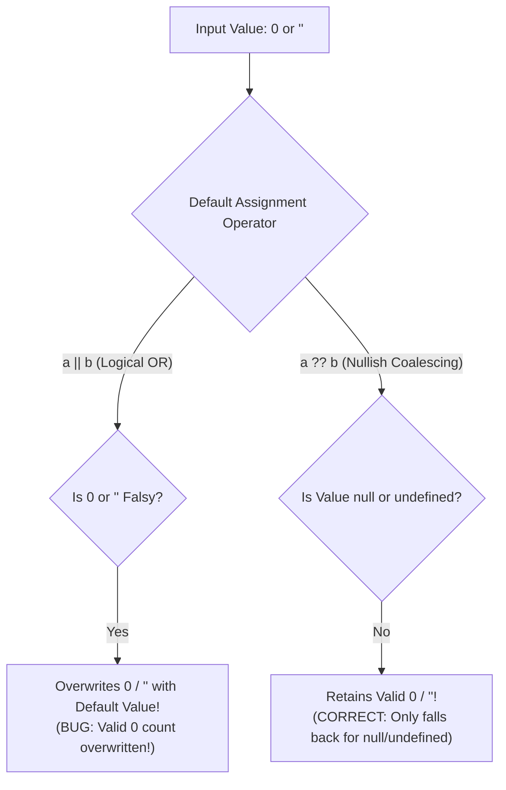

# Module 08: Booleans and Truthy / Falsy Values — The 8 Falsy Values, Short-Circuiting, and Nullish Coalescing

## Overview

In JavaScript, every value evaluates to either **`true`** or **`false`** when placed inside a boolean context (such as an `if` condition, ternary expression, or logical operator evaluation).

Under the ECMAScript specification, values that evaluate to `false` in a boolean context are categorized as **Falsy**. All other values—including empty arrays `[]` and empty objects `{}`—are **Truthy**.

Understanding the **8 Exact Falsy Values**, short-circuiting logic (`&&`, `||`), and the difference between Logical OR (`||`) defaults and **Nullish Coalescing (`??`)** prevents critical control-flow bugs.

---

## 1. The 8 Falsy Values in ECMAScript

```mermaid
flowchart TD
    JSValues[JavaScript Value Evaluation] --> FalsySet[The Exactly 8 Falsy Values]
    JSValues --> TruthySet[Everything Else: TRUTHY!<br/>Includes empty arrays [] and empty objects {}]

    FalsySet --> F1["1. false"]
    FalsySet --> F2["2. 0 (Positive Zero)"]
    FalsySet --> F3["3. -0 (Negative Zero)"]
    FalsySet --> F4["4. 0n (BigInt Zero)"]
    FalsySet --> F5["5. '' (Empty String)"]
    FalsySet --> F6["6. null"]
    FalsySet --> F7["7. undefined"]
    FalsySet --> F8["8. NaN (Not-a-Number)"]
```

> [!IMPORTANT]
> **Empty Containers are Truthy**: Empty arrays `[]`, empty objects `{}`, and strings containing whitespace `" "` evaluate to `true` in JavaScript!

---

## 2. Boolean Casting Mechanisms: `Boolean()` vs. Double NOT (`!!`)

```javascript
// 1. Explicit Casting using Boolean() Function
console.log(Boolean("Hello")); // true
console.log(Boolean(""));      // false
console.log(Boolean(0));       // false
console.log(Boolean([]));      // true (Empty Array is TRUTHY!)
console.log(Boolean({}));      // true (Empty Object is TRUTHY!)

// 2. Unary Double NOT (!!) Operator Shorthand
const inputString = "User Token Payload";
const isInputPresent = !!inputString; // true

console.log(!!null);      // false
console.log(!!undefined); // false
console.log(!!NaN);       // false
```

---

## 3. Short-Circuit Logical Operator Evaluation

```mermaid
flowchart TD
    subgraph Logical OR Operator (a || b)
        ORCheck{Is Left Operand 'a' TRUTHY?}
        ORCheck -- Yes --> ReturnA["Return Left Operand 'a' immediately! (Short-Circuits)"]
        ORCheck -- No --> ReturnB["Return Right Operand 'b'"]
    end

    subgraph Logical AND Operator (a && b)
        ANDCheck{Is Left Operand 'a' FALSY?}
        ANDCheck -- Yes --> ReturnA2["Return Left Operand 'a' immediately! (Short-Circuits)"]
        ANDCheck -- No --> ReturnB2["Return Right Operand 'b'"]
    end
```

```javascript
// 1. Logical OR (||): Returns FIRST Truthy Operand or LAST Falsy Operand
console.log("Anita" || "Default Name"); // "Anita"
console.log("" || "Fallback Name");      // "Fallback Name"

// 2. Logical AND (&&): Returns FIRST Falsy Operand or LAST Truthy Operand
console.log(true && "Execute Task");     // "Execute Task"
console.log(false && "Execute Task");    // false (Short-circuits!)

// Guard Clause Pattern via &&
const user = { isAuthenticated: true, renderUI: () => "Dashboard Rendered" };
const uiOutput = user.isAuthenticated && user.renderUI();
console.log(uiOutput); // "Dashboard Rendered"
```

---

## 4. The Logical OR (`||`) Zero-Bug vs. Nullish Coalescing (`??`)



```javascript
// 1. BUG: Using Logical OR (||) for Numeric Defaults (Overwrites valid 0!)
const itemCount = 0; // Valid user setting: 0 items
const itemsDisplayBad = itemCount || 10;
console.log("Logical OR Default (BUG):", itemsDisplayBad); // 10 (BUG! 0 was treated as falsy!)

// 2. FIX: Using Nullish Coalescing Operator (??)
const itemsDisplayGood = itemCount ?? 10;
console.log("Nullish Coalescing Default:", itemsDisplayGood); // 0 (CORRECT!)
```

---

## Key Production Takeaways

1. **Memorize the 8 Falsy Values**: `false`, `0`, `-0`, `0n`, `""`, `null`, `undefined`, `NaN`.
2. **Remember `[]` and `{}` are Truthy**: Never check array or object emptiness using `if (arr)` or `if (obj)`. Use `if (arr.length === 0)` or `if (Object.keys(obj).length === 0)`.
3. **Use Double NOT (`!!val`) for Boolean Casts**: Use `!!val` as a clean, idiomatic shorthand to convert any value into a strict boolean.
4. **Use `??` for Numeric and String Defaults**: Always prefer Nullish Coalescing (`??`) over Logical OR (`||`) when assigning default fallback values for numerical parameters or string settings.

