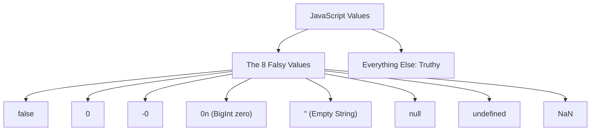

# File 08: Booleans and Truthy / Falsy Values

## Overview
Every value in JavaScript evaluates to either `true` or `false` when checked inside a boolean context (such as an `if` statement or logical operator). Values that evaluate to `false` are categorized as **Falsy**; all other values are **Truthy**.

---

## 1. The 8 Falsy Values in JavaScript



> **Important**: Empty arrays `[]` and empty objects `{}` are **TRUTHY** in JavaScript!

---

## 2. Testing Truthiness with `Boolean()` or `!!`

```javascript
console.log(Boolean("hello")); // true
console.log(Boolean(""));      // false
console.log(Boolean([]));      // true (Empty Array is Truthy!)
console.log(Boolean({}));      // true (Empty Object is Truthy!)
console.log(Boolean(0));       // false

// Unary Double NOT (!!) Shortcut
console.log(!!"data"); // true
console.log(!!null);   // false
```

---

## 3. Logical Operators: Short-Circuit Evaluation

### Logical OR (`||`)
Returns the **first truthy operand**, or the last operand if all are falsy.

### Logical AND (`&&`)
Returns the **first falsy operand**, or the last operand if all are truthy.

```javascript
// Short-Circuit OR: Provides fallback defaults
const username = "" || "Guest User";
console.log(username); // "Guest User"

// Short-Circuit AND: Guard clause execution
const userLoggedIn = true;
userLoggedIn && console.log("Render Dashboard UI");
```

---

## 4. Nuance: Logical OR (`||`) Bug with `0`
Using `||` for numeric defaults can cause bugs because `0` is falsy:

```javascript
const count = 0;
const displayCount = count || 10;
console.log(displayCount); // 10 (BUG! 0 was overwritten!)

// Fix: Use Nullish Coalescing (??) which checks ONLY null or undefined
const safeDisplayCount = count ?? 10;
console.log(safeDisplayCount); // 0 (Correct!)
```

---

## Key Takeaways
1. Memorize the **8 Falsy values**: `false`, `0`, `-0`, `0n`, `""`, `null`, `undefined`, `NaN`.
2. **`[]` and `{}` are TRUTHY**.
3. Use **`!!val`** as a shorthand to cast any value to a strict boolean.
4. Use **`??`** instead of `||` when setting numeric defaults to handle `0` correctly.
