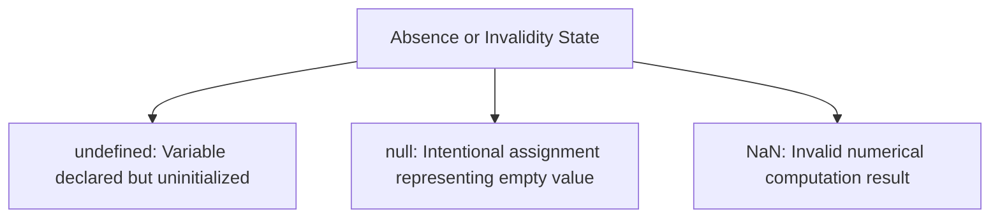

# File 09: Null, Undefined, and NaN

## Overview
`null`, `undefined`, and `NaN` are special primitive values in JavaScript representing absent, uninitialized, or invalid data states.

---

## 1. Comparing Null vs Undefined vs NaN



### Characteristics Comparison

| Value | Meaning | `typeof` Output | `Number(val)` Coercion |
| :--- | :--- | :--- | :--- |
| **`undefined`** | System default for unassigned variables | `"undefined"` | `NaN` |
| **`null`** | Intentional empty variable assignment | `"object"` (Bug) | `0` |
| **`NaN`** | Computational failure / Not a Number | `"number"` | `NaN` |

---

## 2. Deep Dive: `undefined`
`undefined` is automatically assigned by JavaScript when:
1. A variable is declared without initialization (`let x;`).
2. A function lacks an explicit `return` statement.
3. An unassigned function argument is accessed.
4. A non-existent object property is accessed.

```javascript
let unassigned;
console.log(unassigned); // undefined

function noReturn() {}
console.log(noReturn()); // undefined
```

---

## 3. Deep Dive: `null`
`null` represents an **intentional assignment** indicating that a variable deliberately holds no object or value.

```javascript
let selectedItem = null; // Explicitly set to empty state
```

---

## 4. Deep Dive: `NaN` (Not a Number)
`NaN` is returned when mathematical operations fail or attempt invalid numeric conversions.

```javascript
console.log(0 / 0);          // NaN
console.log("hello" * 5);    // NaN

// NaN Comparison Quirks
console.log(NaN === NaN);    // false (NaN is NOT equal to itself!)

// Use Number.isNaN() for reliable checking
console.log(Number.isNaN(NaN)); // true
```

---

## Key Takeaways
1. **`undefined`** = Uninitialized by JavaScript.
2. **`null`** = Explicitly cleared/assigned empty value by developer.
3. **`NaN`** = Invalid math result (`NaN === NaN` returns `false`).
4. Always use **`Number.isNaN(val)`** to verify if a computation resulted in `NaN`.
