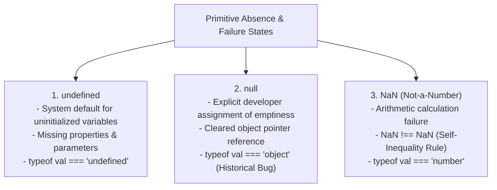
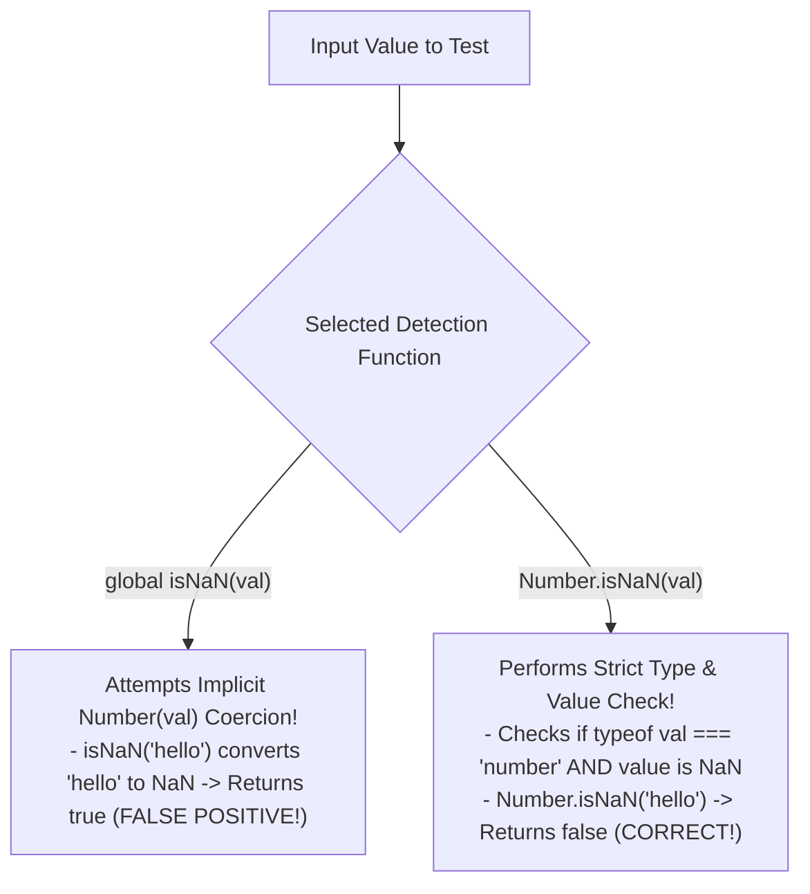

# Module 09: Null, Undefined, and NaN — Primitive Emptiness, `NaN` Quirks, and `Object.is()`

## Overview

`null`, `undefined`, and `NaN` are special primitive values in JavaScript representing absent, uninitialized, or computationally invalid data states.

While developers often treat `null` and `undefined` interchangeably, they have distinct semantics under the ECMAScript specification:
- **`undefined`**: System default representing an uninitialized binding or missing property/argument.
- **`null`**: Explicit assignment representing deliberate absence of any object reference pointer.
- **`NaN` (Not-a-Number)**: IEEE 754 numeric representation of an invalid or unrepresentable arithmetic calculation.

Understanding their differences, detection methods (`Number.isNaN()` vs global `isNaN()`), and equality behavior with `Object.is()` is essential.

---

## 1. Emptiness & Computational Failure Taxonomy



### Detailed Feature Comparison Matrix

| Property / Behavior | `undefined` | `null` | `NaN` |
| :--- | :--- | :--- | :--- |
| **Semantic Meaning** | Uninitialized / Missing binding | Deliberate absence of object value | Computational math failure |
| **`typeof` Operator Output**| `"undefined"` | `"object"` (Historical JS Bug) | `"number"` |
| **Numeric Coercion `Number(x)`**| `NaN` | `0` | `NaN` |
| **JSON Serialization** | Omitted from JSON output | Preserved as `null` | Converted to `null` |
| **Default Parameter Trigger**| **Triggers default parameter** | Does NOT trigger default parameter | Does NOT trigger default parameter |

---

## 2. Deep Dive: `undefined` vs. `null` in Default Parameters

```javascript
// 1. System Scenarios Generating 'undefined'
let declaredVar;
console.log("Uninitialized var:", declaredVar); // undefined

function getProductInfo(user, role) {
  console.log("Missing Parameter 'role':", role); // undefined
}
getProductInfo({ name: "Rohan" });

const emptyObj = {};
console.log("Missing Property:", emptyObj.price); // undefined

// 2. Default Parameters: 'undefined' Triggers Default, 'null' Does NOT!
function renderAvatar(imageUrl = "default-avatar.png") {
  return `Rendering ${imageUrl}`;
}

console.log(renderAvatar(undefined)); // "Rendering default-avatar.png" (Triggered default!)
console.log(renderAvatar(null));      // "Rendering null" (NULL Bypasses default parameter!)
```

---

## 3. Deep Dive: `NaN` Quirks & Verification (`Number.isNaN`)

`NaN` is the only value in JavaScript that is **not equal to itself**:

```javascript
console.log(NaN === NaN); // false!
console.log(NaN == NaN);  // false!
```

### `Number.isNaN()` vs. Global `isNaN()`



```javascript
// Global isNaN() vs. ES6 Number.isNaN()
const invalidMath = 0 / 0;        // NaN
const textString = "Hello World"; // String

// BAD: Legacy global isNaN() coercively converts strings!
console.log(isNaN(textString));       // true (FALSE POSITIVE! Converts "Hello World" -> NaN)

// GOOD: Robust ES6 Number.isNaN() checks without coercion!
console.log(Number.isNaN(invalidMath)); // true (Correct!)
console.log(Number.isNaN(textString));  // false (Correct! String is not NaN)
```

---

## 4. Same-Value Equality Matrix via `Object.is()`

`Object.is(a, b)` evaluates same-value equality without implicit coercion, fixing IEEE 754 float quirks for `NaN` and signed zeros (`-0` vs `+0`):

```javascript
// Object.is() Corrects Standard Equality Quirks
console.log(Object.is(NaN, NaN));   // true (Unlike === which returns false!)
console.log(Object.is(-0, +0));     // false (Unlike === which returns true!)

console.log(Object.is(null, undefined)); // false
console.log(Object.is(null, null));      // true
```

---

## Key Production Takeaways

1. **Use `null` for Explicit Emptiness**: Assign `null` when deliberately clearing object references or signaling an empty initial state.
2. **Never Pass `null` expecting Default Parameters**: Default function parameters (`fn(arg = default)`) only trigger for `undefined`. Passing `null` overrides defaults.
3. **Always Use `Number.isNaN()`**: Never use `NaN === NaN` or legacy global `isNaN()`. Always use `Number.isNaN(val)` to check for computational NaN results.
4. **Use `Object.is()` for Accurate Same-Value Comparison**: Use `Object.is(a, b)` when comparing numbers where `NaN` or `-0` precision matters.

