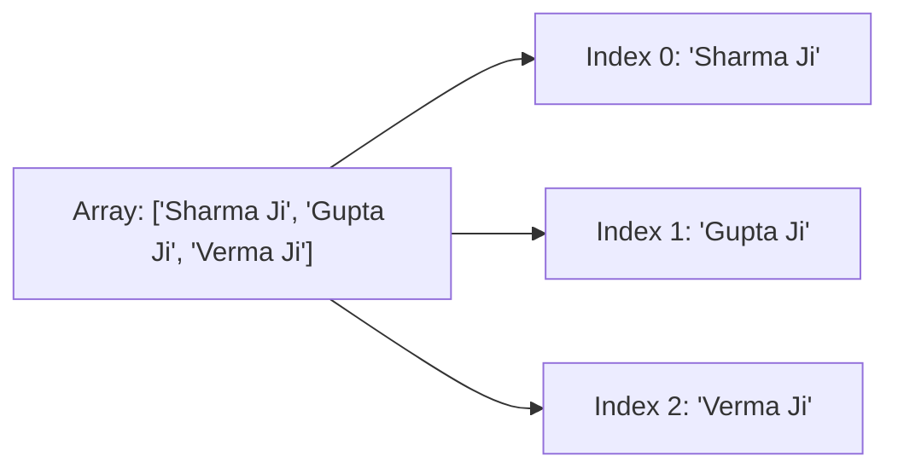

# File 10: Arrays

## Overview
An **Array** in JavaScript is an ordered list of elements. Arrays in JS are zero-indexed, dynamically resizable objects that can hold mixed data types.

---

## 1. Array Creation & Access



```javascript
// Array Literals
const passengers = ["Sharma Ji", "Gupta Ji", "Verma Ji"];

// Element Access & Length
console.log(passengers[0]);       // "Sharma Ji"
console.log(passengers.length);   // 3
console.log(passengers.at(-1));   // "Verma Ji" (ES2022 negative indexing)
```

---

## 2. Mutating Operations (`push`, `pop`, `shift`, `unshift`, `splice`)

```javascript
const list = ["B", "C"];

// Add / Remove from End (Fast O(1))
list.push("D");    // ["B", "C", "D"]
list.pop();        // ["B", "C"]

// Add / Remove from Beginning (Slow O(n) re-indexing)
list.unshift("A"); // ["A", "B", "C"]
list.shift();      // ["B", "C"]

// Splice (start, deleteCount, ...insertItems)
const compartment = ["Sharma", "Gupta", "Verma", "Iyer"];
compartment.splice(2, 1, "Storekeeper"); // Replaces index 2 ('Verma') with 'Storekeeper'
console.log(compartment); // ["Sharma", "Gupta", "Storekeeper", "Iyer"]
```

---

## 3. Non-Mutating Operations (`concat`, `slice`, `flat`)

```javascript
const groupA = [1, 2];
const groupB = [3, 4];

// Merge arrays without mutating originals
const combined = groupA.concat(groupB); // [1, 2, 3, 4]

// Extract slice (start, end)
const subset = combined.slice(1, 3); // [2, 3]

// Flatten nested arrays
const nested = [1, [2, [3, 4]]];
console.log(nested.flat(Infinity)); // [1, 2, 3, 4]
```

---

## 4. Array Searching (`indexOf`, `includes`, `find`)

```javascript
const items = ["Apple", "Banana", "Orange"];

console.log(items.indexOf("Banana"));   // 1
console.log(items.includes("Orange"));  // true

const users = [
    { id: 1, name: "Priya" },
    { id: 2, name: "Rajesh" }
];
const foundUser = users.find(u => u.id === 2); // { id: 2, name: "Rajesh" }
```

---

## Key Takeaways
1. Arrays are **zero-indexed** objects. Use `.at(-1)` for clean negative indexing.
2. `push`/`pop` operate on the end ($O(1)$); `unshift`/`shift` re-index the whole array ($O(n)$).
3. Use **`splice()`** to insert, remove, or replace elements in-place.
4. Use **`slice()`** and **`concat()`** to operate on arrays immutably.
