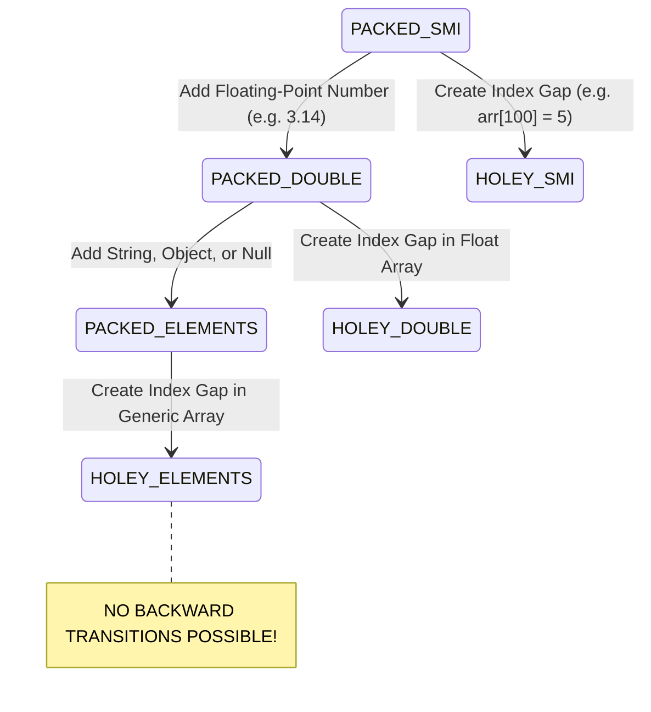

# Module 10: Arrays — V8 Element Kinds, Memory Layouts, and Time Complexity

## Overview

In JavaScript, an **Array** is an ordered, zero-indexed, dynamically resizable object collection.

Unlike low-level languages like C or Java where arrays are fixed contiguous memory blocks of a single data type, JavaScript arrays can store mixed data types and dynamically expand as needed.

Under the hood, Google V8 tracks array performance using **Element Kinds** (`PACKED_SMI`, `PACKED_DOUBLE`, `PACKED_ELEMENTS`, `HOLEY_*`), transitioning arrays along a one-way lattice from fast packed vector memory to slow dictionary mode.

---

## 1. V8 Array Element Kinds Architecture



### V8 Element Kinds Performance Breakdown

| Element Kind | Backing Store Memory Layout | Access Speed | Notes |
| :--- | :--- | :--- | :--- |
| **`PACKED_SMI`** | Contiguous 31-bit integer vector in RAM | **$\mathcal{O}(1)$ Fastest** | Dense array containing integers only. |
| **`PACKED_DOUBLE`** | Contiguous unboxed 64-bit IEEE float vector | $\mathcal{O}(1)$ Fast | Dense array containing floating point numbers. |
| **`PACKED_ELEMENTS`**| Contiguous tagged object pointer array | $\mathcal{O}(1)$ Moderate | Mixed objects, strings, booleans. |
| **`HOLEY_*`** | Array containing missing index slots ("holes") | **$5\times – 10\times$ Slower** | Must traverse prototype chain for missing keys! |

```javascript
// Demonstrating One-Way Element Kind Transitions
const numbers = [10, 20, 30];     // Kind: PACKED_SMI (Fastest)
numbers.push(4.5);                 // Transitions permanently to PACKED_DOUBLE!
numbers.push("item");              // Transitions permanently to PACKED_ELEMENTS!

numbers.pop();                     // Popping string DOES NOT transition back to PACKED_DOUBLE!
numbers[100] = 99;                 // Creates a hole -> Transitions permanently to HOLEY_ELEMENTS!
```

---

## 2. Array Method Time & Space Complexity Matrix

```mermaid
flowchart TD
    subgraph O(1) Constant Time Operations (Fast)
        PushPop["push() & pop()<br/>Operates strictly at the end of the array"]
        DirectAccess["arr[i] & arr.at(-1)<br/>Direct index pointer offset lookup"]
    end

    subgraph O(N) Linear Time Operations (Slower)
        ShiftUnshift["shift() & unshift()<br/>Re-indexes ALL elements across memory"]
        SpliceOp["splice(start, count)<br/>Shifts element pointers across memory"]
    end
```

### Operations Complexity Summary

| Array Method | Time Complexity | Mutates Original Array? | Primary Use Case |
| :--- | :--- | :--- | :--- |
| **`arr[i]` / `arr.at(-1)`** | $\mathcal{O}(1)$ Constant | No | Direct element access (ES2022 negative indexing). |
| **`push(x)` / `pop()`** | $\mathcal{O}(1)$ Amortized | **Yes** | Stack operations at end of array. |
| **`unshift(x)` / `shift()`**| **$\mathcal{O}(N)$ Linear** | **Yes** | Queue operations at start (Re-indexes array!). |
| **`splice(start, count)`** | $\mathcal{O}(N)$ Linear | **Yes** | In-place element removal or insertion. |
| **`slice(start, end)`** | $\mathcal{O}(N)$ Linear | No | Immutably extracting a range portion. |
| **`concat(arr2)`** | $\mathcal{O}(N + M)$ Linear | No | Immutably merging two arrays. |

---

## 3. Array Mutation vs. Non-Mutation Code Patterns

```javascript
// 1. Mutating Operations (Modifies Array In-Place)
const inventory = ["Laptop", "Monitor"];

inventory.push("Keyboard");      // ["Laptop", "Monitor", "Keyboard"]
inventory.pop();                // ["Laptop", "Monitor"]
inventory.unshift("Mouse");     // ["Mouse", "Laptop", "Monitor"]

// Splice: Insert at index 1 without deleting elements
inventory.splice(1, 0, "Webcam"); 
console.log("Mutated Inventory:", inventory); // ["Mouse", "Webcam", "Laptop", "Monitor"]

// 2. Non-Mutating Immutability Patterns (Returns New Array)
const baseList = [1, 2, 3];
const appendedList = [...baseList, 4]; // [1, 2, 3, 4]
const slicedList = baseList.slice(0, 2); // [1, 2]

console.log("Original Base List Unchanged:", baseList); // [1, 2, 3]
```

---

## 4. Contiguous Binary Memory: `TypedArray`

For high-performance graphics, WebAssembly interop, or WebSockets audio/video streaming, standard JS arrays incur too much overhead. Use **`TypedArray`** for flat contiguous binary buffers:

```javascript
// Allocates 16 Bytes of raw contiguous memory
const buffer = new ArrayBuffer(16);

// Int32Array view over the ArrayBuffer (4 32-bit integers)
const int32View = new Int32Array(buffer);
int32View[0] = 100;
int32View[1] = 200;

console.log(int32View.length);   // 4 Slots
console.log(int32View.byteLength); // 16 Bytes (Guaranteed fixed contiguous allocation)
```

---

## Key Production Takeaways

1. **Avoid `unshift()` and `shift()` in Hot Loops**: `unshift()` and `shift()` require V8 to re-index every element in memory ($\mathcal{O}(N)$). Use a circular queue or stack (`push`/`pop`) for $\mathcal{O}(1)$ operations.
2. **Keep Arrays Homogeneous and Dense**: Avoid mixing integers, floats, and objects in the same array to preserve fast `PACKED_SMI` element kinds. Never leave index gaps (`arr[100] = x`).
3. **Use `.at(-1)` for Clean Negative Indexing**: Prefer `arr.at(-1)` over `arr[arr.length - 1]` to access the final element of an array.
4. **Use `TypedArray` for Raw Numerical Datasets**: Use `Uint8Array` or `Float64Array` when processing megabytes of numerical telemetry or binary files to eliminate V8 object heap overhead.

