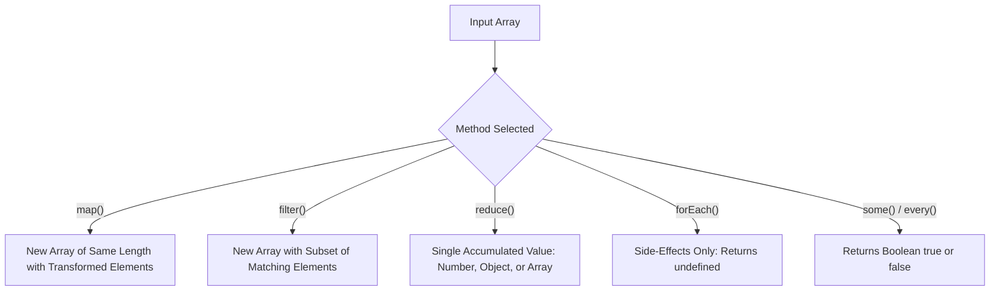

# File 11: Higher-Order Array Iteration Methods

## Overview
Higher-order array iteration methods (`map`, `filter`, `reduce`, `forEach`, `some`, `every`) take callback functions to process array data declaratively without writing manual `for` loops.

---

## 1. Functional Iteration Taxonomy



---

## 2. Iteration Methods Showcase

### `map()`
Transforms every item in an array into a new value, returning a new array of identical length.

```javascript
const prices = [100, 200, 300];
const pricesWithTax = prices.map(price => price * 1.18);
console.log(pricesWithTax); // [118, 236, 354]
```

### `filter()`
Returns a new array containing only elements that satisfy a predicate condition.

```javascript
const scores = [45, 82, 91, 55, 30];
const passingScores = scores.filter(score => score >= 60);
console.log(passingScores); // [82, 91]
```

### `reduce()`
Accumulates array elements down to a single value (such as a total sum, object map, or flattened array).

```javascript
const cart = [
    { item: "Book", price: 250 },
    { item: "Pen",  price: 50 },
    { item: "Bag",  price: 1200 }
];

const totalCost = cart.reduce((accumulator, currentItem) => {
    return accumulator + currentItem.price;
}, 0);

console.log(totalCost); // 1500
```

---

## 3. `some()` & `every()` Validation Methods

```javascript
const inventory = [
    { name: "Laptop", stock: 5 },
    { name: "Mouse",  stock: 0 },
    { name: "Screen", stock: 12 }
];

// Returns true if AT LEAST ONE item satisfies condition
const hasOutOfStock = inventory.some(item => item.stock === 0); // true

// Returns true ONLY IF ALL items satisfy condition
const allInStock = inventory.every(item => item.stock > 0);     // false
```

---

## 4. Chaining Higher-Order Array Methods

```javascript
const transactions = [100, -50, 400, -120, 300];

// Calculate total of positive deposits only
const totalDeposits = transactions
    .filter(amount => amount > 0)
    .map(amount => amount * 1.05) // Add 5% bonus
    .reduce((sum, amount) => sum + amount, 0);

console.log(totalDeposits); // 840
```

---

## Key Takeaways
1. Use **`map()`** to transform elements into a new array.
2. Use **`filter()`** to select a subset of elements based on a condition.
3. Use **`reduce()`** to combine array elements into a single aggregate result.
4. **`forEach()`** is used solely for executing side-effects and returns `undefined`.
