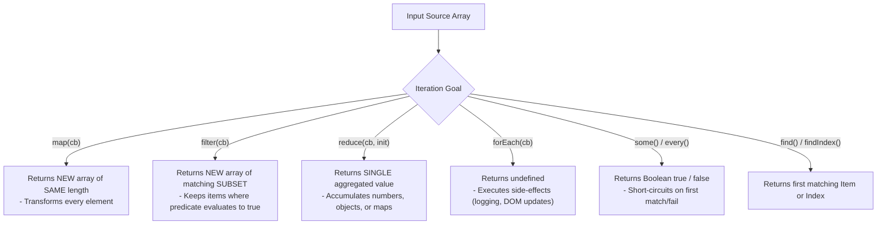
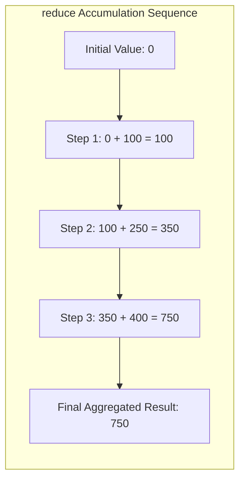

# Module 11: Higher-Order Array Iteration Methods — Functional Pipelines, Accumulators, and Performance

## Overview

JavaScript provides rich **Higher-Order Array Iteration Methods** (`map`, `filter`, `reduce`, `forEach`, `some`, `every`, `find`, `flatMap`) that accept callback functions to process array elements declaratively.

Unlike traditional imperative `for` loops where iteration indexes and state mutations must be managed manually, higher-order methods express **Data Transformations** cleanly.

Understanding how to construct **`reduce()` accumulators**, leverage **short-circuit validation (`some`/`every`)**, and avoid **intermediate array allocation overhead** during method chaining is essential for writing production-grade code.

---

## 1. Functional Iteration Taxonomy Architecture



---

## 2. Iteration Methods Showcase & Internal Behavior

### 1. Element Transformation (`map()`)

`map()` iterates over an array and applies a transformer callback to every element, returning a new array of identical length:

```javascript
const originalPrices = [100, 250, 400];
const pricesWithGST = originalPrices.map((price) => price * 1.18);

console.log("Original Prices:", originalPrices); // [100, 250, 400] (Unchanged)
console.log("Prices with GST:", pricesWithGST);   // [118, 295, 472]
```

### 2. Predicate Selection (`filter()`)

`filter()` tests every element against a boolean predicate function, constructing a new array containing only elements where the predicate returns `true`:

```javascript
const candidateScores = [45, 82, 91, 55, 30, 78];
const qualifyingScores = candidateScores.filter((score) => score >= 70);

console.log("Qualifying Scores:", qualifyingScores); // [82, 91, 78]
```

### 3. Aggregation Machine (`reduce()`)

`reduce()` processes an array elements left-to-right, accumulating state into a single output value (a number, object, map, or flattened structure):

$$\text{reduce((accumulator, currentValue, currentIndex, array) => accumulator, initialValue)}$$



```javascript
// Building an Index Map Object via reduce()
const rawUsers = [
  { id: "U1", name: "Anish", role: "Admin" },
  { id: "U2", name: "Bhavna", role: "Dev" },
  { id: "U3", name: "Chirag", role: "Dev" }
];

const userLookupMap = rawUsers.reduce((acc, user) => {
  acc[user.id] = user; // Build lookup table
  return acc;
}, {});

console.log("User Lookup Table:", userLookupMap["U2"].name); // "Bhavna"
```

---

## 3. Short-Circuit Validation: `some()` and `every()`

- **`some()`**: Checks if **at least one** element satisfies a condition. Returns `true` instantly and short-circuits further iteration upon finding the first match.
- **`every()`**: Checks if **all** elements satisfy a condition. Returns `false` instantly and short-circuits upon encountering the first failed check.

```javascript
const inventory = [
  { item: "Laptop", stock: 10 },
  { item: "Mouse",  stock: 0 },  // Out of stock
  { item: "Keyboard", stock: 5 }
];

const hasOutOfStockItems = inventory.some((item) => item.stock === 0);
console.log("Has Out-of-Stock Items:", hasOutOfStockItems); // true

const isEverythingInStock = inventory.every((item) => item.stock > 0);
console.log("Is Everything In Stock :", isEverythingInStock); // false
```

---

## 4. Method Chaining vs. Single-Pass Performance

```mermaid
flowchart TD
    subgraph Method Chaining (Allocates 2 Intermediate Arrays)
        Source1[Source Array: 10,000 items] --> FilterStep["1. filter(amount > 0)<br/>- Allocates Intermediate Array 1"]
        FilterStep --> MapStep["2. map(amount * 1.05)<br/>- Allocates Intermediate Array 2"]
        MapStep --> ReduceStep["3. reduce(sum)<br/>- Final Output"]
    end

    subgraph Single-Pass reduce (Zero Intermediate Array Allocation)
        Source2[Source Array: 10,000 items] --> SingleReduce["single-pass reduce()<br/>- Filters & Transforms in ONE iteration!"]
    end
```

```javascript
const transactions = [100, -50, 400, -120, 300, -10];

// 1. Declarative Method Chaining (Clean readability)
const totalDepositsChained = transactions
  .filter((amount) => amount > 0)
  .map((amount) => amount * 1.05)
  .reduce((sum, amount) => sum + amount, 0);

// 2. High-Performance Single-Pass reduce (Ideal for 100,000+ items to reduce GC pressure)
const totalDepositsSinglePass = transactions.reduce((sum, amount) => {
  if (amount > 0) {
    return sum + (amount * 1.05);
  }
  return sum;
}, 0);

console.log("Chained Result    :", totalDepositsChained);   // 840
console.log("Single-Pass Result:", totalDepositsSinglePass); // 840
```

---

## Key Production Takeaways

1. **Always Provide `initialValue` to `reduce()`**: Calling `reduce()` on an empty array without providing an `initialValue` throws a `TypeError: Reduce of empty array with no initial value`.
2. **Never Return Values from `forEach()`**: `forEach()` returns `undefined` and cannot be broken out of (`break`/`continue` do not work). Use `find()`, `some()`, or a standard `for...of` loop when early exits are required.
3. **Use Single-Pass `reduce()` for Massive Datasets**: When processing 100,000+ items, combine `.filter()` and `.map()` steps inside a single `.reduce()` pass to prevent creating temporary garbage-collected intermediate arrays.
4. **Prefer `find()` over `filter()[0]`**: `filter()[0]` scans the entire array before taking the first match ($\mathcal{O}(N)$), whereas `find()` short-circuits instantly upon locating the match ($\mathcal{O}(1)$ best case).

