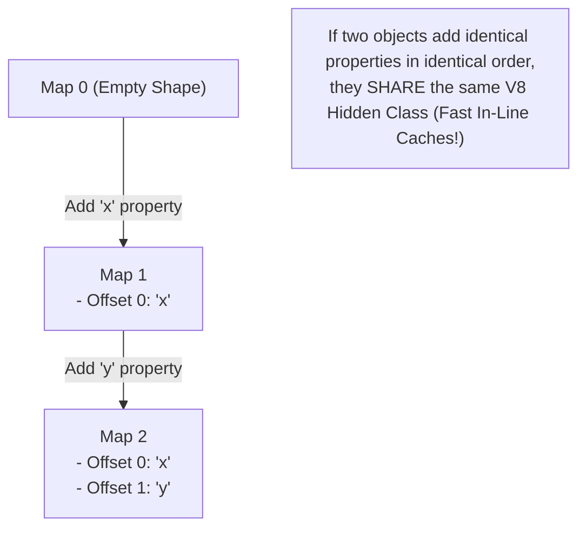
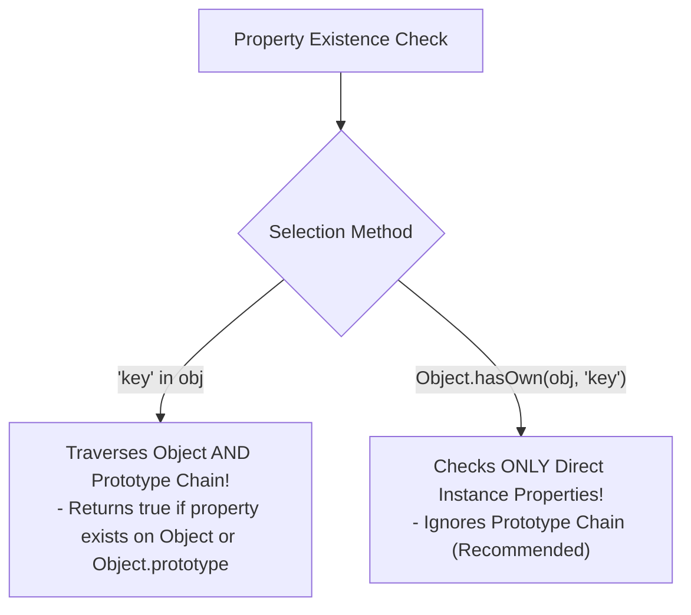

# Module 12: Objects and Properties — Hidden Classes, Property Descriptors, and V8 Storage

## Overview

An **Object** in JavaScript is a dynamic collection of key-value property bindings used to model domain entities or complex data structures.

Property keys are either Strings or Symbols, while property values can be any primitive type, array, nested object, or function (methods).

Under the hood, Google V8 optimizes JavaScript object performance by generating dynamic **Hidden Classes (Shapes)** and storing properties either as **Fast In-Object Properties** or **Slow Dictionary Properties**.

Understanding property descriptors (`writable`, `enumerable`, `configurable`), hidden class transition trees, property access syntax, and `Object.hasOwn()` is fundamental to JavaScript mastery.

---

## 1. V8 Hidden Classes (Shapes) & Transition Trees

Unlike statically typed languages like C++ or Java where object layouts are fixed at compile time, JavaScript allows properties to be added or deleted dynamically at runtime.

To maintain high execution speed, V8 creates internal **Hidden Classes (Maps / Shapes)** that track property offsets in memory:



```javascript
// Object Shape Optimization in V8
function User(name, role) {
  this.name = name; // Transition Map 0 -> Map 1
  this.role = role; // Transition Map 1 -> Map 2
}

const userA = new User("Anish", "Admin"); // Uses Map 2
const userB = new User("Bhavna", "Dev");  // Shares Map 2 (Fast Monomorphic IC!)

// PERFORMANCE ANTI-PATTERN: Deleting properties forces V8 into Slow Dictionary Mode!
delete userA.role; // Breaks Hidden Class optimization! Forces userA into slow dictionary lookup.
```

---

## 2. In-Object Fast Properties vs. Slow Dictionary Mode

```mermaid
flowchart LR
    subgraph Fast In-Object Properties (Default)
        ObjPointer["Object Pointer"] --> InObjectStorage["In-Object Array Buffer<br/>- Offset 0: name<br/>- Offset 1: role<br/>(O(1) Direct Offset Lookup)"]
    end

    subgraph Slow Dictionary Properties (Fallback)
        ObjPointer2["Object Pointer"] --> DictHashTable["Hash Table Backing Store<br/>- Key-Value Hash Map<br/>(Slow O(1) Hash Table Lookup)"]
    end
```

---

## 3. ECMAScript Property Descriptors

Every property on a JavaScript object has an underlying **Property Descriptor** controlling its attributes:

```javascript
const product = {};

// Define property with custom descriptors
Object.defineProperty(product, "sku", {
  value: "PROD-9001",
  writable: false,     // Cannot be re-assigned!
  enumerable: true,    // Appears in for...in and Object.keys()
  configurable: false  // Cannot be deleted or re-defined!
});

console.log(product.sku); // "PROD-9001"
// product.sku = "NEW-SKU"; // Fails silently in non-strict mode, throws TypeError in strict mode!

console.log(Object.getOwnPropertyDescriptor(product, "sku"));
/*
  Output:
  {
    value: 'PROD-9001',
    writable: false,
    enumerable: true,
    configurable: false
  }
*/
```

---

## 4. Property Access & ES6 Enhanced Literals

```javascript
const idKey = "user_id";
const roleValue = "Architect";

// 1. ES6 Enhanced Literals: Shorthands & Computed Keys
const userProfile = {
  [idKey]: "USR-77", // Computed Property Name
  roleValue,          // Property Shorthand (Equivalent to roleValue: roleValue)
  
  // Concise Method Definition Syntax
  getFormattedRole() {
    return `Role: ${this.roleValue}`;
  }
};

console.log(userProfile.user_id);         // "USR-77"
console.log(userProfile.getFormattedRole()); // "Role: Architect"

// 2. Bracket Notation for Dynamic Key Lookups
function getProperty(obj, keyName) {
  return obj[keyName]; // Requires bracket notation for dynamic expressions!
}

console.log(getProperty(userProfile, "roleValue")); // "Architect"
```

---

## 5. Property Existence Verification: `in` vs. `Object.hasOwn()`



```javascript
const vehicle = { make: "Tata", model: "Nexon" };

// 1. 'in' Operator: Checks instance AND inherited prototype properties
console.log("make" in vehicle);     // true (Direct instance property)
console.log("toString" in vehicle); // true (Inherited from Object.prototype!)

// 2. Object.hasOwn(): Checks ONLY direct instance properties (ES2022 Standard)
console.log(Object.hasOwn(vehicle, "make"));     // true (Direct instance property)
console.log(Object.hasOwn(vehicle, "toString")); // false (Inherited property ignored)
```

---

## Key Production Takeaways

1. **Avoid `delete obj.prop` in High-Performance Code**: Deleting properties forces V8 to discard fast Hidden Classes and revert objects to slow Dictionary Mode. Set properties to `null` or `undefined` instead.
2. **Initialize Object Properties in Identical Order**: Always instantiate object properties in the exact same sequence inside constructors to share V8 Hidden Classes and preserve monomorphic inline caches.
3. **Prefer `Object.hasOwn()` over `hasOwnProperty()`**: Use `Object.hasOwn(obj, key)` (ES2022) to test for direct property existence without prototype pollution vulnerabilities.
4. **Use `Object.defineProperty()` for Hidden / Immutable Properties**: Use property descriptors (`enumerable: false`, `writable: false`) when writing framework utilities or un-enumerable metadata fields.

