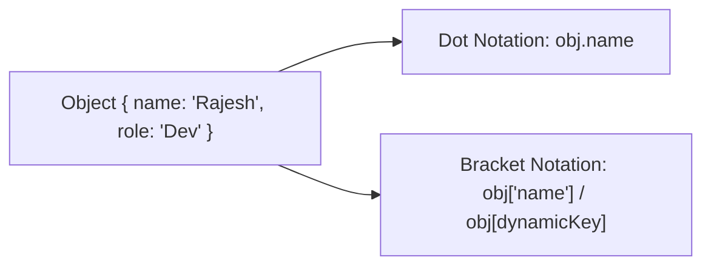

# File 12: Objects and Properties

## Overview
An **Object** in JavaScript is a key-value store used to represent real-world entities or complex data structures. Keys (properties) are strings or Symbols, while values can be any data type, including primitive values, arrays, or functions (methods).

---

## 1. Object Literal Syntax & Property Access



```javascript
const user = {
    name: "Rajesh",
    role: "Developer",
    "favorite-language": "JavaScript"
};

// Dot Notation (Clean & standard for valid identifier keys)
console.log(user.name); // "Rajesh"

// Bracket Notation (Required for dynamic keys or keys with hyphens/spaces)
const key = "role";
console.log(user[key]); // "Developer"
console.log(user["favorite-language"]); // "JavaScript"
```

---

## 2. Dynamic Property Additions & Deletions

```javascript
const product = { id: 101, name: "Phone" };

// Adding / Updating Properties
product.price = 25000;
product.name = "Smartphone";

// Deleting Properties
delete product.id;
console.log(product); // { name: "Smartphone", price: 25000 }
```

---

## 3. ES6 Enhanced Object Literals

```javascript
const name = "Priya";
const age = 28;
const dynamicKey = "status";

const userEnhanced = {
    name, // Shorthand for name: name
    age,  // Shorthand for age: age
    [dynamicKey]: "Active", // Computed Property Name
    greet() { // Method shorthand syntax
        return `Hello, ${this.name}`;
    }
};

console.log(userEnhanced.status); // "Active"
console.log(userEnhanced.greet()); // "Hello, Priya"
```

---

## 4. Property Existence Checking (`in` vs `hasOwnProperty`)

```javascript
const car = { make: "Tata", model: "Nexon" };

// 'in' operator checks object AND its prototype chain
console.log("make" in car); // true
console.log("toString" in car); // true (Inherited from Object.prototype!)

// Object.hasOwn() checks ONLY direct instance properties (Recommended)
console.log(Object.hasOwn(car, "make")); // true
console.log(Object.hasOwn(car, "toString")); // false
```

---

## Key Takeaways
1. Use **Dot Notation** for standard key access; use **Bracket Notation** for dynamic keys.
2. ES6 **property shorthands** allow writing `{ name }` instead of `{ name: name }`.
3. Use **Computed Property Names (`[key]`)** to define dynamic property names dynamically.
4. Prefer **`Object.hasOwn(obj, key)`** over the legacy `hasOwnProperty()` method for checking direct property existence.
