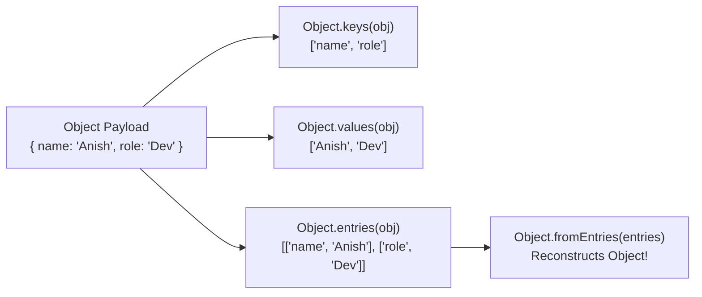
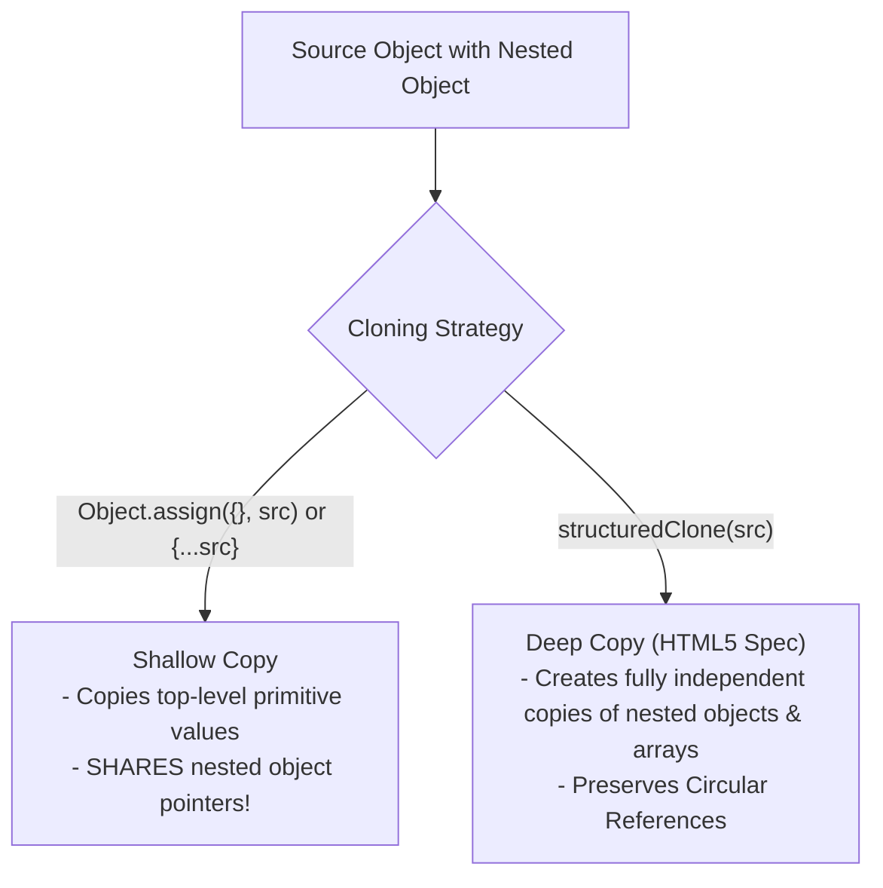
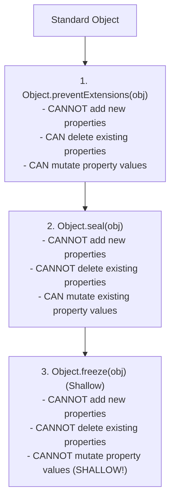

# Module 13: Object Methods and Immutability Controls — Reflection, Cloning, and Deep Freezing

## Overview

JavaScript provides specialized static methods on the `Object` constructor to inspect, reflect, copy, merge, and enforce memory immutability policies on objects.

Understanding **Reflection Methods** (`Object.keys()`, `Object.values()`, `Object.entries()`, `Object.fromEntries()`), **Shallow Copying (`Object.assign()`) vs. Deep Copying (`structuredClone()`)**, and **Immutability Protection Tiers** (`preventExtensions`, `seal`, `freeze`) is essential for building robust application architectures.

---

## 1. Object Reflection Architecture



```javascript
const userProfile = { name: "Anish", role: "DevOps", tier: "Gold" };

// 1. Reflection Methods
console.log("Keys   :", Object.keys(userProfile));   // ["name", "role", "tier"]
console.log("Values :", Object.values(userProfile)); // ["Anish", "DevOps", "Gold"]
console.log("Entries:", Object.entries(userProfile));
// [["name", "Anish"], ["role", "DevOps"], ["tier", "Gold"]]

// 2. Reconstructing Objects via Object.fromEntries()
const entriesArray = [["id", 101], ["status", "ACTIVE"]];
const reconstructedObj = Object.fromEntries(entriesArray);
console.log("Reconstructed Object:", reconstructedObj); // { id: 101, status: 'ACTIVE' }
```

---

## 2. Object Cloning: `Object.assign()` vs. `structuredClone()`



```javascript
const original = {
  title: "Playbook",
  settings: { theme: "dark" }
};

// 1. Shallow Copy via Object.assign()
const shallowCopy = Object.assign({}, original);
shallowCopy.settings.theme = "light"; // MUTATES ORIGINAL! (Shared nested pointer)

console.log("Original Theme (Shallow Mutated):", original.settings.theme); // "light"

// 2. Deep Copy via native structuredClone()
const deepCopy = structuredClone(original);
deepCopy.settings.theme = "cyberpunk"; // Fully isolated copy!

console.log("Original Theme (Deep Preserved):", original.settings.theme); // "light"
```

---

## 3. Immutability Protection Levels Hierarchy

JavaScript provides three distinct levels of object restriction enforcement:



### Immutability Protection Comparison Matrix

| Restrictions / Method | `preventExtensions()` | `seal()` | `freeze()` |
| :--- | :--- | :--- | :--- |
| **Add New Properties** | **Prohibited** | **Prohibited** | **Prohibited** |
| **Delete Existing Properties** | Allowed | **Prohibited** | **Prohibited** |
| **Mutate Existing Values** | Allowed | Allowed | **Prohibited** |
| **Re-configure Property Descriptors** | Allowed | **Prohibited** | **Prohibited** |
| **Verification Method** | `Object.isExtensible()` | `Object.isSealed()` | `Object.isFrozen()` |

```javascript
// Demonstrating Object.seal() vs Object.freeze()
const sealedConfig = Object.seal({ env: "production", timeout: 5000 });
sealedConfig.timeout = 10000; // PERMITTED: Mutating existing values
// sealedConfig.newPort = 8080; // PROHIBITED: Throws TypeError in strict mode

const frozenConfig = Object.freeze({ env: "production", timeout: 5000 });
// frozenConfig.timeout = 10000; // PROHIBITED: Throws TypeError in strict mode
console.log("Is Frozen:", Object.isFrozen(frozenConfig)); // true
```

---

## 4. Deep Freezing Recursion Algorithm

`Object.freeze()` is strictly **shallow**; nested objects remain mutable. To make an object completely immutable across nested structures, implement a **Deep Freeze Algorithm**:

```javascript
function deepFreeze(object) {
  // Retrieve property names defined on object
  const propNames = Reflect.ownKeys(object);

  // Recursively freeze nested objects before freezing outer object
  for (const name of propNames) {
    const value = object[name];
    if (value && typeof value === "object") {
      deepFreeze(value); // Recursive step
    }
  }

  return Object.freeze(object);
}

const complexConfig = deepFreeze({
  api: { endpoint: "https://domain.com", headers: { auth: true } }
});

// complexConfig.api.headers.auth = false; // Throws TypeError in strict mode!
```

---

## Key Production Takeaways

1. **Use `structuredClone()` for True Deep Copying**: Use `structuredClone(obj)` for deep object cloning instead of `JSON.parse(JSON.stringify(obj))`, which destroys Dates, RegExps, Maps, Sets, and Functions.
2. **Remember `Object.freeze()` is Shallow**: Be cautious when freezing nested configuration objects with `Object.freeze()`. Use a recursive `deepFreeze()` utility for nested structures.
3. **Use `Object.entries()` with `reduce()` or `fromEntries()`**: Use `Object.entries()` to transform object key-value pairs using array methods like `.filter()` or `.map()`, then re-assemble using `Object.fromEntries()`.
4. **Use `Object.seal()` when Property Schemas must remain Fixed**: Use `Object.seal()` when you want to lock down object properties from being added or deleted while allowing existing values to be updated.

