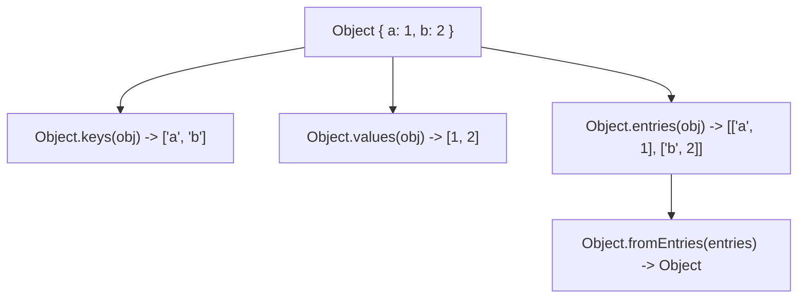

# File 13: Object Methods and Immutability Utilities

## Overview
JavaScript provides built-in `Object` constructor methods for iterating over keys and values (`Object.keys`, `Object.values`, `Object.entries`) and for enforcing memory immutability policies (`Object.freeze`, `Object.seal`).

---

## 1. Object Reflection Utilities



```javascript
const user = { name: "Rajesh", role: "Developer", city: "Bengaluru" };

console.log(Object.keys(user));   // ["name", "role", "city"]
console.log(Object.values(user)); // ["Rajesh", "Developer", "Bengaluru"]
console.log(Object.entries(user));// [["name", "Rajesh"], ["role", "Developer"], ["city", "Bengaluru"]]

// Converting Entries Array back into an Object
const entries = [["id", 100], ["status", "active"]];
const objFromEntries = Object.fromEntries(entries);
console.log(objFromEntries); // { id: 100, status: "active" }
```

---

## 2. Copying & Merging: `Object.assign()`
`Object.assign(target, ...sources)` copies top-level enumerable properties from source objects into a target object.

```javascript
const defaults = { theme: "light", showSidebar: true };
const userConfig = { theme: "dark" };

const finalConfig = Object.assign({}, defaults, userConfig);
console.log(finalConfig); // { theme: "dark", showSidebar: true }
```

---

## 3. Immutability Controls: `Object.freeze()` vs `Object.seal()`

### `Object.freeze()` (Shallow Immutability)
Prevents property addition, deletion, or modification of existing property values.

### `Object.seal()` (Sealed Properties)
Prevents property addition or deletion, but **allows mutating existing property values**.

```javascript
// Object.freeze
const frozen = Object.freeze({ rate: 18 });
// frozen.rate = 20; // Silently fails or throws TypeError in strict mode
console.log(Object.isFrozen(frozen)); // true

// Object.seal
const sealed = Object.seal({ status: "Pending" });
sealed.status = "Approved"; // Permitted!
// sealed.newProp = "test"; // Prohibited!
console.log(Object.isSealed(sealed)); // true
```

---

## Key Takeaways
1. Use **`Object.keys()`**, **`Object.values()`**, and **`Object.entries()`** for object iteration.
2. **`Object.fromEntries()`** converts `[key, value]` entry arrays back into objects.
3. **`Object.freeze()`** locks an object completely (shallow); **`Object.seal()`** locks property structure but permits updating existing values.
