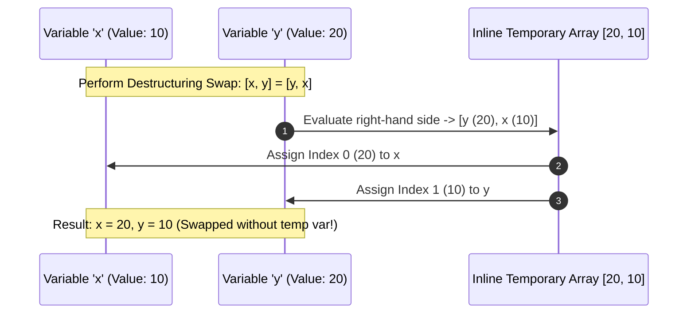
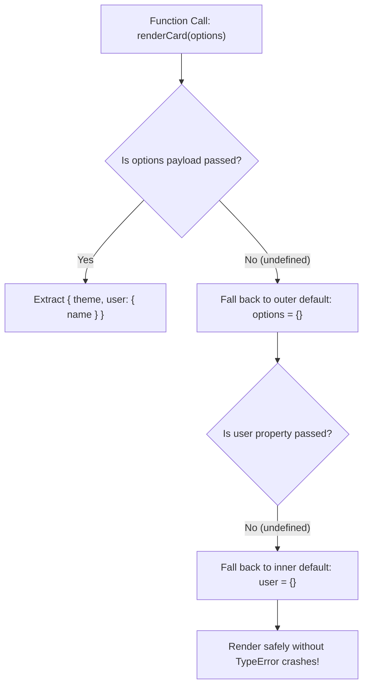

# Module 14: Destructuring Assignment — Objects, Arrays, and Safe Parameter Unpacking

## Overview

Introduced in ECMAScript 2015 (ES6), **Destructuring Assignment** is a declarative syntax pattern for extracting values from arrays or properties from objects into standalone variables.

Destructuring simplifies accessing nested properties, renaming variables on the fly (`{ prop: alias }`), setting fallback defaults (`{ key = defaultValue }`), and swapping variable bindings without temporary variables (`[x, y] = [y, x]`).

Understanding how to construct **Safe Nested Destructuring Defaults** prevents fatal `TypeError: Cannot read properties of undefined` crashes in production apps.

---

## 1. Object vs. Array Destructuring Unpacking Architecture

```mermaid
flowchart TD
    subgraph Object Destructuring (Property-Name Matching)
        ObjInput["Object: { name: 'Priya', role: 'Lead' }"] --> ObjExtract["{ name, role: title, status = 'Active' }"]
        ObjExtract --> Var1["name = 'Priya'"]
        ObjExtract --> Var2["title = 'Lead' (Renamed!)"]
        ObjExtract --> Var3["status = 'Active' (Default Used!)"]
    end

    subgraph Array Destructuring (Positional Index Matching)
        ArrInput["Array: ['Red', 'Green', 'Blue']"] --> ArrExtract["[first, , third]"]
        ArrExtract --> AVar1["first = 'Red'"]
        ArrExtract --> AVar2["third = 'Blue' (Index 1 Skipped!)"]
    end
```

---

## 2. Object Destructuring Patterns & Computed Keys

```javascript
const userPayload = {
  user_id: 9001,
  account_info: { email: "priya@domain.com", tier: "Premium" }
};

// 1. Basic Extraction, Property Renaming, and Default Assignment
const { 
  user_id: userId,                   // Renames user_id to userId
  account_info: { email },           // Nested property extraction
  status = "ACTIVE"                  // Fallback default value if property is undefined
} = userPayload;

console.log(userId);  // 9001
console.log(email);   // "priya@domain.com"
console.log(status);  // "ACTIVE" (Default applied!)

// 2. Computed Property Key Destructuring
const dynamicKey = "tier";
const { account_info: { [dynamicKey]: userTier } } = userPayload;
console.log("Computed Tier:", userTier); // "Premium"
```

---

## 3. Array Destructuring & In-Memory Variable Swapping



```javascript
// 1. Array Index Unpacking & Skipping Slots
const coordinates = [12.9716, 77.5946, 920]; // [lat, lng, altitude]
const [latitude, longitude, , accuracy = "High"] = coordinates;

console.log("Lat:", latitude, "Lng:", longitude, "Accuracy:", accuracy);

// 2. Zero-Temp Variable Swapping Pattern
let primary = "Primary Server";
let backup = "Backup Server";

[primary, backup] = [backup, primary]; // Swaps values atomically
console.log("Primary is now:", primary); // "Backup Server"
```

---

## 4. Safe Nested Parameter Destructuring Fallback Pipeline



> [!CRITICAL]
> **Crash Safeguard**: Destructuring nested properties on an `undefined` object (`const { a: { b } } = {}`) throws a fatal `TypeError`. Always attach an outer empty object default (`= {}`) to function parameters!

```javascript
// Production Pattern: Safe Parameter Destructuring with Dual Default Guards
function configureSession({
  timeout = 3000,
  security: { enableCSRF = true, allowedOrigins = [] } = {} // Inner object fallback default!
} = {}) { // Outer options fallback default!
  
  console.log("Session Timeout:", timeout);
  console.log("CSRF Protection:", enableCSRF);
  console.log("Allowed Origins :", allowedOrigins);
}

// 1. Calling with full payload
configureSession({ security: { enableCSRF: false, allowedOrigins: ["https://app.com"] } });

// 2. Calling with completely empty argument (Zero Arguments!)
configureSession(); // SAFE! Outer = {} and Inner = {} prevent crashes.
```

---

## Key Production Takeaways

1. **Always Supply Outer and Inner Defaults for Options Objects**: When destructuring options inside function parameters, attach outer (`= {}`) and inner (`= {}`) defaults to prevent runtime `TypeError` crashes when users pass no arguments.
2. **Use Destructuring for Variable Swapping**: Prefer `[x, y] = [y, x]` over manual temporary variables (`temp = x; x = y; y = temp`) for variable swapping.
3. **Rename Generic Property Names Cleanly**: Use property renaming (`const { id: userId, data: userPayload } = response`) to avoid variable shadowing or ambiguous variable names.
4. **Remember `undefined` Triggers Defaults, `null` Does NOT**: If a property explicitly contains `null`, default values in destructuring assignments are ignored!

