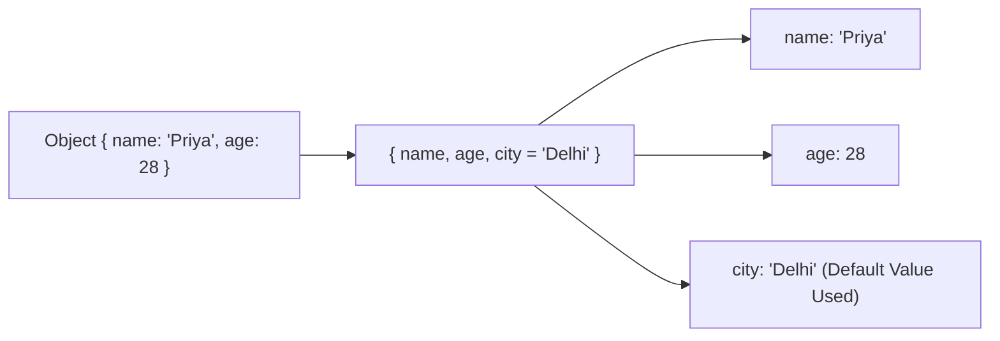

# File 14: Destructuring Assignment

## Overview
**Destructuring Assignment** is an ES6 syntax pattern that allows unpacking values from arrays or properties from objects into distinct, standalone variables cleanly.

---

## 1. Object Destructuring



```javascript
const user = { name: "Priya", age: 28, city: "Bengaluru" };

// Basic Unpacking & Renaming
const { name: fullName, age } = user;
console.log(fullName); // "Priya"
console.log(age);      // 28

// Default Values for Missing Keys
const { role = "Guest" } = user;
console.log(role);     // "Guest"
```

---

## 2. Array Destructuring

```javascript
const colors = ["Red", "Green", "Blue"];

// Basic Unpacking
const [firstColor, secondColor] = colors;
console.log(firstColor);  // "Red"

// Skipping Element Slots
const [, , thirdColor] = colors;
console.log(thirdColor);  // "Blue"

// Variable Swapping without Temporary Variable
let x = 10, y = 20;
[x, y] = [y, x];
console.log(x, y);        // 20, 10
```

---

## 3. Nested Destructuring & Function Parameter Destructuring

```javascript
const employee = {
    id: 101,
    details: { email: "priya@example.com" }
};

// Nested Object Unpacking
const { details: { email } } = employee;
console.log(email); // "priya@example.com"

// Parameter Destructuring inside Function Signatures
function renderProfile({ name, role = "User" }) {
    console.log(`Rendering ${name} (${role})`);
}

renderProfile({ name: "Rajesh" }); // "Rendering Rajesh (User)"
```

---

## Key Takeaways
1. Use **`const { prop: alias } = obj`** to extract and rename object keys.
2. Use **`[a, b] = [b, a]`** for concise variable swapping.
3. Provide **default values** (`key = defaultValue`) to safeguard against missing keys or `undefined`.
4. Use **parameter destructuring** inside function signatures for clean API contracts.
