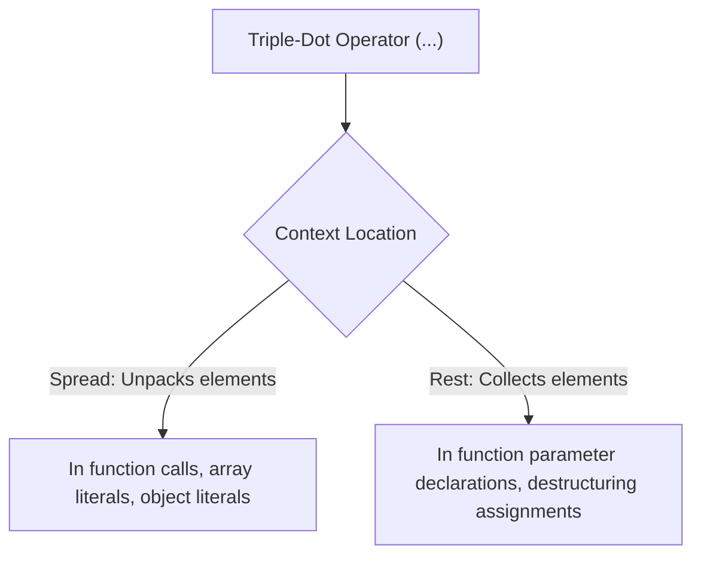

# File 15: Spread and Rest Operators

## Overview
The triple-dot operator (`...`) serves two distinct purposes based on usage location: **Spread Syntax** (expands an iterable into individual elements) and **Rest Parameters** (collects multiple elements into a single array).

---

## 1. Spread Operator vs Rest Parameters



---

## 2. The Spread Operator (`...`)

### Merging & Cloning Arrays
```javascript
const arr1 = [1, 2];
const arr2 = [3, 4];

const mergedArray = [...arr1, ...arr2]; // [1, 2, 3, 4]
const arrayCopy = [...arr1];           // Shallow Copy
```

### Merging & Cloning Objects
```javascript
const user = { name: "Rajesh", role: "Dev" };
const location = { city: "Bengaluru", country: "India" };

const userProfile = { ...user, ...location, status: "Active" };
console.log(userProfile); // { name: "Rajesh", role: "Dev", city: "Bengaluru", country: "India", status: "Active" }
```

---

## 3. Rest Parameters (`...`)

### Variadic Function Parameters
Rest parameters collect all remaining arguments passed into a function into an array instance.

```javascript
function sumAll(...numbers) {
    return numbers.reduce((total, num) => total + num, 0);
}

console.log(sumAll(10, 20, 30, 40)); // 100
```

### Rest Operator in Destructuring
```javascript
const [lead, ...teamMembers] = ["Priya", "Amit", "Raj", "Suresh"];

console.log(lead);        // "Priya"
console.log(teamMembers); // ["Amit", "Raj", "Suresh"]
```

---

## Key Takeaways
1. **Spread (`...`)** unpacks arrays/objects into elements/properties.
2. **Rest (`...`)** gathers remaining values into an array.
3. Rest parameters must be placed as the **final parameter** in function parameter lists.
4. Spread syntax creates **shallow copies** of objects and arrays.
