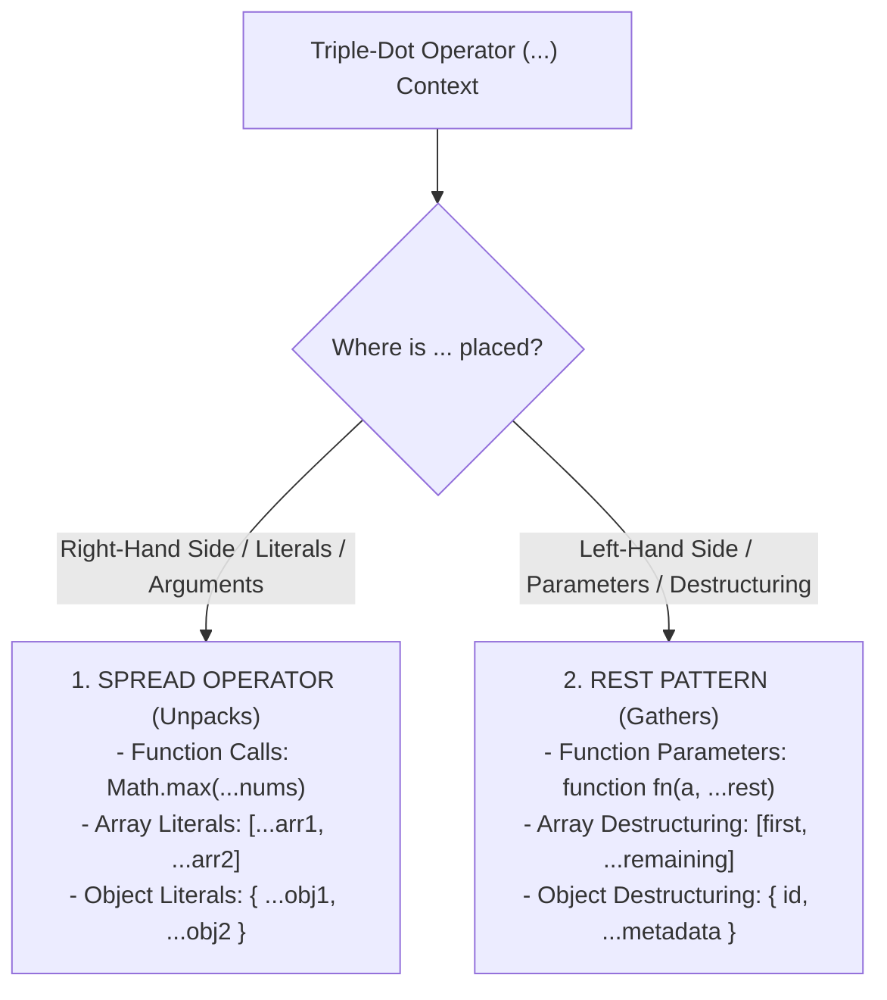

# Module 15: Spread and Rest Operators — Unpacking Iterables, Variadic Functions, and Property Overriding

## Overview

The triple-dot syntax (`...`) in JavaScript serves two distinct, dual capabilities depending on where it appears in code:
1. **Spread Operator (`...`)**: **Unpacks** elements from arrays, strings, sets, or properties from objects into distinct values or entry lists.
2. **Rest Parameters / Rest Patterns (`...`)**: **Gathers** multiple remaining elements or object properties into a single array or object instance.

Understanding the difference between **Spread (Expanding)** and **Rest (Gathering)**, property overriding precedence in object spreads, and why rest parameters replace the legacy `arguments` object is essential.

---

## 1. Spread vs. Rest Context Taxonomy



---

## 2. The Spread Operator (`...`) Deep Dive

### 1. Object Spreading & Property Overriding Precedence

When spreading objects into an object literal, properties are evaluated **left-to-right**. If identical keys exist across multiple spread objects, **later properties overwrite earlier ones**:

```mermaid
flowchart LR
    subgraph Object Spread Precedence: { ...defaults, ...userConfig, theme: 'cyberpunk' }
        Defaults["defaults:<br/>{ theme: 'light', sidebar: true }"] --> Overwrite1["userConfig:<br/>{ theme: 'dark' } (Overwrites 'light')"]
        Overwrite1 --> Overwrite2["Inline Override:<br/>theme: 'cyberpunk' (Overwrites 'dark')"]
    end
```

```javascript
const defaultSettings = { theme: "light", sidebar: true, fontSize: 14 };
const userCustomizations = { theme: "dark", fontSize: 18 };

// Properties evaluated left-to-right: userCustomizations overwrites defaultSettings
const finalSettings = {
  ...defaultSettings,
  ...userCustomizations,
  fontSize: 20 // Final inline explicit override!
};

console.log(finalSettings);
// Output: { theme: "dark", sidebar: true, fontSize: 20 }
```

### 2. Array Spreading & Function Arguments

```javascript
const numbers = [15, 42, 8, 99, 23];

// 1. Spreading elements into Math.max() function call
const maxVal = Math.max(...numbers); // Equivalent to Math.max(15, 42, 8, 99, 23)
console.log("Maximum Value:", maxVal); // 99

// 2. Cloning Arrays (Shallow Copy Nuance)
const originalList = [1, 2, { status: "Active" }];
const clonedList = [...originalList];

clonedList[0] = 999;
clonedList[2].status = "MUTATED"; // Nested objects share memory pointer!

console.log("Original List item 0:", originalList[0]);        // 1 (Primitive un-mutated)
console.log("Original List item 2:", originalList[2].status); // "MUTATED" (Shared reference!)
```

---

## 3. Rest Parameters (`...`) & Rest Destructuring

### 1. Variadic Rest Parameters vs. Legacy `arguments` Object

```mermaid
flowchart TD
    subgraph Legacy arguments Object (ES5)
        LegacyArg["arguments object<br/>- NOT a real array (Array.isArray === false)<br/>- Lacks map, filter, reduce<br/>- Includes all arguments indiscriminately"]
    end

    subgraph ES6 Rest Parameters (...rest)
        ModernRest["...rest parameter<br/>- REAL Array instance (Array.isArray === true)<br/>- Supports map, filter, reduce<br/>- Collects strictly remaining arguments"]
    end
```

```javascript
// Modern Variadic Function with Rest Parameters
function calculateTotalInvoice(taxRate, discount, ...lineItemPrices) {
  console.log("Is lineItemPrices a real Array?:", Array.isArray(lineItemPrices)); // true

  const subtotal = lineItemPrices.reduce((sum, price) => sum + price, 0);
  const discountedTotal = subtotal - discount;
  return discountedTotal * (1 + taxRate);
}

console.log("Final Invoice:", calculateTotalInvoice(0.18, 50, 100, 200, 300)); // 649
```

> [!CAUTION]
> **Rest Parameter Placement**: A rest parameter must be the **last parameter** in a function signature. Placing parameters after a rest parameter (`function fn(...rest, lastArg)`) throws a `SyntaxError: Rest parameter must be last formal parameter`.

### 2. Rest Patterns in Destructuring

```javascript
const productPayload = {
  sku: "SKU-990",
  title: "Gaming Laptop",
  price: 150000,
  warehouse: "BLR-01",
  supplier: "TechDistributors"
};

// Extract sku & title, collect remaining metadata properties into 'restMetadata' object
const { sku, title, ...restMetadata } = productPayload;

console.log("SKU  :", sku);           // "SKU-990"
console.log("Title:", title);         // "Gaming Laptop"
console.log("Rest Metadata Object:", restMetadata);
// { price: 150000, warehouse: "BLR-01", supplier: "TechDistributors" }
```

---

## Key Production Takeaways

1. **Use Rest Parameters instead of `arguments`**: Never use the legacy array-like `arguments` object. Rest parameters (`...args`) return a true Array instance with built-in access to `.map()`, `.filter()`, and `.reduce()`.
2. **Order Property Overrides Carefully in Object Spreads**: Ensure default configurations are placed *before* dynamic overrides in object literals (`{ ...defaults, ...overrides }`).
3. **Remember `...` Performs Shallow Copies Only**: Spreading arrays or objects duplicates top-level primitives only. Nested object references remain shared.
4. **Place Rest Parameters Last**: Always place `...rest` as the final parameter in function definitions to prevent `SyntaxError` compilation crashes.

