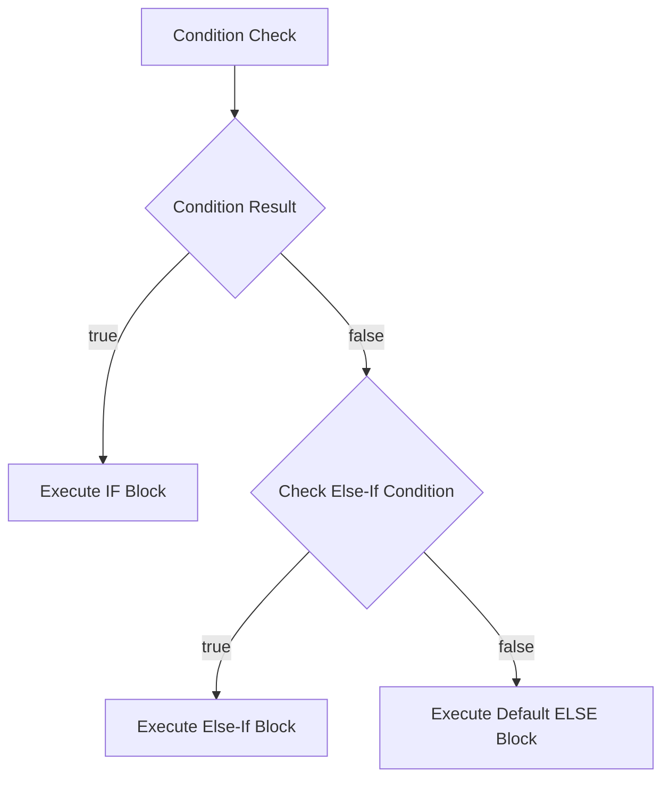

# File 16: Conditionals

## Overview
Control flow statements (`if/else`, `switch`, Ternary `? :`) allow JavaScript applications to execute different code branches dynamically based on boolean conditions.

---

## 1. Control Flow Decision Tree



---

## 2. Standard `if`, `else if`, `else`

```javascript
const score = 85;

if (score >= 90) {
    console.log("Grade: A+");
} else if (score >= 75) {
    console.log("Grade: A");
} else {
    console.log("Grade: B");
}
```

---

## 3. Ternary Operator (`condition ? trueExpr : falseExpr`)
Provides a concise syntax for conditional variable assignment.

```javascript
const age = 20;
const status = age >= 18 ? "Adult" : "Minor";
console.log(status); // "Adult"
```

---

## 4. `switch` Statement
Evaluates an expression against discrete `case` values using **strict equality (`===`) comparison**.

```javascript
const day = "MONDAY";

switch (day) {
    case "MONDAY":
        console.log("Start of work week");
        break; // Prevents fall-through!
    case "FRIDAY":
        console.log("Weekend is near");
        break;
    default:
        console.log("Mid-week day");
}
```

> **Warning**: Always place a `break` keyword at the end of each `case` block to prevent accidental case fall-through bugs.

---

## Key Takeaways
1. Use **`if / else`** for complex or range-based conditions.
2. Use **Ternary operators (`? :`)** for concise single-line variable assignments.
3. Use **`switch`** for matching discrete discrete strict equality (`===`) options.
4. Always append **`break`** statements to `switch` cases to prevent fall-through bugs.
