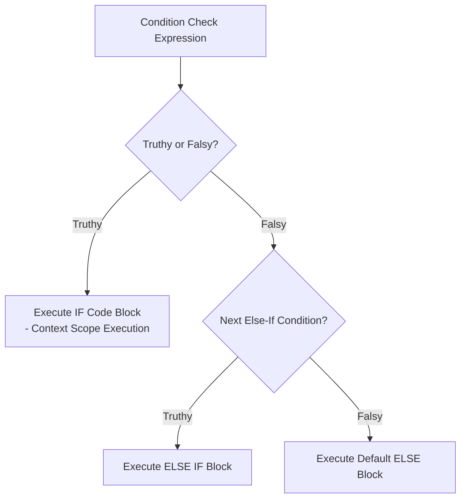
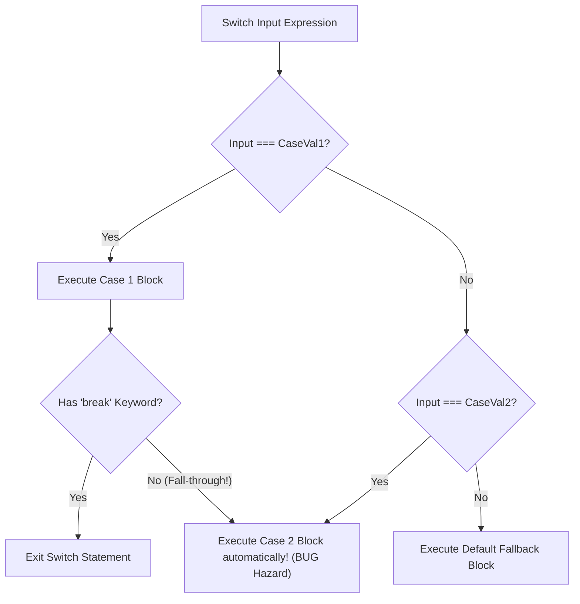

# Module 16: Conditionals — Branching Architecture, Switch Mechanics, and Guard Clauses

## Overview

Conditional control flow statements (`if/else`, Ternary `? :`, `switch`) dynamically direct execution flow along distinct code branches based on truthy or falsy expression evaluation.

Beyond basic conditional syntax, enterprise JavaScript development requires minimizing **Nested Conditional Complexity (Pyramid of Doom)** using **Early-Exit Guard Clauses** and replacing massive `switch` structures with **Lookup Table Dispatch Objects**.

Understanding strict equality (`===`) in `switch` statements and preventing accidental fall-through bugs is vital.

---

## 1. Branching Control Flow Architecture



---

## 2. Deep Dive: `switch` Statements & Strict Equality (`===`)

A `switch` statement evaluates an input expression and matches it against multiple `case` clauses using **Strict Equality (`===`)**.



```javascript
// 1. Strict Equality (===) Comparison in Switch
const numericString = "10";

switch (numericString) {
  case 10:
    console.log("Matched Number 10");
    break;
  case "10":
    console.log("Matched String '10'"); // MATCHED! (Strict equality prevents type coercion)
    break;
  default:
    console.log("No Match");
}

// 2. Intentional Case Fall-Through Pattern (Grouping Multiple Cases)
function getDayCategory(dayOfWeek) {
  switch (dayOfWeek.toUpperCase()) {
    case "MONDAY":
    case "TUESDAY":
    case "WEDNESDAY":
    case "THURSDAY":
    case "FRIDAY":
      return "Weekday (Work Operations)"; // Executes for any weekday case
    case "SATURDAY":
    case "SUNDAY":
      return "Weekend (Rest Operations)";
    default:
      return "Invalid Day";
  }
}

console.log(getDayCategory("Monday")); // "Weekday (Work Operations)"
```

---

## 3. Refactoring Nested Conditionals: The Guard Clause Pattern

Avoid nesting deep `if` statements inside one another. Use **Early-Exit Guard Clauses** to validate preconditions upfront and return immediately:

```mermaid
flowchart TD
    subgraph Nested Conditional Pyramid (Anti-Pattern)
        CheckA[if user] --> CheckB[if isAuthenticated] --> CheckC[if hasPermission] --> Action[Execute Action]
    end

    subgraph Early Exit Guard Clauses (Clean Architecture)
        Guard1[if !user return] --> Guard2[if !isAuthenticated return] --> Guard3[if !hasPermission return] --> CleanAction[Execute Action Directly]
    end
```

```javascript
// BAD: Deeply Nested Conditional Pyramid
function processOrderBad(user, order) {
  if (user) {
    if (user.isActive) {
      if (order && order.items.length > 0) {
        return `Order ${order.id} processed for ${user.name}`;
      } else {
        throw new Error("Invalid order payload");
      }
    } else {
      throw new Error("User account is inactive");
    }
  } else {
    throw new Error("User is unauthenticated");
  }
}

// GOOD: Flat Guard Clause Architecture (Clean & Maintainable)
function processOrderClean(user, order) {
  if (!user) throw new Error("User is unauthenticated");
  if (!user.isActive) throw new Error("User account is inactive");
  if (!order || order.items.length === 0) throw new Error("Invalid order payload");

  // Main Business Logic Executes Flat!
  return `Order ${order.id} processed for ${user.name}`;
}
```

---

## 4. O(1) Lookup Table Dispatch Pattern

Instead of long `switch` or `if...else if` chains, map dispatch handlers into an **Object Lookup Table** for $\mathcal{O}(1)$ execution:

```javascript
// Replaces multi-branch switch/if-else with clean dictionary lookup
const ROLE_PERMISSIONS = {
  ADMIN: () => ["CREATE", "READ", "UPDATE", "DELETE"],
  EDITOR: () => ["READ", "UPDATE"],
  VIEWER: () => ["READ"]
};

function getPermissions(role) {
  const handler = ROLE_PERMISSIONS[role.toUpperCase()];
  if (!handler) {
    return ["GUEST_READ"]; // Fallback default
  }
  return handler();
}

console.log("Admin Permissions:", getPermissions("ADMIN")); // ["CREATE", "READ", "UPDATE", "DELETE"]
```

---

## Key Production Takeaways

1. **Use Guard Clauses to Flatten Code**: Validate invalid inputs at the start of a function and return early to eliminate nested `if/else` indentation.
2. **Remember `switch` Uses Strict Equality (`===`)**: Never expect `switch (val)` to perform type coercion (`"10"` will not match `10`).
3. **Use Object Lookup Tables for Dynamic Dispatch**: Replace large `switch` statements with key-value lookup objects for cleaner, more extensible $\mathcal{O}(1)$ dispatching.
4. **Reserve Ternaries for Assignments**: Use ternary expressions (`cond ? a : b`) exclusively for inline variable assignments or JSX returns. Never nest multi-level ternary statements.

