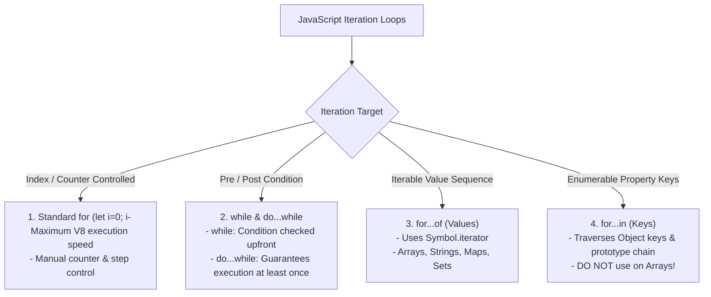
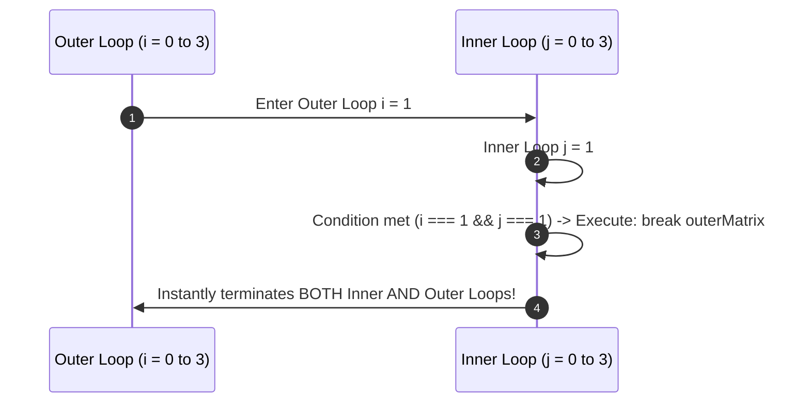

# Module 17: Loops and Iteration — Iterable Protocol, `for...of` vs `for...in`, and Labeled Statements

## Overview

Iteration statements (`for`, `while`, `do...while`, `for...of`, `for...in`) execute a block of code repeatedly until a termination condition is met.

JavaScript features two modern iteration loops with fundamentally distinct behaviors:
- **`for...of`**: Invokes the **Iterable Protocol (`Symbol.iterator`)** to yield sequential values from Arrays, Strings, Sets, Maps, and NodeLists.
- **`for...in`**: Iterates over **Enumerable String Keys** of an object, traversing the entire prototype chain.

Understanding why `for...in` is hazardous on arrays, how labeled statements exit nested loop structures, and V8 loop optimization techniques is essential.

---

## 1. Iteration Loop Architecture Taxonomy



---

## 2. Deep Dive: `for...of` vs. `for...in`

```mermaid
flowchart LR
    subgraph for...of (Value Iteration)
        ArrayOf["Array ['A', 'B', 'C']"] -->|Symbol.iterator| Values["Yields Values:<br/>'A' -> 'B' -> 'C'"]
    end

    subgraph for...in (Key & Prototype Traversal)
        ObjIn["Array ['A', 'B'] + Array.prototype.customProp"] -->|Enumerable Key Scan| Keys["Yields String Keys:<br/>'0' -> '1' -> 'customProp' (DANGER!)"]
    end
```

### `for...of` vs `for...in` Comparison Matrix

| Property Dimension | `for...of` (ES6 Standard) | `for...in` (ES5 Legacy) |
| :--- | :--- | :--- |
| **Iterates Over** | **Values** of iterable collection | **Enumerable Property Keys** |
| **Protocol Used** | Calls `[Symbol.iterator]()` | Scans Object Property Table |
| **Prototype Traversal** | **No** (Ignores prototype chain) | **Yes** (Traverses prototype chain!) |
| **Target Data Types** | Arrays, Strings, Maps, Sets, Generators | Plain Objects (`{}`) |
| **Array Compatibility** | **Ideal for Arrays** | **HAZARDOUS for Arrays (Avoid!)** |

```javascript
// 1. GOOD: for...of iterating array values cleanly
const fruits = ["Apple", "Banana", "Orange"];
for (const fruit of fruits) {
  console.log("Fruit Value:", fruit); // "Apple", "Banana", "Orange"
}

// 2. DANGER: for...in iterating array indices + prototype pollution!
Array.prototype.customPollutedMethod = function() {}; // Prototype modification

const numbers = [100, 200];
for (const indexKey in numbers) {
  console.log("Key:", indexKey, "| Value:", numbers[indexKey]);
  // Output:
  // Key: 0 | Value: 100
  // Key: 1 | Value: 200
  // Key: customPollutedMethod | Value: [Function] (UNINTENDED PROTOTYPE LEAK!)
}
```

---

## 3. Labeled Statements: Exiting Nested Loops

Standard `break` and `continue` keywords operate strictly on the innermost enclosing loop. To jump or break out of **nested multi-level loops**, use **Labeled Statements**:



```javascript
// Labeled Loop Statement for Multi-Level Nested Breaking
outerMatrixLoop: for (let i = 0; i < 3; i++) {
  for (let j = 0; j < 3; j++) {
    console.log(`Processing Cell [${i}, ${j}]`);

    if (i === 1 && j === 1) {
      console.log("Target cell found! Breaking out of entire matrix...");
      break outerMatrixLoop; // Exits BOTH loops instantly!
    }
  }
}
```

---

## 4. Loop Performance & Iteration Benchmarks

In performance-critical hot loops (e.g. processing 10,000,000 graphics items):
1. **Standard `for (let i = 0; i < len; i++)`**: Fastest raw performance in V8 (Direct Smi index offset).
2. **`for...of`**: Highly optimized in modern V8 engines; clean readability with negligible overhead.
3. **`forEach()`**: Incurs callback function invocation frame overhead per element.
4. **`for...in`**: Slowest iteration mechanism due to prototype chain lookup overhead.

```javascript
// Optimized Standard For Loop with Cached Array Length
const massiveArray = new Array(1_000_000).fill(42);

// Cache length outside evaluation clause to eliminate length property dereferencing
for (let i = 0, len = massiveArray.length; i < len; i++) {
  // Fast contiguous V8 loop execution
}
```

---

## Key Production Takeaways

1. **Use `for...of` for Array Iteration**: Always use `for...of` when iterating over arrays, strings, maps, or sets.
2. **Never Use `for...in` on Arrays**: `for...in` iterates over string key indexes and leaks prototype modifications. Use `for...in` strictly on plain key-value objects.
3. **Use Labeled Statements for Nested Matrix Early Exits**: Use labeled loop statements (`outer: for (...)`) when searching 2D matrices to break out of nested loops cleanly without flag variables.
4. **Cache Loop Length in High-Frequency Computations**: Cache `len = arr.length` when iterating over large arrays in performance-sensitive algorithms.

