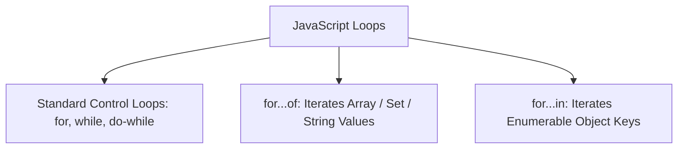

# File 17: Loops and Iteration

## Overview
Loops repeatedly execute a block of code while a specified condition remains true. JavaScript supports standard `for`, `while`, and `do...while` loops, alongside ES6 `for...of` (for arrays and iterables) and `for...in` (for enumerable object keys).

---

## 1. Loop Categories & Use Cases



---

## 2. Standard Loops (`for`, `while`, `do...while`)

```javascript
// Standard for loop (Counter controlled)
for (let i = 0; i < 3; i++) {
    console.log(`Iteration ${i}`);
}

// while loop (Pre-condition check)
let count = 0;
while (count < 2) {
    count++;
}

// do...while loop (Guarantees execution AT LEAST ONCE)
let val = 10;
do {
    console.log("Executes at least once!");
} while (val < 5);
```

---

## 3. Modern Iteration Loops: `for...of` vs `for...in`

### `for...of` (Values Iteration)
Iterates over **values** of iterable collections (Arrays, Strings, Maps, Sets).

### `for...in` (Keys Iteration)
Iterates over **enumerable property keys** of an object (includes inherited prototype keys).

```javascript
const fruits = ["Apple", "Banana", "Orange"];

// for...of over Array Values
for (const fruit of fruits) {
    console.log(fruit); // "Apple", "Banana", "Orange"
}

// for...in over Object Property Keys
const user = { name: "Rajesh", role: "Dev" };
for (const key in user) {
    console.log(`${key}: ${user[key]}`);
}
```

---

## 4. Loop Controls: `break` & `continue`
- `break`: Immediately exits and terminates the entire loop.
- `continue`: Skips the remainder of the current iteration and jumps to the next iteration turn.

```javascript
for (let i = 0; i < 5; i++) {
    if (i === 2) continue; // Skips index 2
    if (i === 4) break;    // Terminates loop at index 4
    console.log(i);
}
```

---

## Key Takeaways
1. Use **`for...of`** for arrays, strings, and sets.
2. Use **`for...in`** exclusively for plain objects.
3. **`do...while`** guarantees execution at least once regardless of initial condition evaluation.
4. Use **`break`** to exit loops early and **`continue`** to skip specific iteration cycles.
