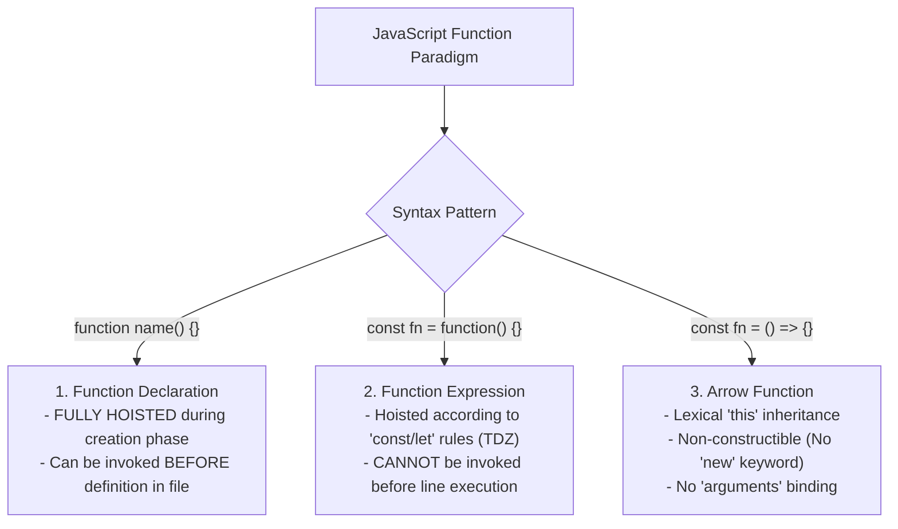
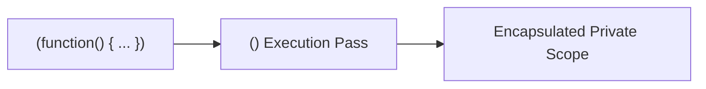

# Module 18: Functions and Arrow Functions — First-Class Citizens, Lexical `this`, and Execution Frames

## Overview

In JavaScript, **Functions are First-Class Citizens**, meaning they are treated as first-class objects: functions can be assigned to variables, passed as arguments to other functions, stored in data structures, and returned from function invocations.

Modern ECMAScript provides three primary syntax paradigms for defining functions:
1. **Function Declarations**: Named functions hoisted with their complete body implementation.
2. **Function Expressions**: Functions assigned to variables, subject to variable scope rules.
3. **Arrow Functions (`() => {}`)**: ES6 concise functions featuring **Lexical `this` Binding**, no `arguments` object, and zero constructor prototype overhead.

---

## 1. Function Syntax & Hoisting Architecture



### Comprehensive Function Paradigm Comparison

| Feature / Behavior | Function Declarations | Function Expressions | Arrow Functions (`() => {}`) |
| :--- | :--- | :--- | :--- |
| **Hoisting Behavior** | Fully hoisted with body implementation | Variable hoisted into TDZ or `undefined` | Variable hoisted into TDZ or `undefined` |
| **`this` Binding** | **Dynamic** (Determined by call site) | **Dynamic** (Determined by call site) | **Lexical** (Inherited from parent scope) |
| **`arguments` Object** | Present (`arguments`) | Present (`arguments`) | **Absent** (Use `...args` rest parameter) |
| **`new` Constructor Use**| Permitted (`new Fn()`) | Permitted (`new Fn()`) | **Prohibited** (Throws `TypeError`) |
| **`prototype` Property**| Present (`Fn.prototype`) | Present (`Fn.prototype`) | `undefined` (No prototype object) |

---

## 2. Dynamic `this` vs. Lexical `this` Mechanics

```mermaid
flowchart TD
    subgraph Regular Function (Dynamic 'this')
        RegCall["counter.regularMethod()"] --> RegThis["'this' bound dynamically to Caller Object (counter)"]
        CallbackCall["setTimeout(function() {})"] --> WindowThis["'this' reset dynamically to globalThis / undefined! (BUG Hazard)"]
    end

    subgraph Arrow Function (Lexical 'this')
        ArrowCall["setTimeout(() => {})"] --> LexicalThis["'this' preserved strictly from enclosing parent scope!"]
    end
```

```javascript
// Demonstrating Lexical 'this' in Arrow Functions
const timerModule = {
  seconds: 0,
  
  // 1. Regular Method: Has dynamic 'this' pointing to timerModule
  start() {
    console.log("Timer Started. Initial seconds:", this.seconds);

    // 2. Arrow Function Callback inside setTimeout: Inherits lexical 'this' from start()!
    setTimeout(() => {
      this.seconds += 5; // 'this' reliably points to timerModule!
      console.log("Updated seconds (Arrow Callback):", this.seconds); // 5
    }, 100);
  }
};

timerModule.start();
```

---

## 3. Arrow Function Non-Constructibility & Syntax Shortcuts

Arrow functions omit internal `[[Construct]]` specification methods and prototype pointers, rendering them non-constructible and extremely lightweight in memory:

```javascript
// 1. Omission of Constructor Capability
const ProductCard = (name) => {
  this.name = name;
};

// const card = new ProductCard("Laptop"); // Throws TypeError: ProductCard is not a constructor!

// 2. Concise Syntax Shortcuts
const double = x => x * 2;                 // Single parameter: parentheses optional
const add = (a, b) => a + b;               // Single line expression: implicit return
const makeObject = (id) => ({ id, ok: true }); // Returning object literal requires wrapping in ()

console.log(makeObject(101)); // { id: 101, ok: true }
```

---

## 4. Immediately Invoked Function Expressions (IIFE)

An **IIFE** is a function that executes immediately upon creation, isolating local variables from polluting global scope:



```javascript
// Modern IIFE Pattern
const appModule = (() => {
  // Private encapsulated state
  let privateApiKey = "SECRET-KEY-9901";

  return {
    getPublicStatus() {
      return `System Active (Key Configured: ${privateApiKey.slice(0, 6)}***)`;
    }
  };
})();

console.log(appModule.getPublicStatus());
// privateApiKey is inaccessible directly from global window/globalThis scope!
```

---

## Key Production Takeaways

1. **Use Arrow Functions for Event Handlers and Async Callbacks**: Arrow functions preserve lexical `this` context without requiring manual `const self = this` or `.bind(this)` hacks.
2. **Never Use Arrow Functions for Object Methods**: Defining object methods with arrow functions (`obj = { fn: () => this.x }`) binds `this` to the outer global scope instead of the target object instance.
3. **Use Function Declarations for Top-Level Utilities**: Declare shared module helper functions using standard function declarations to leverage hoisting and self-documenting stack traces.
4. **Use IIFEs or ES Modules for Scope Encapsulation**: Use IIFEs or modern ES Modules to prevent temporary variables from polluting global scope.

