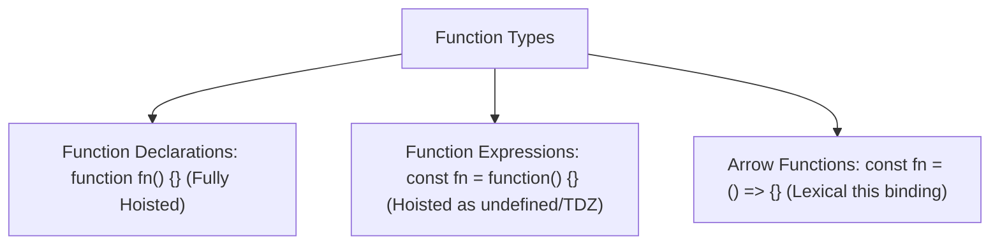

# File 18: Functions and Arrow Functions

## Overview
Functions are reusable blocks of code designed to perform specific tasks. In JavaScript, functions are **First-Class Citizens**—they can be stored in variables, passed as arguments to other functions, and returned from function calls.

---

## 1. Function Syntax Options



---

## 2. Declaration vs Expression vs Arrow Function

```javascript
// 1. Function Declaration (Fully Hoisted)
function calculateTax(amount) {
    return amount * 0.18;
}

// 2. Function Expression (Hoisted according to variable rules)
const multiply = function(a, b) {
    return a * b;
};

// 3. Arrow Function (Concise syntax, implicit return for single expressions)
const add = (a, b) => a + b;
const square = x => x * x; // Single parameter paren omission
```

---

## 3. Arrow Function Mechanics & Differences

### Key Differences from Regular Functions
1. **Lexical `this`**: Arrow functions do not bind their own `this`; they inherit `this` from their outer enclosing lexical scope.
2. **No `arguments` Object**: Arrow functions do not possess an `arguments` object (use rest parameters `...args` instead).
3. **Cannot be used as Constructors**: Invoking an arrow function with `new` throws a `TypeError`.

```javascript
const counter = {
    count: 0,
    startTimer() {
        // Arrow function retains 'this' pointing to 'counter' object
        setInterval(() => {
            this.count++;
            console.log(this.count);
        }, 1000);
    }
};
```

---

## 4. Default Parameters & Guard Clauses

```javascript
// Default Parameter Values
function greetUser(name = "Valued Guest", role = "User") {
    return `Hello ${name}, logged in as ${role}`;
}

// Guard Clause Pattern (Early Return)
function processOrder(order) {
    if (!order) return "Error: No order payload provided";
    if (!order.items || order.items.length === 0) return "Error: Order items empty";
    
    // Main processing logic...
    return "Order processed successfully";
}
```

---

## Key Takeaways
1. Function Declarations are **fully hoisted**; expressions and arrow functions are not.
2. Arrow functions inherit **`this` lexically** from their parent scope.
3. Arrow functions cannot be used as class/object **constructors** with `new`.
4. Use **Default Parameters** to safeguard against missing arguments.
5. Use **Guard Clauses** (early returns) to simplify nested conditional logic.
