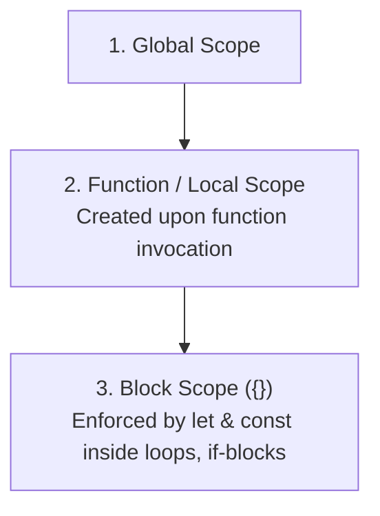
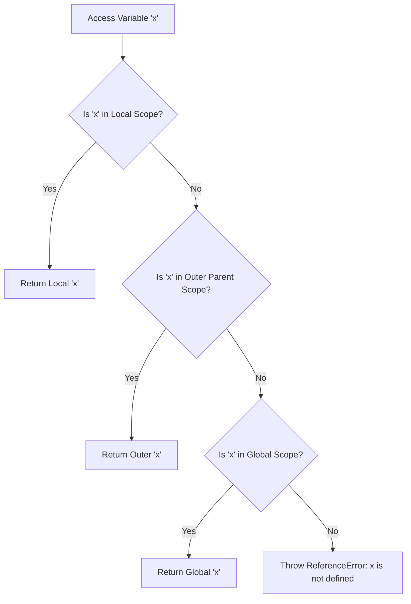

# Module 19: Scope and Hoisting — Execution Contexts, Scope Chains, and Temporal Dead Zones

## Overview

**Scope** defines the accessibility boundary of variables, functions, and objects across distinct regions of JavaScript source code. **Hoisting** is the V8 engine behavior of allocating memory space for variable and function declarations during the **Creation Phase** of an Execution Context before executing code line by line.

Understanding the **V8 Execution Context Lifecycle**, the **Lexical Environment Scope Chain**, **Variable Shadowing**, and the **Temporal Dead Zone (TDZ)** is vital for writing bug-free software.

---

## 1. V8 Execution Context Lifecycle Architecture

```mermaid
flowchart TD
    subgraph Phase 1: Creation Phase (Memory Allocation)
        Step1[Scan Code for Declarations] --> FuncHoist["Function Declarations<br/>Hoisted with COMPLETE implementation body!"]
        Step1 --> VarHoist["var Declarations<br/>Allocated and initialized to 'undefined'"]
        Step1 --> LetConstTDZ["let / const Declarations<br/>Allocated into Temporal Dead Zone (UNINITIALIZED)"]
    end

    subgraph Phase 2: Execution Phase (Line-by-Line Run)
        Step2[Execute Code Line-by-Line] --> AssignValues["Assign values to variables<br/>(Exit TDZ upon declaration line)"]
        Step2 --> ExecFuncs["Execute function invocations"]
    end
```

---

## 2. Scope Hierarchy: Global, Function, & Block Scopes



### Comprehensive Scope & Hoisting Matrix

| Declaration Keyword | Scope Boundary | Creation Phase Memory Binding | Access Before Declaration Line |
| :--- | :--- | :--- | :--- |
| **`function` Name()** | Function / Global | Fully hoisted with body implementation | **Allowed** (Returns function output) |
| **`var` Identifier** | Function / Global | Hoisted and initialized to `undefined` | **Allowed** (Returns `undefined`) |
| **`let` Identifier** | Block Scope (`{}`) | Hoisted into **Temporal Dead Zone** | **Throws `ReferenceError`** |
| **`const` Identifier**| Block Scope (`{}`) | Hoisted into **Temporal Dead Zone** | **Throws `ReferenceError`** |
| **`class` Identifier**| Block Scope (`{}`) | Hoisted into **Temporal Dead Zone** | **Throws `ReferenceError`** |

```javascript
// 1. Function Declaration Hoisting (Invokable upfront!)
console.log(calculateDiscount(100)); // Output: 20 (Works!)

function calculateDiscount(amount) {
  return amount * 0.20;
}

// 2. var Hoisting vs. let/const TDZ
console.log(legacyVar); // Output: undefined
// console.log(modernLet);  // Throws ReferenceError: Cannot access 'modernLet' before initialization!

var legacyVar = "Legacy Var";
let modernLet = "Modern Let";
```

---

## 3. The Scope Chain & Lexical Resolution Algorithm

When a variable is referenced, the V8 engine executes the **Scope Chain Lookup Algorithm**, searching the immediate Lexical Environment first, then traversing outer parent scope environments up to the Global Object:



```javascript
const globalConfig = "Production-v1";

function outerModule() {
  const outerConfig = "Module-Scope";

  function innerComponent() {
    const localConfig = "Component-Scope";

    // Walks up Scope Chain: localConfig (Component) -> outerConfig (Module) -> globalConfig (Global)
    console.log(localConfig, outerConfig, globalConfig);
  }

  innerComponent();
}

outerModule();
```

---

## 4. Variable Shadowing & Scope Leakage

**Variable Shadowing** occurs when an inner scope declares a variable with the exact same identifier name as an outer scope variable, masking the outer variable within the inner scope:

```javascript
const userRole = "Global Guest";

function authenticateUser() {
  const userRole = "Authenticated Admin"; // Shadows outer userRole!

  if (true) {
    const userRole = "Block Local Role"; // Shadows function userRole!
    console.log("Inside Block Scope:", userRole); // "Block Local Role"
  }

  console.log("Inside Function Scope:", userRole); // "Authenticated Admin"
}

authenticateUser();
console.log("Inside Global Scope:", userRole); // "Global Guest" (Un-mutated!)
```

---

## Key Production Takeaways

1. **Rely on `let` and `const` Block Scoping**: Stop using legacy `var` to eliminate accidental scope leakage out of `if` blocks and `for` loops.
2. **Declare Functions at Module Top Level**: Declare function dependencies at the top level of modules or files for clear readability.
3. **Avoid Variable Shadowing**: Avoid re-using outer variable identifier names inside inner scopes to prevent developer confusion and logic bugs.
4. **Respect the Temporal Dead Zone**: Always define `let` and `const` variables at the top of their block scope before attempting to reference or call them.

