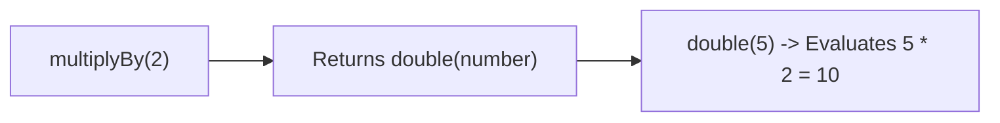

# Module 20: Closures — V8 Context Objects, Encapsulation, and Memory Leak Hazards

## Overview

A **Closure** is the combination of a function bundled together (enclosed) with references to its surrounding **Lexical Environment**.

In JavaScript, closures are created automatically whenever a function is defined. An inner function retains access to variables declared in its outer enclosing parent scopes, even **after the outer function execution frame has popped off the call stack**.

Under the hood, Google V8 moves captured closure variables from call stack frames into heap-allocated **`Context` Objects**, linked via the internal `[[Environment]]` property slot of the inner function.

---

## 1. V8 Memory Architecture: Heap Context Objects

```mermaid
flowchart LR
    subgraph Call Stack (Frame Popped)
        OuterFrame["outerFunction() Execution Frame<br/>(POPPED OFF STACK!)"]
    end

    subgraph Memory Heap (Survives Call Execution)
        V8Context["V8 Heap Context Object<br/>{ secretToken: 'AUTH-8001' }"]
        InnerFn["innerFunction Object<br/>[[Environment]] Pointer Slot"]
    end

    InnerFn -->|Points to Heap Context| V8Context
```

```javascript
function createTokenAuthenticator(secretToken) {
  // Variable 'secretToken' is captured in a V8 Heap Context object
  return function verifyToken(inputToken) {
    // Retains reference to 'secretToken' long after createTokenAuthenticator() returned!
    return inputToken === secretToken;
  };
}

const checkAuth = createTokenAuthenticator("BEARER-SECRET-9001");

console.log(checkAuth("WRONG_TOKEN"));         // false
console.log(checkAuth("BEARER-SECRET-9001")); // true (Closure retained access!)
```

---

## 2. Practical Enterprise Patterns for Closures

### 1. Private Data Encapsulation (Module Pattern)

```javascript
function createBankAccount(initialBalance) {
  let balance = initialBalance; // Private variable hidden inside closure

  return {
    deposit(amount) {
      if (amount <= 0) throw new Error("Invalid deposit amount");
      balance += amount;
      return balance;
    },
    withdraw(amount) {
      if (amount > balance) throw new Error("Insufficient funds");
      balance -= amount;
      return balance;
    },
    getBalance() {
      return balance;
    }
  };
}

const account = createBankAccount(1000);
account.deposit(500);
console.log("Account Balance:", account.getBalance()); // 1500

// Direct access is IMPOSSIBLE from outside:
console.log(account.balance); // undefined (Private state is encapsulated!)
```

### 2. Function Currying & Partial Application



```javascript
// Function Currying via Closures
const multiply = (factor) => (number) => number * factor;

const double = multiply(2);
const triple = multiply(3);

console.log(double(10)); // 20
console.log(triple(10)); // 30
```

---

## 3. The Classic Loop Closure Bug: `var` vs. `let`

```mermaid
flowchart TD
    subgraph var Loop Bug (Single Shared Binding)
        VarLoop["for (var i = 0; i < 3; i++)"] --> SingleVar["ONE shared 'i' variable in Function Scope"]
        SingleVar --> VarTimeout["All 3 callbacks log final mutated value: 3, 3, 3"]
    end

    subgraph let Loop Fix (Fresh Per-Iteration Binding)
        LetLoop["for (let j = 0; j < 3; j++)"] --> FreshScope["NEW block scope 'j' binding per iteration"]
        FreshScope --> LetTimeout["Callbacks log independent values: 0, 1, 2"]
    end
```

```javascript
// 1. BUG: 'var' shares a single variable binding across loop turns
for (var i = 0; i < 3; i++) {
  setTimeout(() => console.log(`var loop i: ${i}`), 50); // Output: 3, 3, 3
}

// 2. FIX: 'let' creates a distinct Lexical Environment per iteration
for (let j = 0; j < 3; j++) {
  setTimeout(() => console.log(`let loop j: ${j}`), 50); // Output: 0, 1, 2
}
```

---

## 4. Closure Memory Leak Pitfalls

When an inner function captures an outer scope variable, V8 preserves the **entire context object** of that scope. If a huge array or buffer is retained in an unused closure, it cannot be Garbage Collected:

```mermaid
flowchart LR
    subgraph Memory Leak Risk
        HugeBuffer["Large 10MB Array Buffer"] --> ParentScope["Outer Scope Context"]
        ParentScope <-- Retained By -- ClosureFn["Long-Lived Event Listener Callback"]
    end
```

```javascript
// Memory Leak Anti-Pattern: Accidental Retention of Huge Datasets
function setupEventListener() {
  const hugePayload = new Array(1_000_000).fill("DATA"); // 8 MB RAM

  return function handleEvent() {
    // Even if handleEvent only uses hugePayload[0], the ENTIRE 8MB array remains in RAM!
    console.log(hugePayload[0]);
  };
}
```

---

## Key Production Takeaways

1. **Use Closures for Private State Encapsulation**: Encapsulate private variables inside closures or factory functions when building modules, SDKs, or state stores.
2. **Beware of Unintended Memory Retention**: Be careful not to hold references to giant objects or DOM nodes inside long-lived event listener closures. Nullify unused variables (`hugePayload = null`) when done.
3. **Always Use `let` inside Asynchronous Loops**: Always use `let` in `for` loops containing async callbacks to bind a fresh closure variable per iteration cycle.
4. **Leverage Closures for Function Currying & Partial Application**: Use closures to pre-configure configuration parameters for higher-order functions.

