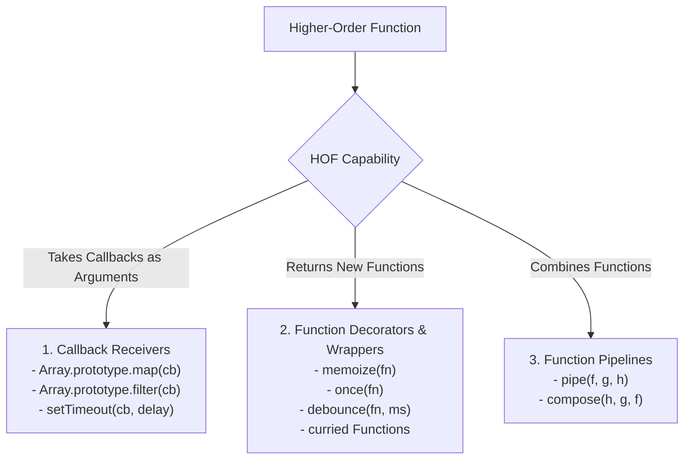
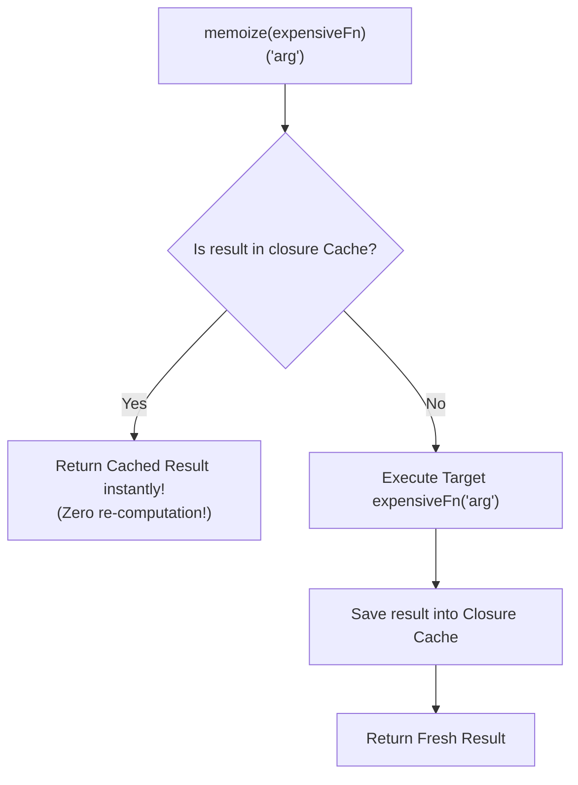

# Module 21: Higher-Order Functions — Abstraction, Decorators, and Function Composition

## Overview

A **Higher-Order Function (HOF)** is a function that fulfills at least one of the following mathematical criteria:
1. Takes one or more functions as input arguments (**Callback Functions**).
2. Returns a new function as its output result (**Function Generators / Decorators**).

In functional programming, HOFs enable declarative data abstractions, function decorators (`once`, `memoize`, `debounce`), and modular functional pipelines via **Function Composition (`pipe` and `compose`)**.

---

## 1. Higher-Order Function Architecture Taxonomy



---

## 2. Function Decorators: `once()` and `memoize()`

Function Decorators are HOFs that accept a target function, augment its behavior with internal closure state, and return a enhanced wrapper function.



```javascript
// 1. 'once' Decorator: Guarantees a function executes AT MOST ONCE
function once(fn) {
  let hasExecuted = false;
  let result;

  return function (...args) {
    if (!hasExecuted) {
      hasExecuted = true;
      result = fn.apply(this, args);
    }
    return result; // Returns cached result on subsequent calls
  };
}

const initializeDatabase = once(() => {
  console.log("Database Connection Pool Initialized!");
  return { status: "CONNECTED", poolId: 9001 };
});

console.log(initializeDatabase()); // "Database Connection Pool Initialized!"
console.log(initializeDatabase()); // (Returns cached status without re-executing!)

// 2. 'memoize' Decorator: Caches computational outputs based on input arguments
function memoize(fn) {
  const cache = new Map();

  return function (...args) {
    const key = JSON.stringify(args);
    if (cache.has(key)) {
      return cache.get(key); // Cache hit!
    }

    const result = fn.apply(this, args);
    cache.set(key, result);
    return result; // Cache miss
  };
}

const slowSquare = memoize((n) => {
  console.log(`Computing square for ${n}...`);
  return n * n;
});

console.log(slowSquare(5)); // "Computing square for 5..." -> 25
console.log(slowSquare(5)); // 25 (Instant Cache Hit!)
```

---

## 3. Function Composition Pipelines: `pipe` vs. `compose`

```mermaid
flowchart LR
    subgraph Pipe (Left-to-Right Execution)
        Input1[Input x] --> Fn1["fn1(x)"] --> Fn2["fn2(res1)"] --> Fn3["fn3(res2)"] --> Output1[Final Result]
    end

    subgraph Compose (Right-to-Left Execution)
        Input2[Input x] --> G3["fn3(x)"] --> G2["fn2(res3)"] --> G1["fn1(res2)"] --> Output2[Final Result]
    end
```

```javascript
const trimString = (str) => str.trim();
const toLowerCase = (str) => str.toLowerCase();
const wrapInTag = (tag) => (str) => `<${tag}>${str}</${tag}>`;

// 1. Pipe Implementation (Left-to-Right execution pass)
const pipe = (...fns) => (initialValue) =>
  fns.reduce((acc, fn) => fn(acc), initialValue);

// 2. Compose Implementation (Right-to-Left execution pass)
const compose = (...fns) => (initialValue) =>
  fns.reduceRight((acc, fn) => fn(acc), initialValue);

// Constructing a clean data transformation pipeline via pipe
const formatEmailBadge = pipe(
  trimString,
  toLowerCase,
  wrapInTag("span")
);

console.log(formatEmailBadge("   User.Email@Domain.COM  \n"));
// Output: <span>user.email@domain.com</span>
```

---

## Key Production Takeaways

1. **Use `memoize` for Expensive Pure Functions**: Wrap CPU-intensive mathematical or parsing functions in a memoization HOF to cache evaluation outputs.
2. **Use `once` for Initialization Routines**: Wrap DB initialization or event listener attachment functions in a `once` HOF to prevent duplicate executions.
3. **Use `pipe` for Clean Data Transformations**: Chain multi-step string, array, or object transformations using `pipe(...fns)` to eliminate deeply nested function call pyramids (`fn3(fn2(fn1(x)))`).
4. **Ensure Pure Callbacks inside HOFs**: Pass pure functions (functions with no side effects) into HOFs to ensure predictable composition.

