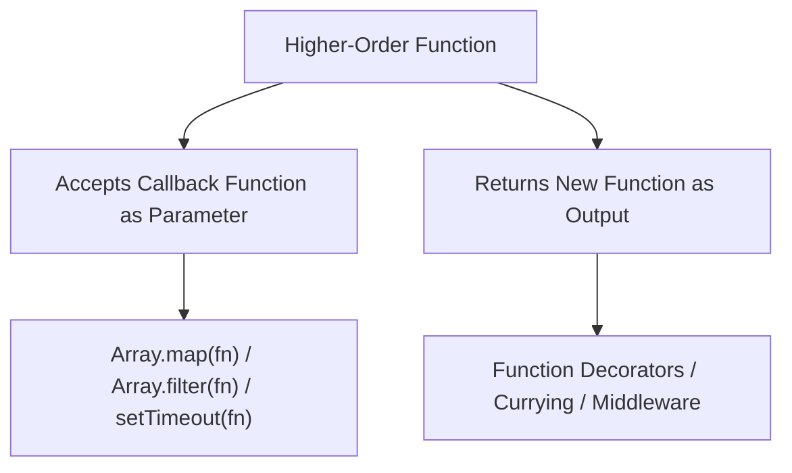

# File 21: Higher-Order Functions

## Overview
A **Higher-Order Function (HOF)** is a function that either accepts one or more functions as arguments (**callbacks**) or returns a new function as its output value.

---

## 1. Higher-Order Function Mechanics



---

## 2. Functions Accepting Callbacks

```javascript
// HOF taking a callback function
function processNumbers(numbers, transformCallback) {
    const results = [];
    for (const num of numbers) {
        results.push(transformCallback(num));
    }
    return results;
}

const nums = [1, 2, 3];
const doubled = processNumbers(nums, x => x * 2);
console.log(doubled); // [2, 4, 6]
```

---

## 3. Functions Returning Functions (Factory / Decorator Pattern)

```javascript
// HOF returning a logger decorator function
function createLogger(prefix) {
    return function(message) {
        console.log(`[${prefix}] ${message}`);
    };
}

const infoLog = createLogger("INFO");
const errorLog = createLogger("ERROR");

infoLog("Application started successfully"); // "[INFO] Application started successfully"
errorLog("Failed to connect to database");  // "[ERROR] Failed to connect to database"
```

---

## 4. Function Composition (`pipe` and `compose`)
Function composition combines multiple functions into a single pipeline where the output of one function becomes the input of the next.

```javascript
const add5 = x => x + 5;
const multiply3 = x => x * 3;

// Pipe (Left-to-Right execution)
const pipe = (...fns) => x => fns.reduce((val, fn) => fn(val), x);

const addThenMultiply = pipe(add5, multiply3);
console.log(addThenMultiply(10)); // (10 + 5) * 3 = 45
```

---

## Key Takeaways
1. Higher-order functions treat functions as **first-class values**.
2. Pass callbacks to HOFs for flexible data processing (e.g., `map`, `filter`).
3. Return functions from HOFs to build **factories**, **decorators**, or **curried pipelines**.
4. Use **Function Composition (`pipe`)** to build modular data transformation chains.
