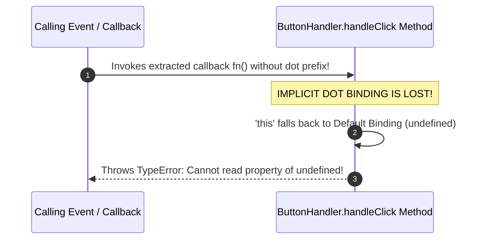

# Module 22: The `this` Keyword — Call-Site Resolution, Binding Precedence, and Context Loss

## Overview

The `this` keyword in JavaScript refers to the execution context object associated with the current running function.

Unlike standard lexical variables which are determined at author-time based on scope declaration location, `this` is **dynamically bound at runtime** based strictly on **how the function was invoked (the Call-Site)**.

Understanding the **4 Binding Precedence Rules** (`new` > explicit > implicit > default), strict mode behavior (`undefined` vs `globalThis`), the **Lexical `this` Exception of Arrow Functions**, and how to fix **Lost `this` Context Bugs** is essential for JavaScript developers.

---

## 1. The 4 Binding Precedence Rules Architecture

```mermaid
flowchart TD
    CallSite[Function Invocation Call-Site] --> CheckNew{1. Called with 'new'?}

    CheckNew -- Yes --> NewBind["1. 'new' Binding (Highest Precedence)<br/>this = Newly instantiated object instance"]
    
    CheckNew -- No --> CheckExplicit{2. Called via call(), apply(), or bind()?}
    CheckExplicit -- Yes --> ExplicitBind["2. Explicit Binding<br/>this = Explicit object passed as argument"]
    
    CheckExplicit -- No --> CheckImplicit{3. Called as obj.method()?}
    CheckImplicit -- Yes --> ImplicitBind["3. Implicit Binding<br/>this = Object to the left of the dot (obj)"]
    
    CheckImplicit -- No --> CheckDefault["4. Default Binding (Lowest Precedence)<br/>Strict Mode: this = undefined<br/>Non-Strict: this = globalThis / window"]

    style ArrowNote fill:#FEF3C7,stroke:#F59E0B
    note1["ARROW FUNCTIONS ( () => {} ) BYPASS ALL 4 RULES!<br/>They inherit 'this' lexically from enclosing parent scope."]
```

### Binding Precedence Order Matrix

| Order Precedence | Binding Rule | Call-Site Syntax Example | Bound `this` Value |
| :--- | :--- | :--- | :--- |
| **1 (Highest)** | **`new` Binding** | `new Person("Anita")` | The newly allocated memory instance. |
| **2** | **Explicit Binding** | `fn.call(userObj, arg1)` | The explicit target object parameter. |
| **3** | **Implicit Binding** | `account.getBalance()` | The object left of the dot (`account`). |
| **4 (Lowest)** | **Default Binding** | `standaloneFn()` | `undefined` (Strict Mode) or `globalThis` (Non-strict). |

---

## 2. Dynamic Call-Site Code Showcase

```javascript
// 1. Implicit Binding (Object left of the dot)
const user = {
  name: "Anita",
  greet() {
    return `Hello, I am ${this.name}`;
  }
};

console.log(user.greet()); // "Hello, I am Anita" (this = user)

// 2. Default Binding & Strict Mode Nuance
function showContext() {
  "use strict";
  return this;
}

console.log("Strict Standalone Execution:", showContext()); // undefined

// 3. Arrow Function Lexical 'this' (Bypasses dynamic binding!)
const teamStore = {
  teamName: "Architecture Core",
  members: ["Vikram", "Deepa"],
  printSummary() {
    // Arrow function preserves 'this' from printSummary() context!
    this.members.forEach((member) => {
      console.log(`${member} belongs to ${this.teamName}`);
    });
  }
};

teamStore.printSummary();
```

---

## 3. The Classic "Losing `this` Binding" Bug & 3 Fix Patterns

When a method is extracted from its object container and passed as a callback parameter (e.g. `setTimeout`, event listeners), its implicit dot linkage is lost, falling back to Default Binding (`undefined` in strict mode):



```javascript
const buttonController = {
  label: "Submit Transaction",
  handleClick() {
    console.log(`Action Executed: ${this.label}`);
  }
};

// UNBOUND EXTRACTION: Loses 'this' context!
const unboundHandler = buttonController.handleClick;
// unboundHandler(); // Throws TypeError: Cannot read properties of undefined (reading 'label')

// FIX PATTERN 1: Explicit Binding using .bind()
const boundHandler = buttonController.handleClick.bind(buttonController);
boundHandler(); // "Action Executed: Submit Transaction" (Fixed!)

// FIX PATTERN 2: Inline Arrow Function Wrapper
setTimeout(() => buttonController.handleClick(), 100); // "Action Executed: Submit Transaction"

// FIX PATTERN 3: ES2022 Public Class Field Arrow Property
class ModernButton {
  label = "Save Order";
  // Arrow property bound permanently at construction time!
  handleClick = () => {
    console.log(`Class Action: ${this.label}`);
  };
}

const btn = new ModernButton();
const extractedClassFn = btn.handleClick;
extractedClassFn(); // "Class Action: Save Order" (Context Preserved!)
```

---

## Key Production Takeaways

1. **Evaluate `this` by Inspecting the Call-Site**: To determine what `this` points to, inspect the line where the function is *invoked*, not where it is *written*.
2. **Use Arrow Functions for Callbacks**: Use arrow functions for array iteration callbacks (`.forEach`, `.map`) and event timers to inherit lexical `this` from outer methods automatically.
3. **Use `.bind(this)` or Class Field Arrows for Methods Passed as Callbacks**: When passing class or object methods to event listeners or callbacks, bind context using `.bind(this)` or class field arrows (`fn = () => {}`).
4. **Enable Strict Mode (`'use strict'`)**: Always use strict mode so unintended standalone function calls set `this` to `undefined` instead of mutating the global window/globalThis object.

