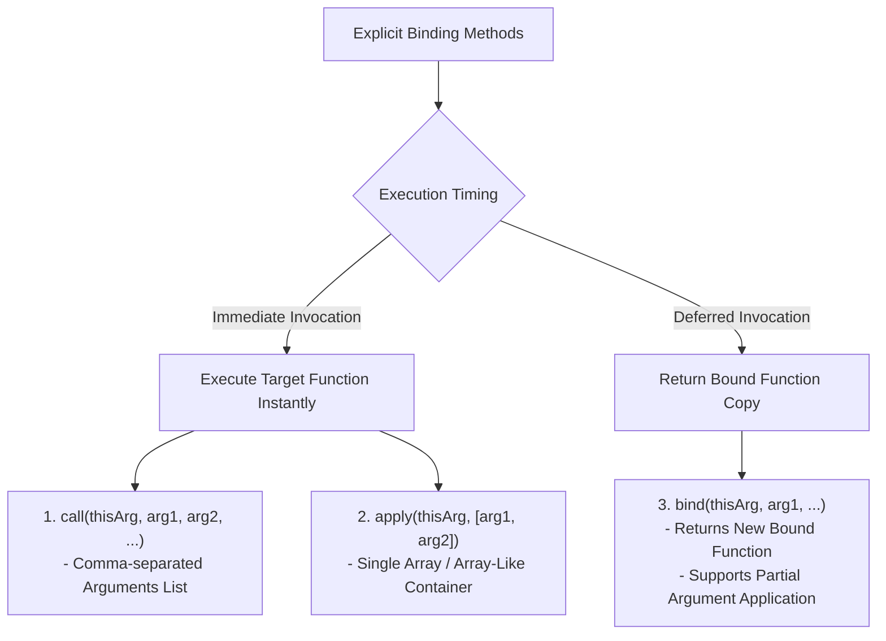
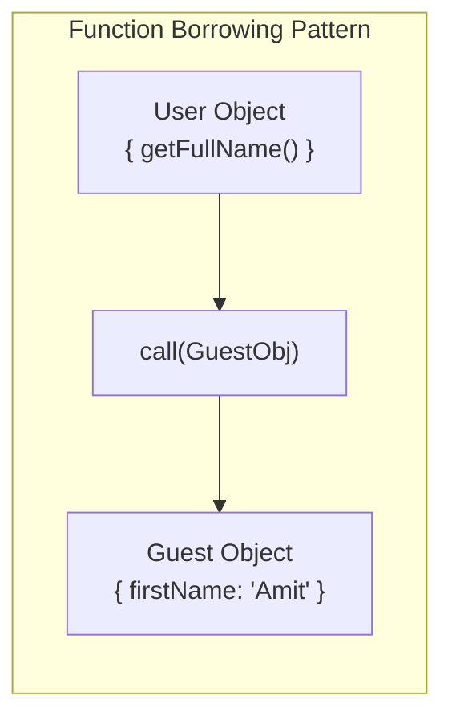

# Module 23: Explicit Binding (`call`, `apply`, `bind`) — Method Borrowing, Polyfills, and Hard Binding

## Overview

JavaScript functions inherit three methods from `Function.prototype` that enable explicit control over their `this` execution context:
1. **`call(thisArg, arg1, arg2, ...)`**: Invokes the target function **immediately**, passing arguments individually as a comma-separated list.
2. **`apply(thisArg, [argsArray])`**: Invokes the target function **immediately**, passing arguments packed inside a single Array or Array-like object.
3. **`bind(thisArg, arg1, arg2, ...)`**: Returns a **new hard-bound target function copy** with `this` permanently bound, deferring execution for later invocation.

Understanding method borrowing, constructing polyfills for `call`/`apply`/`bind`, and recognizing hard-binding immutability is essential.

---

## 1. Explicit Binding API Comparison Matrix



### Detailed Method Specification Matrix

| Method | Execution Timing | Argument Format | Return Value | Hard-Bound Immutability? |
| :--- | :--- | :--- | :--- | :--- |
| **`Function.prototype.call`** | **Immediate** | Comma-separated parameters (`a, b, c`) | Function Return Value | No (Per-call dynamic binding) |
| **`Function.prototype.apply`**| **Immediate** | Single Array container (`[a, b, c]`) | Function Return Value | No (Per-call dynamic binding) |
| **`Function.prototype.bind`** | **Deferred** | Comma-separated parameters (`a, b, c`) | **New Bound Function Copy** | **YES (Cannot be re-bound!)** |

---

## 2. Code Showcase: Method Borrowing & Partial Application

```javascript
function generateInvoice(taxRate, shippingFee) {
  const subtotal = this.price * this.quantity;
  const grandTotal = (subtotal - this.discount) * (1 + taxRate) + shippingFee;
  return `${this.clientName}: Total Rs.${grandTotal.toFixed(2)}`;
}

const orderPayload = { clientName: "Anish", price: 5000, quantity: 2, discount: 500 };

// 1. Using call() — Comma-separated arguments
console.log("call() Result :", generateInvoice.call(orderPayload, 0.18, 150));

// 2. Using apply() — Array container arguments
console.log("apply() Result:", generateInvoice.apply(orderPayload, [0.18, 150]));

// 3. Using bind() for Partial Application (Pre-filling 18% Tax Rate)
const generateAnishInvoiceWithTax = generateInvoice.bind(orderPayload, 0.18);
console.log("bind() Result :", generateAnishInvoiceWithTax(150)); // Shipping fee passed later!
```

---

## 3. Function Borrowing Pattern

Method borrowing allows an object to invoke a method belonging to an unrelated object or prototype without inheriting its class or prototype chain:



```javascript
// Borrowing Array.prototype methods for Array-Like objects (e.g. arguments)
function processArguments() {
  // Borrow Array.prototype.slice to convert array-like 'arguments' into a real Array
  const argsArray = Array.prototype.slice.call(arguments);
  return argsArray.join(" - ");
}

console.log(processArguments("Node", "V8", "Libuv")); // "Node - V8 - Libuv"
```

---

## 4. Engineering Polyfills for `call` and `bind`

Implementing polyfills exposes how JavaScript attaches functions to objects internally to control `this`:

```javascript
// 1. Polyfill for Function.prototype.myCall
Function.prototype.myCall = function (context = globalThis, ...args) {
  if (typeof this !== "function") throw new TypeError("Not a function");

  // Create unique Symbol property key to prevent overwriting existing keys
  const fnSymbol = Symbol("fn");
  context[fnSymbol] = this; // Attach function temporarily to context object

  const result = context[fnSymbol](...args); // Invoke method (Implicitly sets 'this'!)
  delete context[fnSymbol]; // Clean up temporary property
  return result;
};

// 2. Polyfill for Function.prototype.myBind
Function.prototype.myBind = function (context, ...presetArgs) {
  const targetFn = this;
  if (typeof targetFn !== "function") throw new TypeError("Cannot bind non-function");

  return function (...laterArgs) {
    // Combine preset arguments with arguments supplied at invocation time
    return targetFn.apply(context, [...presetArgs, ...laterArgs]);
  };
};

// Verification of Custom Polyfills
function greet(greeting, punctuation) {
  return `${greeting}, ${this.name}${punctuation}`;
}
const person = { name: "Deepa" };

console.log(greet.myCall(person, "Hello", "!")); // "Hello, Deepa!"
const boundGreet = greet.myBind(person, "Welcome");
console.log(boundGreet("."));                    // "Welcome, Deepa."
```

---

## Key Production Takeaways

1. **Use `call()` for Individual Arguments, `apply()` for Arrays**: Choose `call()` when parameters are known scalar variables; use `apply()` when parameters are already stored in an array.
2. **Use `bind()` to Lock Context in Async Callbacks**: Use `.bind(this)` when passing methods to event listeners or timeouts to prevent lost context bugs.
3. **Remember Bound Functions are Hard-Bound**: Functions returned by `.bind()` cannot have their `this` context changed by subsequent `.bind()`, `.call()`, or `.apply()` calls.
4. **Prefer Spread Operator over `apply()` in Modern ES6+**: Use `fn(...args)` instead of `fn.apply(null, args)` for cleaner syntax.
