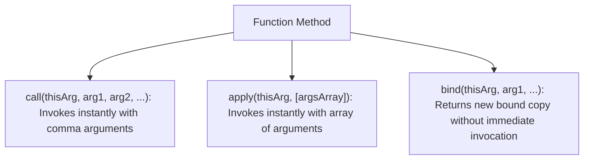

# File 23: Explicit Binding: call, apply, and bind

## Overview
JavaScript provides three built-in Function methods—`call()`, `apply()`, and `bind()`—allowing developers to explicitly control and override the `this` execution context of any function.

---

## 1. Comparing `call`, `apply`, and `bind`



### Direct Comparison Matrix

| Method | Execution Timing | Argument Format | Returns |
| :--- | :--- | :--- | :--- |
| **`call()`** | Immediately Executed | Comma-separated list (`arg1, arg2`) | Function return value |
| **`apply()`** | Immediately Executed | Single array instance (`[arg1, arg2]`) | Function return value |
| **`bind()`** | Deferred Execution | Comma-separated list (`arg1, arg2`) | **New bound Function copy** |

---

## 2. Code Usage Showcase

```javascript
function printDetails(city, country) {
    return `${this.name} (${this.role}) from ${city}, ${country}`;
}

const person = { name: "Priya", role: "Software Architect" };

// 1. Using call() — Arguments passed individually
console.log(printDetails.call(person, "Bengaluru", "India"));

// 2. Using apply() — Arguments passed as an Array
console.log(printDetails.apply(person, ["Bengaluru", "India"]));

// 3. Using bind() — Creates a preset function copy
const boundPrint = printDetails.bind(person, "Bengaluru");
console.log(boundPrint("India")); // Invoked later!
```

---

## 3. Function Borrowing Pattern
`call()` and `apply()` allow borrowing methods from objects without inheriting from them.

```javascript
const user = {
    firstName: "Rajesh",
    lastName: "Kumar",
    getFullName() {
        return `${this.firstName} ${this.lastName}`;
    }
};

const guest = { firstName: "Amit", lastName: "Sharma" };

// Borrow getFullName method for guest object
console.log(user.getFullName.call(guest)); // "Amit Sharma"
```

---

## Key Takeaways
1. Use **`call()`** for immediate execution with individual arguments.
2. Use **`apply()`** for immediate execution with an array of arguments.
3. Use **`bind()`** to lock context and return a reusable function copy for callbacks.
4. Use explicit binding to borrow methods across unrelated objects.
