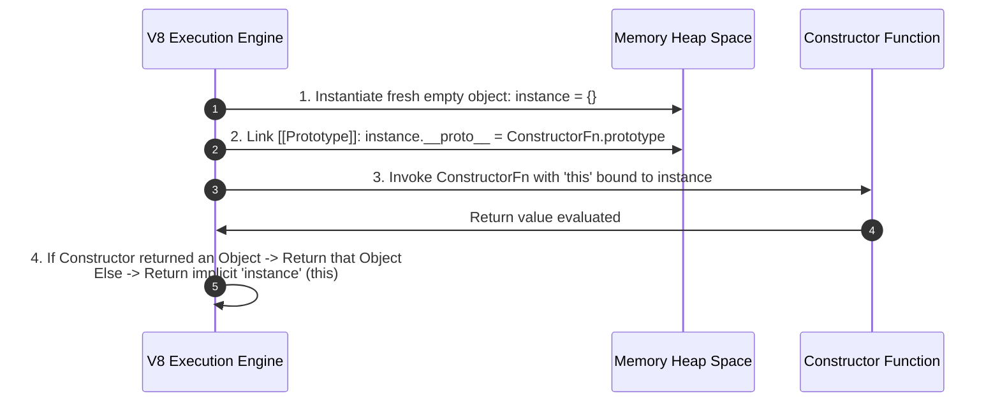
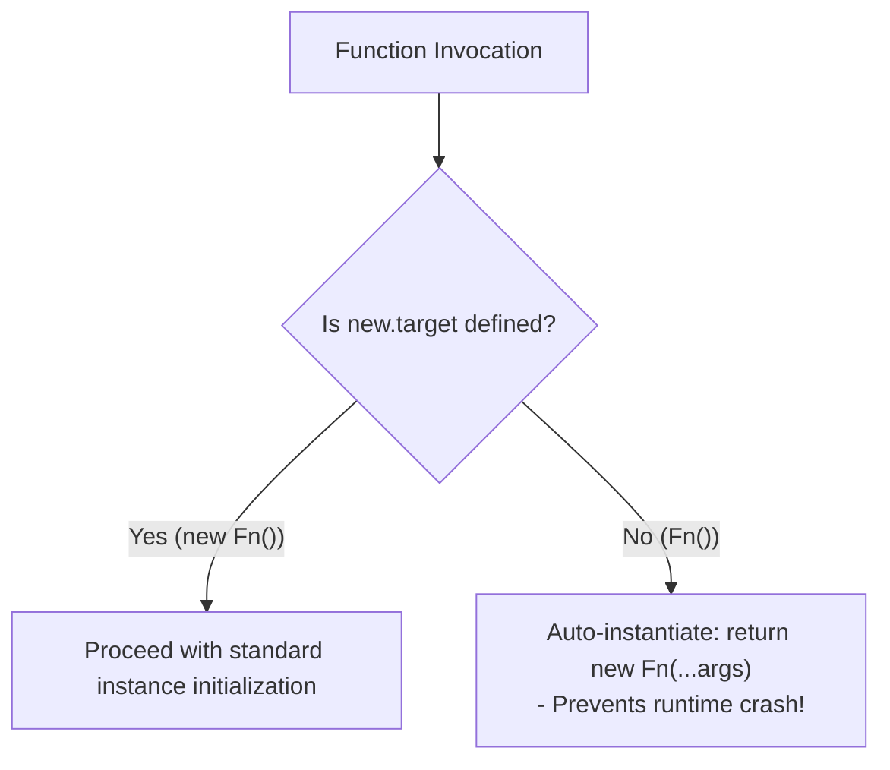

# Module 24: The `new` Keyword and Constructor Functions — Internal Mechanics, `new.target`, and Polyfills

## Overview

In JavaScript, **Constructor Functions** act as blueprints for instantiating multiple custom object instances.

When a function is called with the **`new` keyword**, JavaScript executes the internal ECMAScript **`[[Construct]]`** algorithm, executing a precise 4-step object creation procedure under the hood.

Understanding the **4-step `new` execution sequence**, return value override mechanics (primitive vs. object return), `new.target` meta-property instantiation guards, and building a `myNew()` polyfill is essential for mastering object-oriented JavaScript.

---

## 1. The 4-Step Execution Algorithm of `new`



### Detailed 4-Step Algorithm Breakdown

| Step | Internal Engine Action | Consequence |
| :--- | :--- | :--- |
| **Step 1** | Instantiates a fresh plain object in Heap memory (`{}`). | Allocates memory address space. |
| **Step 2** | Sets internal `[[Prototype]]` link (`instance.__proto__ = ConstructorFn.prototype`). | Inherits all prototype methods and properties. |
| **Step 3** | Binds `this` to the new instance and executes the constructor body with supplied arguments. | Initializes instance properties (`this.name = name`). |
| **Step 4** | Evaluates constructor return value. | Returns `this` implicitly unless explicit object was returned. |

---

## 2. Constructor Return Value Override Mechanics

A critical nuance of constructor functions is how explicit `return` statements interact with the `new` operator:
1. **Returning a Primitive Value (`string`, `number`, `boolean`)**: The primitive return is **completely ignored**, and `new` returns the implicitly constructed `this` instance.
2. **Returning an Object Reference (`object`, `array`, `function`)**: The constructed `this` instance is **discarded**, and `new` returns the explicit custom object instead!

```javascript
// 1. Primitive Return (Ignored by 'new')
function UserWithPrimitiveReturn(name) {
  this.name = name;
  return "IGNORING PRIMITIVE STRING"; // Ignored!
}
const user1 = new UserWithPrimitiveReturn("Anish");
console.log(user1.name); // "Anish" (Implicit 'this' instance returned!)

// 2. Object Return (Overrides 'this' instance!)
function UserWithObjectReturn(name) {
  this.name = name;
  return { customOverride: true, role: "SuperAdmin" }; // Overrides instance!
}
const user2 = new UserWithObjectReturn("Bhavna");
console.log(user2); // { customOverride: true, role: "SuperAdmin" } (Instance discarded!)
```

---

## 3. Instantiation Safety via `new.target`

If a developer accidentally calls a constructor function without the `new` keyword, `this` resolves to `undefined` in strict mode, throwing a runtime error.

The **`new.target`** meta-property detects whether a function was invoked with `new`:



```javascript
function SafePerson(name, role) {
  // Detect missing 'new' keyword call
  if (!new.target) {
    return new SafePerson(name, role); // Automatically instantiate correctly!
  }

  this.name = name;
  this.role = role;
}

const safeUser = SafePerson("Chirag", "Lead Developer"); // Missing 'new' handled safely!
console.log(safeUser.name); // "Chirag"
```

---

## 4. Engineering a `myNew` Custom Polyfill

Simulating the `new` keyword in custom JavaScript demonstrates the 4-step specification procedure:

```javascript
function myNew(ConstructorFn, ...args) {
  // Step 1 & 2: Create object and link its [[Prototype]] to ConstructorFn.prototype
  const instance = Object.create(ConstructorFn.prototype);

  // Step 3: Execute constructor with 'this' set to 'instance'
  const result = ConstructorFn.apply(instance, args);

  // Step 4: Return explicit object if returned, otherwise return 'instance'
  return (typeof result === "object" && result !== null) || typeof result === "function"
    ? result
    : instance;
}

// Verification of Custom Polyfill
function Car(make, model) {
  this.make = make;
  this.model = model;
}

Car.prototype.getDetails = function () {
  return `${this.make} ${this.model}`;
};

const myCar = myNew(Car, "Tata", "Nexon");
console.log(myCar.getDetails()); // "Tata Nexon" (Polyfill works identically to 'new'!)
```

---

## Key Production Takeaways

1. **Attach Methods to `Constructor.prototype`**: Never define methods inside constructor function bodies (`this.fn = ...`); define them on `Constructor.prototype` so all instances share one memory copy.
2. **Use `new.target` for Constructor Safety**: Use `new.target` inside custom constructor functions to prevent crashes when invoked without `new`.
3. **Use PascalCase Naming Convention**: Name constructor functions using `PascalCase` (e.g. `UserSession`) to visually distinguish constructors from standard functions.
4. **Never Return Objects from Constructors**: Avoid writing explicit `return` statements in constructor functions to prevent discarding the constructed instance.

