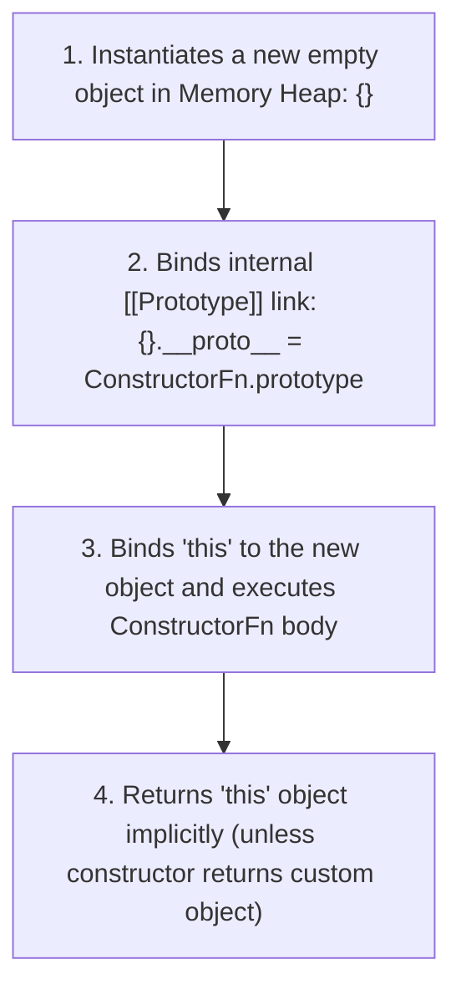

# File 24: The `new` Keyword and Constructor Functions

## Overview
Constructor functions act as object factories. When a function is invoked using the **`new` keyword**, JavaScript automatically executes a 4-step object creation procedure under the hood.

---

## 1. The 4-Step Behavior of `new`



---

## 2. Constructor Function Implementation

```javascript
// Constructor Function Convention: PascalCase naming
function Person(name, role) {
    // Step 1 & 2 happen automatically
    this.name = name;
    this.role = role;
    // Step 4 returns 'this' implicitly
}

// Prototype Method Attachment (Memory Efficient - Shared across instances)
Person.prototype.describe = function() {
    return `${this.name} is a ${this.role}`;
};

const user1 = new Person("Rajesh", "Developer");
const user2 = new Person("Priya", "Architect");

console.log(user1.describe()); // "Rajesh is a Developer"
console.log(user2.describe()); // "Priya is a Architect"
```

---

## 3. Forcing `new` Safety with `new.target`
If a developer forgets the `new` keyword, `this` will point to `undefined` in strict mode, throwing a runtime error. `new.target` detects missing `new` calls.

```javascript
function SafeUser(name) {
    if (!new.target) {
        return new SafeUser(name); // Auto-instantiates if 'new' was omitted
    }
    this.name = name;
}

const u1 = SafeUser("Amit"); // Missing 'new' handled safely!
console.log(u1.name); // "Amit"
```

---

## Key Takeaways
1. The **`new` keyword** instantiates an empty object, links its `__proto__`, binds `this`, and returns the instance.
2. Attach methods to **`Constructor.prototype`** so all instances share one memory copy.
3. Use **`new.target`** to detect and guard against missing `new` keyword calls.
4. Name constructor functions using **PascalCase**.
